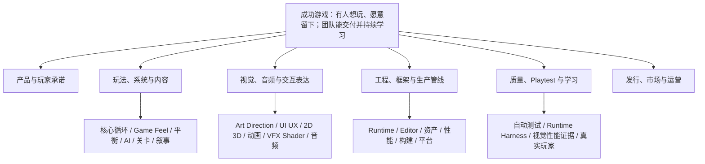

# AI 游戏开发能力图谱

> 状态：持续演进的项目北极星文档。初始基线建立于 **2026-08-31**，随 **2026-09-01 Framework Baseline** 进入真实新游戏验证阶段。它描述“为了持续做出可玩的 Unity 游戏，项目还需要哪些能力和反馈闭环”，不是功能排期、成功承诺或要求一次性填满的检查表。

## 1. 目的与非目标

本图谱从玩家与产品结果向下拆解能力，再决定由文档、Project Skill、工具、测试、Harness 还是人工评审承载。它用于：

- 防止围绕某个流行工具或 Skill 局部最优；
- 让一次真实开发暴露的缺口能被记录、验证和逐步补齐；
- 区分团队可复制的项目能力与个人机器、账号、偏好；
- 为后续分发开放 Agent Skill、产品专属 Plugin / Extension、Unity Package 或独立工具保留边界；
- 淘汰重复、空泛或不能提高真实任务成功率的 Skill。

它不保证游戏一定成功，也不把自动测试绿、截图完成或 LLM 评价等同于“好玩”“好看”或“有市场”。这些结论必须由目标玩家、人工审美和真实发行反馈校准。

## 2. 顶层结果



顶层结果按以下顺序相互约束：

1. **有人想玩**：目标受众、核心幻想、差异化和进入门槛成立。
2. **愿意继续玩**：核心循环、操作反馈、节奏、成长、平衡和信息清晰度成立。
3. **能产生情绪与记忆**：视觉、音频、叙事、角色、关卡和交互语言一致。
4. **能够持续生产**：架构、工具、资产、性能和质量体系不会随内容增长失控。
5. **能够发行并学习**：构建、平台、无障碍、本地化、数据、市场、运营和授权风险可控。

多人、F2P / IAP、开放世界、UGC / Mod、XR、主机认证、运行时 LLM NPC、程序化大世界和长期 LiveOps 是条件分支。只有产品方向需要时才进入 `Now`，不为图谱完整预建。

## 3. 能力不是 Skill

| 载体 | 适合承载 | 本项目真值 |
|---|---|---|
| `CONTEXT.md` / guide / ADR | 领域语言、长期事实、原理与设计决定 | `CONTEXT.md`、`docs/` |
| Project Skill | 有清晰触发条件、需要判断的重复流程 | `.agents/skills/<name>/SKILL.md` |
| MCP / CLI / DCC / 外部服务 | 操作 Unity、Blender、Figma 或生成平台 | 当前 Unity 使用 AnkleBreaker MCP |
| Harness | 驱动、观察、判定、恢复、重试和证据的闭环 | 主 Agent（当前 Codex）+ MCP + 测试 + 项目工具，仍在完善 |
| 测试 / Hook / 编译约束 | 确定性、必须执行的行为门禁 | Unity Test Framework、项目测试和 Editor Seam |
| 人工 / 玩家评审 | 好玩、审美、情感、市场、伦理与法律判断 | 需在每个垂直切片安排真实反馈 |

Skill 只写会改变执行质量的非显然知识。已经由代码或测试保证的契约不重复写成长说明；一次性偏好和未验证设想不创建 Skill。

## 4. 成熟度

| 等级 | 定义 |
|---|---|
| M0 缺失 | 项目尚未识别或没有可用入口 |
| M1 可描述 | 有目标、输入、输出和最低质量标准 |
| M2 可重复 | 有文档、Skill、模板或人工规程 |
| M3 可执行 | Agent 能借助稳定工具完成主要步骤 |
| M4 可闭环 | 能运行、观察、判定、恢复并留下可复核证据 |
| M5 有界自治 | 能在明确权限、预算和停止条件内重试、恢复和收口 |

编译、测试、资源校验和构建可以追求 M4–M5；玩法、审美、叙事、音乐和市场通常以 M2–M3 加人工校准为合理目标。法律和“好玩”不能伪装成 M5。

## 5. 当前能力基线

以下成熟度是用于选择下一步实验的工作假设，不是项目评分。

| ID | 能力 | 当前 → 目标 | 已有证据 | 主要缺口 / 下一实验 |
|---|---|---:|---|---|
| P1 | 受众、幻想、差异化、产品支柱 | M2 → M3 | [商业 3D 游戏策略](commercial-3d-game-strategy.md)的目标玩家、概念矩阵、范围盒与证据 Gate | 用 Concept Card、共享灰盒和 5 名目标玩家验证《游牧工坊》与备选方向，不把推荐误写成结论 |
| G1 | 核心循环与 Game Feel | M3 → M4 | 可运行 Outpost 流程、玩家路径 smoke | 增加真实 Input 路径、时序视觉证据和人工手感 rubric |
| G2 | 系统、AI、成长、经济与平衡 | M4 → M4 | 固定 seed、双后端对拍、黄金轨迹和长跑 guard | 自动结果仍需真实玩家难度与节奏校准 |
| C1 | 关卡、遭遇、节奏与叙事内容 | M1 → M3 | 当前垂直切片内容 | 先用真实关卡任务形成可重复评审，再决定是否建 Skill |
| V1 | Art Direction、2D / 3D 资产 | M1 → M3 | `imagegen` 可做概念与 2D 原型 | 缺 art bible、资产 brief、来源记录、导入和场景验收闭环 |
| V2 | Shader、VFX、材质、灯光、镜头与动画 | M1 → M3 | Unity 6 + URP 17.3 基础 | 在首个代表性效果上建立 RenderGraph、性能和视觉证据 |
| U1 | UI / UX、输入、教程、无障碍、本地化 | M3 → M4 | UGUI / UI Toolkit / Bridge、Localization、相关测试 | 缺游戏级视觉语言、真实输入 E2E、无障碍与多分辨率矩阵 |
| A1 | 音效、音乐、配音和动态混音 | M2 → M3 | Framework Audio 契约与测试；[AI 音频生产候选](ai-audio-production-research.md)已整理少量平台、授权边界与共用 Spike | 尚无生成结果真实进入 Unity；需验证同族一致性、DAW 后期、响度与目标设备表现 |
| E1 | Framework 架构与 AI 可导航性 | M4 → M4 | `CONTEXT.md`、ADR、分层 AGENTS、模块测试、`improve-ssframework-architecture` | 在不同架构任务中验证 Skill 能减少误抽象和跨 Module 泄漏 |
| E2 | 资源、配置、热更与构建管线 | M4 → M4 | YooAsset / Luban / HybridCLR、隔离构建探针 | 补正式游戏发布组合、目标平台和失败恢复演练 |
| E3 | AI 执行可承接性 | M2 → M3 | `AGENTS.md`、开放 `.agents/skills`、`ai-agent-onboarding.md` 与共享 Harness | Codex 已闭环；其他 Agent 不预配置，真实采用时完成规则、工具与代表性任务 smoke |
| Q1 | 编译、EditMode / PlayMode 与验证编排 | M4 → M5 | 1396 项基线、预检、后台自动化 | 用 `unity-validation-harness` 统一最小充分证据和交付摘要 |
| Q2 | 视觉回归、性能与内存预算 | M2 → M4 | 截图、Profiler / Frame Debugger 能力 | 固定场景、设备、采样窗口、批准基线和预算阈值 |
| Q3 | Agent Playtest 与真实玩家测试 | M2 → M4 | 业务 Command 玩家路径 smoke | 加极薄 Input Driver；另建真实玩家观察和访谈循环 |
| R1 | 构建、发布、平台和商店 | M3 → M4 | Unity CLI Adapter、隔离 Player Build、Steam / Windows 首发建议与移动 Gate | 概念通过后建立 Windows 可分发 Player 包、Steamworks 准备与目标设备 smoke |
| R2 | 市场、分析、社区、运营、隐私与授权 | M1 → M2 | 平台官方约束、概念商业 Gate 与生成资产台账字段已进入商业游戏策略 | 用真实竞品集、试玩指标和第一批资产授权记录证明流程，再形成发布 checklist |

## 6. Harness 分层

```text
Primary Coding Agent（当前 Codex）
  ↓ 项目知识与 Project Skills
AnkleBreaker Unity MCP / Unity CLI Adapter
  ↓ 编辑器、Player、测试和证据工具
Unity Test Framework + BattleSim / PlayerPath Harness
  ↓ 确定性 Oracle、里程碑与清理
逐步增加：统一验证 → 性能 Oracle → 视觉 Oracle → Input Playtest → Skill Eval
```

当前优先补齐：

1. `unity-validation-harness`：选择验证范围并汇总证据，不新造 Runner。
2. 固定场景、设备与窗口的性能基线。
3. 少量高价值页面 / Shader 的视觉基线，黄金图只由人工批准。
4. 经 Input System 虚拟设备和 Input Action 驱动的薄 Playtest Driver。
5. 当 Project Skill 数量增长后，用真实历史任务做有 / 无 Skill 对照 Eval。

外部 Harness 只按缺口采用：

| 缺口 | 候选 | 当前决策 |
|---|---|---|
| 性能 Oracle | Unity [Performance Testing Extension](https://docs.unity3d.com/Packages/com.unity.test-framework.performance@3.2/manual/index.html) + `ProfilerRecorder` | 先在分支验证与当前 Unity / UTF 的包兼容，只建 3–5 个固定场景；Editor 数据用于诊断，门禁优先固定 Player |
| 视觉 Oracle | Unity [Graphics Test Framework](https://docs.unity3d.com/Packages/com.unity.testframework.graphics@9.0/manual/index.html) | 当前为 pre-release 候选，只试点一个运行时 UI、一个 EditorWindow、一个 Shader 场景；黄金图必须人工批准 |
| GitHub CI 执行 | [GameCI Unity Test Runner](https://github.com/game-ci/unity-test-runner) | 真正建立 GitHub CI 时再接；它远程运行 UTF，不替代本地 MCP 或项目 Oracle |
| Playtest 设计参考 | [DeNA Anjin](https://github.com/DeNA/Anjin)、[Signal Loop Unity Code MCP](https://github.com/Signal-Loop/UnityCodeMCPServer) | 借鉴 fixed seed、timeout、observe → act → observe 和真实 Input Action；不原装，不引入第二套 MCP |
| 跨设备黑盒 E2E | [AltTester Unity SDK](https://github.com/alttester/AltTester-Unity-SDK) | 只有外部 QA / 真机矩阵成为需求时评估，并先审 GPL-3.0 与测试构建边界 |
| 学习型探索 Agent | [Unity ML-Agents](https://github.com/Unity-Technologies/ml-agents) | 仅用于关卡探索、平衡或涌现行为问题；不替代普通回归 Harness 和业务 Oracle |

不要安装第二套完整 Unity MCP / REST 后端，也不要为了“统一”立即重构成熟的 `BattleSimTestHarness` 和 `OutpostPlayerPathSmokeTests`。

## 7. Skill 的作用域与准入

### 用户级与项目级

- 用户级 `~/.agents/skills`：跨仓库通用的发现、安装、文档、浏览器、通用制图等个人能力。
- 项目级 `.agents/skills`：依赖 SSFramework 架构、测试、Unity 版本、MCP 语义和项目安全边界的流程；随仓库复制即可复用。
- 可跨多个 Unity 项目的稳定 Skill：先在本项目证明，再按开放 Agent Skills 结构分发；只有产品专属元数据、工具或安装体验确有价值时才抽成对应 Plugin / Extension。Unity Runtime / Editor 实现另抽 UPM Package；不要假设 Unity Package 内部的 Skill 会自动进入宿主 Agent 的仓库发现路径。
- `agents/openai.yaml` 等产品元数据不进入公共语义。只有实际采用某个 Agent 时才增加必要的薄接入层；完成规则、Skill、Unity 工具和代表性任务 smoke 后，才能宣称该任务类型可用。
- 机器路径、账号、Token、付费套餐和个人偏好不提交仓库。项目只保存无秘密的配置模板、版本约束、验证方法和卸载路径。

### 新增 Skill 的默认准入

以下是防止 Skill 膨胀的默认判断，不是为了凑勾选框。若一个能力虽然只经历一次任务，却有明显安全价值或能解除高成本阻塞，可以作为标明“实验性”的窄 Skill 先落地；后续没有收益就删除。

1. 有清晰触发条件，且不是一次性问题。
2. 与现有 Skill 的职责不同；如果只是补一条稳定事实，优先更新原 Skill 或文档。
3. 规定可观察输入、输出和证据，而不是泛泛建议。
4. 尊重场景 / Prefab、第三方 Package、权限和外部副作用边界。
5. 至少经过一个真实任务验证；准备推广前最好有第二个不同任务复验。
6. 能说明失效、升级和删除条件。

当 Skill 数量明显增长时，对代表性任务比较有 / 无 Skill 的成功率、人工介入、耗时和工具调用；没有可见收益的 Skill 合并或删除。

### 严格去重后的 Skill 候选队列

| 决策 | 能力 / 来源 | 为什么这样处理 |
|---|---|---|
| 已项目化 | `improve-ssframework-architecture`，参考 [mattpocock/skills](https://github.com/mattpocock/skills) 的 `improve-codebase-architecture` / `codebase-design` | 通用版不是 Claude 专属，但项目已有五层、CONTEXT、ADR、Unity 生命周期与 Adapter 语言；合并成一个项目 Skill 比同时安装多个互相调用的上游 Skill 更少误触发 |
| 已项目化 | `unity-validation-harness` | 填补“按改动风险选择并收口已有证据”的真实缺口，不另造 Runner 或第二套 Unity MCP |
| 下一真实测试任务再适配 | [.NET `test-gap-analysis`](https://github.com/dotnet/skills/blob/main/plugins/dotnet-test/skills/test-gap-analysis/SKILL.md) | “改变可观察行为时测试是否真会失败”价值高；必须改成 Unity EditMode / PlayMode、预检、`UnityTest`、帧与 `total > 0` 语义，不能原样安装 |
| 遇到重复 R3 时序问题再适配 | [`r3-reactive-extensions`](https://github.com/Aaronontheweb/dotnet-skills/blob/master/skills/r3-reactive-extensions/SKILL.md) | 与项目 R3 版本高度相关，但需覆盖 SSFramework 的 Bag、UniTask、取消和生命周期所有权；没有真实重复痛点前先不增加常驻候选 |
| 作为材料，不单独安装 | 通用 bug diagnosis、test anti-patterns、code review | 可把可证伪假设、假通过检查和需求/规则双轴审查吸收到现有诊断、验证或 review 流程；单独安装会与已有 Skill 和 Codex review 重叠 |
| 不采用 | 泛化 Clean Architecture、C# 12 / .NET 8 标准、普通 NUnit/TDD、TypeScript refactor、指标仪表盘型 Skill | 与 Unity 6 / C# 10、UniTask、主线程、asmdef、EditMode / PlayMode 或项目自主协作方式不匹配，容易形成套层与形式主义 |

候选表是实验队列，不是安装清单。只有真实任务重复暴露相同缺口时才创建项目适配；上游更新先做差异审查，不运行会改写 `AGENTS.md` / `CLAUDE.md` 或批量安装依赖的 setup。

## 8. 外部软件与平台的采用流程

探索阶段可以讨论或试用，不立即写正式安装教程。候选能力达到“已稳定”后，再新增 `docs/ai-game-development-environment.md`，避免教程先于真实流程。

### 候选依赖登记

| 能力 | 当前候选 | 采用条件 | 当前状态 |
|---|---|---|---|
| 图片、概念图、2D 资产 | Codex `imagegen` + 项目资产验收流程 | 同一风格资产族能稳定生成、规范化并在 Unity 中通过验收 | 探索 |
| Sprite 法线 / 高度 / AO | [Laigter](https://github.com/azagaya/laigter) | 项目确定 2D 光照方案、贴图命名和导入规则 | 候选 |
| 程序化 PBR 材质 | [Material Maker](https://github.com/RodZill4/material-maker) | 首个 Shader / 材质垂直切片需要 | 候选 |
| 3D 制作自动化 | Blender + [Blender MCP](https://github.com/ahujasid/blender-mcp) | Blender 成为正式 DCC，且任意脚本执行边界可接受 | 候选 |
| AI 3D 原型 | [Meshy](https://github.com/meshy-dev/meshy-3d-agent) | API、成本、拓扑 / UV 质量和商业授权验证通过 | 候选 |
| UI 设计真值 | [Figma MCP](https://developers.figma.com/docs/figma-mcp-server/) | Figma 真正成为设计源，而不是只为接插件 | 候选 |
| 游戏音效生成 | [AI 音频生产候选](ai-audio-production-research.md)：Stable Audio 3 Small SFX + ElevenLabs；Adobe Firefly 为人工备选 | 同一 Brief 的质量、循环、同族一致性、API / 本地成本和商业授权验证通过 | 探索 |
| 音乐生成 | [AI 音频生产候选](ai-audio-production-research.md)：Stable Audio 3 + AIVA；Eleven Music / SOUNDRAW 为在线基准，Suno 仅优先做概念 | 游戏发行和多平台权利明确，能保存 Prompt / Seed / 原始输出 / License，并通过主题一致性和可编辑性测试 | 探索 |
| 音频后期与动态编排 | REAPER / Audacity；运行时先用 Framework Audio + Unity AudioMixer | 真实资产需要批量后期时选择 DAW；只有交互音乐或内容生产瓶颈成立才评估 FMOD / Wwise | 候选 |
| 市场图片 / 视频 | Canva / Runway 等 | 进入商店素材与预告片生产阶段 | Later |

### 从探索到正式指南的门槛

外部能力进入“项目正式支持”的安装、注册和配置指南前，通常应满足：

1. 至少一个生成物真实导入 Unity 并进入代表性场景或 UI。
2. 同一流程重复两次以上，输入、输出和质量波动已知。
3. 版本、系统要求、账号、费用和商业授权已经核验。
4. 凭据归属、项目配置、缓存、失败重试、升级和卸载边界明确。
5. 有可运行的 smoke test 或人工验收表，能判断“装好了”而不只是“程序能打开”。

稳定后的指南至少包含：前置条件、软件下载 / 注册、固定版本、凭据配置、项目接入、首次 smoke、常见失败、升级 / 回滚、卸载和授权记录。需要用户购买、注册、登录或安装桌面软件时，Agent 应明确列出用户动作和验证结果，不假装已经完成。

## 9. 路线

### Now

- 维护本能力图谱，并把新缺口绑定到真实任务证据。
- 使用 `unity-validation-harness` 收口每次非琐碎变更的验证。
- 在真实架构任务中使用 `improve-ssframework-architecture`，按证据继续收窄或补充，而不直接复制通用 Skill。
- 按[商业 3D 游戏策略](commercial-3d-game-strategy.md)先对《游牧工坊》与备选方向做 Concept Card、共享灰盒和目标玩家验证，再确认正式产品方向并跑通实现、编译、Play、观察、验收和恢复。
- 游戏业务先留在独立目录/asmdef；只有跨游戏通用或阻断公共用法的证据才回流 Framework。

### Next

- 从真实美术任务建立 art brief、资产 manifest、来源和 Unity 导入验收。
- 按 [AI 音频生产候选](ai-audio-production-research.md)完成一轮小规模 Audio Spike，再决定主线平台、DAW 和是否形成项目 Skill。
- 选择性适配游戏 UI / UX、Game Feel、关卡设计和 test-gap-analysis Skill。
- 建立 3–5 个性能场景；选择少量 UI / Shader 试点视觉回归。
- 增加一条真实 Input Action 玩家路径，不直接修改 Transform 或私有状态伪造成功。

### Later

- 根据正式美术风格选择 Blender / Meshy / 法线材质工具和音效服务。
- 首个目标平台的 Player 构建、设备 smoke、无障碍与本地化矩阵。
- Skill Eval Harness、CI 并发验证和可恢复的证据 manifest。
- 将稳定的跨项目能力抽成可移植 Agent Skill；将产品专属体验按需抽成 Plugin / Extension，将 Unity 执行层抽成 UPM Package。

### Intentionally Blank

在产品方向明确前不建设：多人网络、LiveOps、UGC、XR、主机认证、大规模 ML-Agents、运行时 LLM NPC、运行时或全自动音乐生成平台。空白是明确取舍，不是遗漏。

## 10. 用真实开发更新图谱

每个垂直切片完成后只做一次轻量复盘：

1. 哪个玩家或生产结果没有达到？
2. 失败属于知识、工具、可观察性、Oracle、确定性门禁还是人工判断？
3. 最小正确载体是什么：代码 / 测试、文档、Skill、工具还是 Harness？
4. 新载体是否在下一次任务中减少了失败、重复指导或人工介入？
5. 是否存在可以删除或合并的旧 Skill、规则和工具？

每个能力条目后续可逐步补充：稳定 ID、Outcome、Trigger、Current / Target、Carrier、Evidence、Gap、Next Experiment 和 Last Proven。只有真实证据变化时更新成熟度，不按文档数量升级。

## 11. 相关项目真值

- `AGENTS.md`：始终加载的协作和安全边界。
- `CONTEXT.md`：框架领域语言与设计上下文。
- `docs/ai-collaboration-guide.md`：公共规则、Skill、工具与 Harness 的协作原则。
- `docs/ai-agent-onboarding.md`：新 Agent 的最小接入、验证与 Handoff 契约。
- `docs/unity-mcp-tips.md`：当前 Unity MCP 的稳定调用语义。
- `docs/project-improvement-plan.md`：最新可复核工程基线。
- `docs/roadmap.md`：框架功能路线，不由本能力图谱替代。
