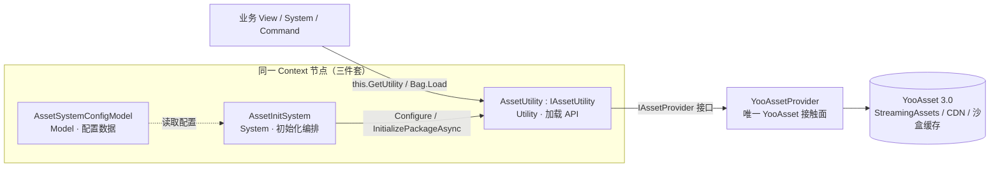
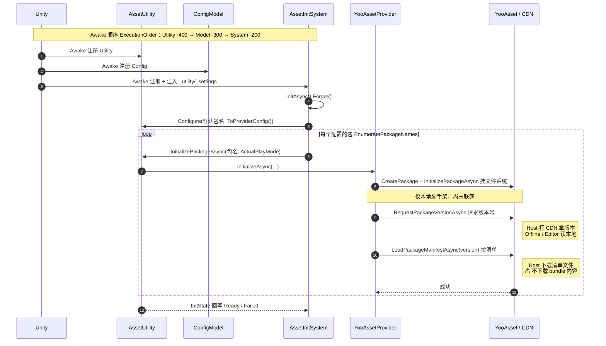
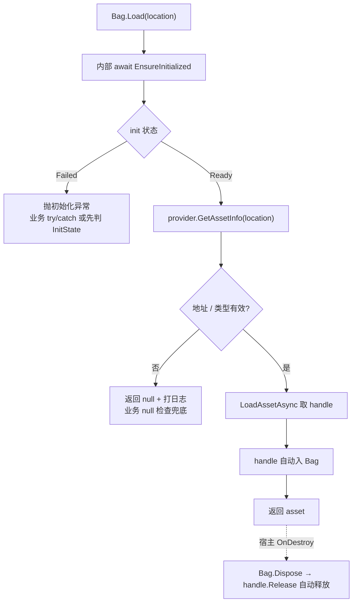
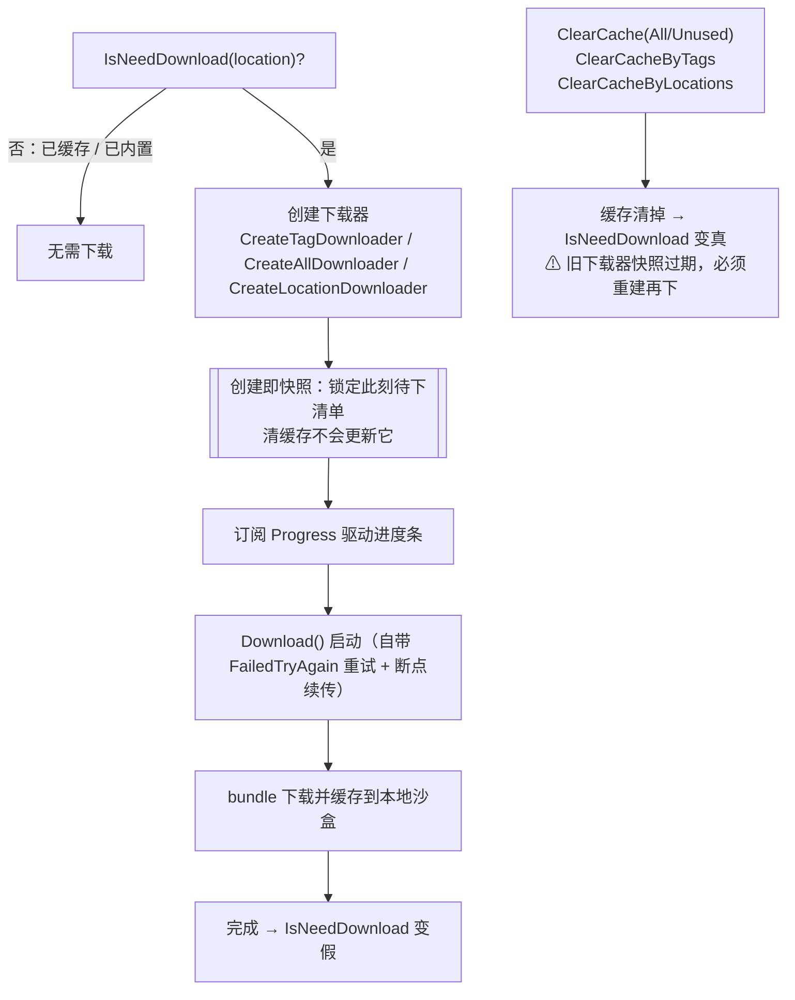
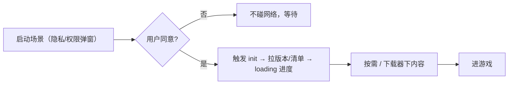

# 资源系统全流程（初始化 / 加载 / 下载缓存）

> 速查图谱：资源系统在「进游戏 → 加载资源 → 下载/清缓存」各阶段到底发生了什么、哪步联网、哪步会抛/返 null。
> 配套：使用约定见 [`Assets/Game/AGENTS.md` §19](../Assets/Game/AGENTS.md)，底层库踩坑见 [`docs/yooasset-pitfalls.md`](yooasset-pitfalls.md)，原生 API 改造背景见 [ADR 0013](adr/0013-yooasset-native-rewrite.md)。
> 三层职责拆分（Model/System/Utility）与代码位置见 [`docs/framework-guide.md`](framework-guide.md)。

---

## 1. 架构总览：业务只认接口，YooAsset 锁在 provider

- 业务**只经** `this.GetUtility<IAssetUtility>()` 或 `Bag.Load`，看不到 YooAsset。
- 换底层库（Addressables / 自研）只需实现一个新 `IAssetProvider`，上层零改动（`AssetProviderFactory.CreateDefault()` 里 new provider 是唯一切换点）。

---

## 2. 启动初始化全流程：Play 后立刻做什么

**Awake 顺序由 `DefaultExecutionOrder` 保证**：Utility(-400) → Model(-300) → System(-200)。所以 `AssetInitSystem` 跑 Awake 时，`AssetUtility` 与 `ConfigModel` 已注册好，`[Inject]` 拿得到。

**初始化做了 / 没做：**

| 做了 | 没做 |
|---|---|
| 建包、按模式挂文件系统、装解密器 | ❌ 不下载 bundle 资源内容 |
| 请求版本号（Host 联网 CDN） | ❌ 不加载任何具体资源 |
| 拉取并解析清单 manifest（知道远端全貌） | ❌ 不替业务决定加载什么 |

→ init 后你「知道远端是什么版本、有哪些资源、各自 hash/依赖」，但**资源文件还在 CDN**，`Bag.Load` 用到才下（或下载器批量预下）。
单包失败只把该包置 `Failed`、不抛、不阻塞后续包；业务加载该包时再感知其状态。

---

## 3. 运行模式（PlayMode）对照

一个全局 `PlayMode` 套所有包（`AssetPackageConfig` 当前只存包名，包级模式/CDN 是预留扩展点）。

| 模式 | 资源来源 | 启动联网？ | 本地缓存 |
|---|---|---|---|
| **EditorSimulate** | 编辑器直读 AssetDatabase（免打包） | 否 | 无 |
| **Offline** | 仅内置首包（StreamingAssets） | 否 | 无（全内置） |
| **Host** | 内置首包 + 远端 CDN，**缺的按需下载并缓存** | 是（拉版本+清单） | 下载的落沙盒缓存 |
| **Web** | 纯远端 HTTP（WebGL） | 是 | 不落地 |

> 「部分内置首包 + 部分远端」不需要混模式：**Host 模式本身就是首包 + CDN 混合**，哪些 bundle 进首包是**构建期**（AssetBundleCollector）决定的。

---

## 4. 资源加载流程：Bag.Load 的成功与两种失败

**失败语义两套（别用混）：**

| 失败类型 | 触发 | 框架行为 | 你该怎么写 |
|---|---|---|---|
| 加载期失败 | 地址不在 manifest / 类型不符 / 空地址 | `Load` 返回 **null**（不抛）+ 日志 | **null 检查** + 兜底 |
| 初始化失败 | 包 init 失败：CDN 不可达 / 断网 | 加载方法内部 `EnsureInitialized` **抛**异常 | **try/catch** 或先判 `InitState` |

心智：包 `Ready` 后 `Load` 只返 null；会抛 = 你在 init 成功前就加载了。流程先 gate 在「资源系统就绪」上，后面只需 null 检查。

---

## 5. 下载与缓存流程：下载器是「创建即快照」

- 三种范围：按 tag（关卡/DLC 整批）、全部（整包预下）、按地址（点名含依赖）。
- 清缓存是 **bundle 粒度**：按 tag 是并集（命中任一即清）；按地址会连带同 bundle 邻居。想精确隔离要打包时让资源独占 bundle。
- 固定顺序：**清缓存 → 重建下载器 → 开始下载**（下载器是快照，不会自己更新）。

---

## 6. 启动流程控制：auto-init（默认）vs 延迟 init（可选）

**默认 auto-init**：`AssetInitSystem.Awake` 一上来就 `InitAsync()`——节点 Awake 一跑，连「请求远端清单」这步就发生了。多数游戏想资源尽早就绪，这是合理默认。

**延迟 init（可选）**：手机端启动常有隐私同意 / 权限弹窗，**合规要求同意前不得发起任何网络连接**（哪怕一个清单请求）。这类场景需要「点同意后才 init」。

**落地（已实现，最小版）**：`AssetSystemConfigModel.AutoInitializeOnStartup`（默认 true，Inspector 可配）。

- 设 **false** 时，`AssetInitSystem` 启动只 `Configure`（含**写入运行模式**，所以延迟触发也用对模式）、**不跑初始化循环**、不联网。
- 业务在「同意 / 选区 / 流量确认」后调 `IAssetUtility.RetryInitialize()` 触发——对 `Idle` 包即「冷启动初始化」；用 `InitState` 驱动 loading。
- CDN 地址按运行期决定、流量提醒等都走这条门。

demo「资源加载 · 初始化与状态」节已把该开关（`AutoInitializeOnStartup` 当前值徽标）+ `RetryInitialize` 触发口直观呈现。

> ⚠ 延迟模式下，**触发 init 之前别调 `Bag.Load`**——`Load` 内部会等初始化完成，未触发就会一直等。把首个 `Load` gate 在「已触发 + `InitState=Ready`」之后。
