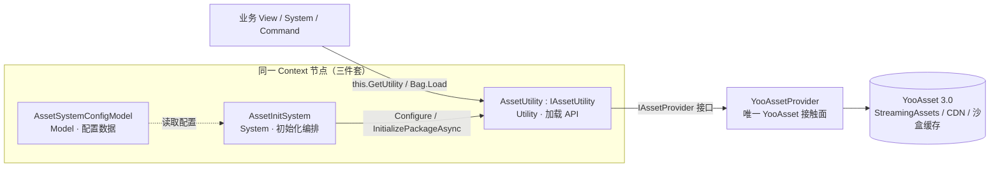
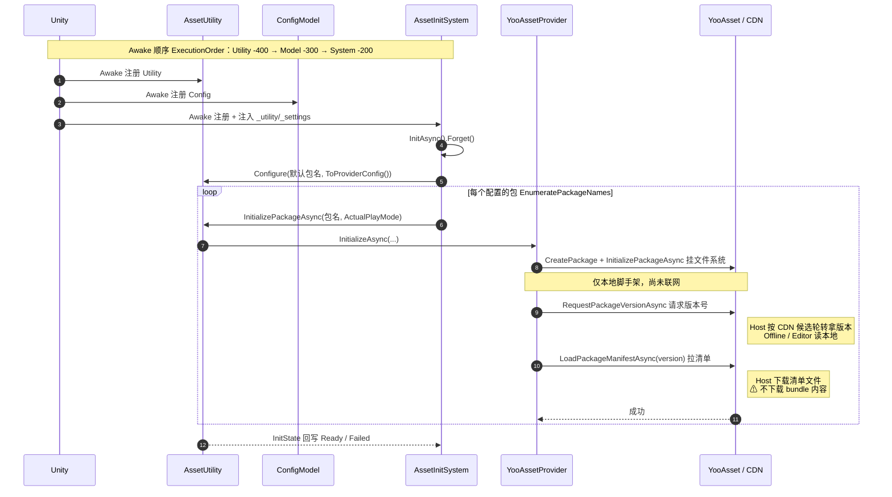
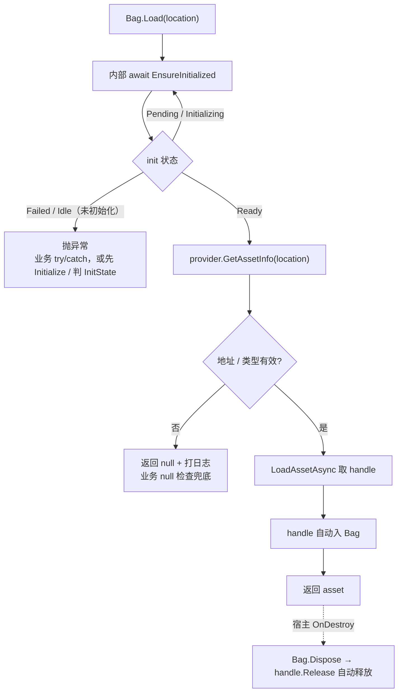
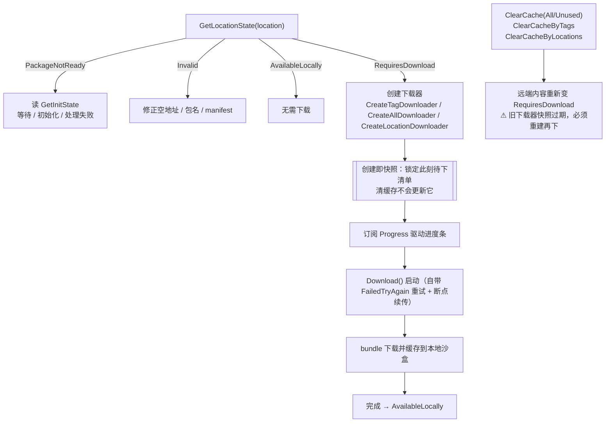
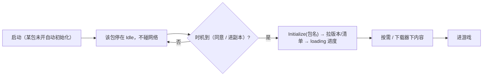

# 资源系统全流程（初始化 / 加载 / 下载缓存）

> 速查图谱：资源系统在「进游戏 → 加载资源 → 下载/清缓存」各阶段到底发生了什么、哪步联网、哪步会抛/返 null。
> 配套：使用约定见 [`Assets/Game/AGENTS.md`「模块使用不变量」的资源条目](../Assets/Game/AGENTS.md#模块使用不变量)，底层库踩坑见 [`docs/yooasset-pitfalls.md`](yooasset-pitfalls.md)，原生 API 改造背景见 [ADR 0013](adr/0013-yooasset-native-rewrite.md)，资源加密 / 构建过程开关见 [`docs/asset-encryption.md`](asset-encryption.md)。
> 三层职责拆分（Model/System/Utility）与代码位置见 [`docs/framework-guide.md`](framework-guide.md)。

---

## 1. 架构总览：业务只认接口，YooAsset 锁在 provider

- 业务**只经** `this.GetUtility<IAssetUtility>()` 或 `Bag.Load`，看不到 YooAsset。
- 换底层库（Addressables / 自研）只需实现一个新 `IAssetProvider`，上层零改动（`AssetProviderFactory.CreateDefault()` 里 new provider 是唯一切换点）。

---

## 2. 启动初始化全流程：Play 后立刻做什么

**Awake 顺序由 `DefaultExecutionOrder` 保证**：Utility(-400) → Model(-300) → System(-200)。所以 `AssetInitSystem` 跑 Awake 时，`AssetUtility` 与 `ConfigModel` 已注册好，`[Inject]` 拿得到。

**初始化做了 / 没做：**

| 做了 | 没做 |
|---|---|
| 建包、按模式挂文件系统、装解密器 | ❌ 不下载 bundle 资源内容 |
| 请求版本号（Host 联网 CDN） | ❌ 不加载任何具体资源 |
| 拉取并解析清单 manifest（知道远端全貌） | ❌ 不替业务决定加载什么 |

→ init 后你「知道远端是什么版本、有哪些资源、各自 hash/依赖」，但**资源文件还在 CDN**，`Bag.Load` 用到才下（或下载器批量预下）；
包级取消「启用按需下载」时则 `Load` 未缓存资源直接失败、须先显式下载。
单包失败只把该包置 `Failed`、不抛、不阻塞后续包；业务加载该包时再感知其状态。
Host 下版本号与清单请求都会按配置的 CDN 候选列表轮转重试（候选需是等价镜像），全部失败才算 init 失败。

---

## 3. 运行模式（PlayMode）对照

一个全局 `PlayMode` 套所有包；CDN 是全局候选列表（第一条主，其余备用，失败时轮转）。包级可配「是否自动初始化」（DLC 懒加载 / 合规延迟联网）与「启用按需下载」（默认勾选；取消用于 DLC 手动下载场景）；包级模式/CDN 仍是预留扩展点。

| 模式 | 资源来源 | 启动联网？ | 本地缓存 |
|---|---|---|---|
| **EditorSimulate** | 编辑器直读 AssetDatabase（免打包） | 否 | 无 |
| **Offline** | 仅内置首包（StreamingAssets） | 否 | 无（全内置） |
| **Host** | 内置首包 + 远端 CDN，默认**缺的按需下载并缓存**；包级可取消「启用按需下载」 | 是（拉版本+清单） | 下载的落沙盒缓存 |
| **Web** | 纯远端 HTTP（WebGL） | 是 | 不落地 |

> 「部分内置首包 + 部分远端」不需要混模式：**Host 模式本身就是首包 + CDN 混合**，哪些 bundle 进首包是**构建期**（AssetBundleCollector）决定的。

---

## 4. 资源加载流程：Bag.Load 的成功与两种失败

**失败语义两套（别用混）：**

| 失败类型 | 触发 | 框架行为 | 你该怎么写 |
|---|---|---|---|
| 加载期失败 | 地址不在 manifest / 类型不符 / 空地址 | `Load` 返回 **null**（不抛）+ 日志 | **null 检查** + 兜底 |
| 初始化失败 / 未初始化 | 包 init 失败（CDN 不可达 / 断网 → `Failed`）或从未初始化（既没自动初始化、也没 `Initialize` → `Idle`） | 加载方法内部 `EnsureInitialized` **抛**异常 | **try/catch**，或先判 `InitState` / 先 `Initialize` |

心智：包 `Ready` 后 `Load` 只返 null；会抛 = init 未成功 / 未触发就加载（含「`Idle` 包直接 `Load`」这种 fail-fast）。流程先 gate 在「该包就绪」上，后面只需 null 检查。`Pending`/`Initializing` 的包 `Load` 会等其完成、不抛。

---

## 5. 下载与缓存流程：下载器是「创建即快照」

- 地址查询是四态而非两个 bool：PackageNotReady 与 Invalid 不混，AvailableLocally 与 RequiresDownload 不混；要细分未就绪原因再读 `GetInitState(package)`。
- 三种范围：按 tag（关卡/DLC 整批）、全部（整包预下）、按地址（点名含依赖）。
- 清缓存是 **bundle 粒度**：按 tag 是并集（命中任一即清）；按地址会连带同 bundle 邻居。想精确隔离要打包时让资源独占 bundle。
- 固定顺序：**清缓存 → 重建下载器 → 开始下载**（下载器是快照，不会自己更新）。
- 并发有两层护栏：`AssetUtility` 串行自身的同包维护；Yoo Adapter 再按实际 `ResourcePackage` 做进程级公平 Reader/Writer 协调，跨 Utility/Provider 覆盖按需 Load、显式 Download 与维护。调用者取消只离开等待；排队且已无人等待的项跳过，原生 operation 一旦开始就运行到真实终态。
- 每次 `ClearCache*` 到达终态都会推进缓存世代（失败也按可能部分改盘处理）；旧 downloader 会明确报“重建”，不会拿创建时快照静默续跑。
- `GetLocationState` / `Create*Downloader` 是同步快照：Writer 活跃或已排队时立即拒绝并提示维护后重试，不阻塞 Unity 主线程，也不越过 Writer 读取中间态。
- Host 默认允许 `Load` 对未缓存 bundle 当场按需下载；大型 DLC 可在 `AssetSystemConfigModel.Packages` 列表里取消该包的「启用按需下载」，让未缓存 `Load` 直接失败，强制先走显式下载器和进度 UI。

---

## 6. 启动流程控制：按包 auto-init + 显式 Initialize

自动初始化是**按包**的（`AssetPackageConfig.AutoInitialize`，默认开）。每个包独立决定启动时机：

- **自动初始化（默认）**：包标了「自动初始化」→ `AssetInitSystem` 启动就为它拉版本/清单。多数游戏的基础包都这样，资源尽早就绪。
- **延迟初始化**：包标了「不自动初始化」→ 启动不碰它的网络（包停在 `Idle`），由业务在合适时机显式 `Initialize("包名")` 冷启动。两类典型场景：
  - **大型 DLC 懒加载**：进副本 / 进 DLC 内容时再 init，平时不拉它的清单。
  - **合规延迟联网**：隐私同意 / 权限弹窗 / 选区前**不得发起任何网络连接**——把要联网的包全设「不自动初始化」，同意后再逐个 `Initialize`。

- 业务用 `IAssetUtility.Initialize(包名)` 触发（默认包传空）——对 `Idle` 包即「冷启动初始化」、对 `Failed` 包即「重试」；普通失败不抛，结果写回 `InitState` 驱动 loading。调用者取消只以 `OperationCanceledException` 离开自己的等待，不等同于中止共享的原生操作：utility 通常持有初始化 owner；一旦 YooAsset 原生操作已启动，包级协调器会保证它继续到终态。状态保持 `Initializing`，同包后续调用加入同一 owner，不重复启动底层 operation。
- 启动批次会先把「该自动初始化」的包统一标 `Pending` 再依次初始化：批次窗口内对还没轮到的包 `Load` 会**等待**（`Pending`/`Initializing`），不会误报「未初始化」。
- 把全部要联网的包都设「不自动初始化」= 启动前零网络连接（最强的合规门）。

demo「资源加载 · 初始化与状态」节用「默认包自动初始化」徽标 + `Initialize` 触发口直观呈现（demo 默认包就设了不自动初始化，所以停在 `Idle`，点「初始化」才启动）。

> ⚠ 既没自动初始化、也没 `Initialize` 过的包（`Idle`），**直接 `Bag.Load` 它会抛**「未初始化」异常（fail-fast，不再无限等待）——要加载的包，要么开自动初始化、要么先 `Initialize`。这是刻意取舍：`Idle` 与「排队中」无法可靠区分，与其无限挂起，不如当场报错引导。
