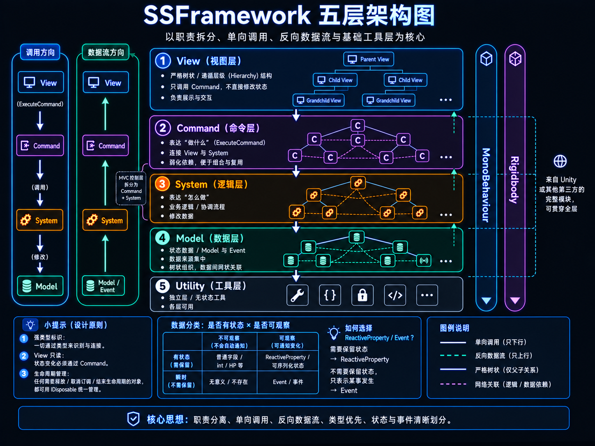

# SSFramework 用户手册

## 目录

1. [框架理念](#1-框架理念)
2. [架构总览](#2-架构总览)
3. [快速开始](#3-快速开始)
4. [Context（上下文）](#4-context上下文)
5. [Model 与 Event（数据层）](#5-model-与-event数据层)
6. [System（逻辑层）](#6-system逻辑层)
7. [Utility（工具层）](#7-utility工具层)
8. [View（视图层）](#8-view视图层)
9. [Command（命令）](#9-command命令)
10. [多上下文：层级与平行](#10-多上下文层级与平行)
11. [容器注册与解析规则](#11-容器注册与解析规则)
12. [纯代码上下文](#12-纯代码上下文)
13. [AssetReference（资源引用）](#13-assetreference资源引用)
14. [数据流：异步原语的统一抽象](#14-数据流异步原语的统一抽象)
15. [热更新（HybridCLR）](#15-热更新hybridclr)
16. [配置表（Luban）](#16-配置表luban)
17. [UI 框架（窗口 / 层级）](#17-ui-框架窗口--层级)
18. [本地存储（存档）](#18-本地存储存档)
19. [音频（BGM / 音效）](#19-音频bgm--音效)
20. [游戏流程状态机](#20-游戏流程状态机)
21. [本地化（多语言）](#21-本地化多语言)
22. [字体（多语言字体链）](#22-字体多语言字体链)
23. [框架诊断面板](#23-框架诊断面板)
24. [响应式集合与列表绑定](#24-响应式集合与列表绑定)
25. [网络（HTTP / WebSocket）](#25-网络http--websocket)
26. [推荐项目结构](#26-推荐项目结构)
27. [UI 嵌入桥（把 UGUI / 相机内容嵌进 UI Toolkit）](#27-ui-嵌入桥把-ugui--相机内容嵌进-ui-toolkit)
28. [日志（分级 + 可插拔 sink）](#28-日志分级--可插拔-sink)

---

## 1. 框架理念

---

### 🔧 从一个问题开始

传统 MVC 里，Controller 是一个矛盾的存在：它既要响应用户输入、又要协调数据、还要驱动业务逻辑，随着项目规模增长，Controller 几乎必然变成难以维护的"垃圾桶"。

这个框架的出发点是把 Controller 一分为二：

| | 职责 | 归属 |
|---|---|---|
| **System** | 封装"怎么做"——修改数据、协调逻辑、发出通知 | 逻辑开发者 |
| **Command** | 封装"做什么"——用户意图的原子化表达，连接 View 与 System | 视图开发者 |

两者之间有一条清晰的接缝：视图开发者定义 Command 接口，逻辑开发者实现 System，通过 Command 对接，互不干扰。Command 的典型职责来自两个方向——**向下**整理参数调用 System，**向上**取数适配后返回给 View。

---

### ➡️ 数据流动的方向

有了这个分工，整条流程的方向就自然确定了：

```
调用方向：  View ──→ Command ──→ System ──→ Model
数据方向：  View ←── 查询 Command 返回订阅源 ←── System / Model
```

> **核心原则** — View 只发 Command：不获取 System，不持有 Model，不写 Model，也不发送 Event。数据反向流动时，View 通过只读查询 Command 拿到 `Observable<T>` / `ReadOnlyReactiveProperty<T>` 等只读订阅源，再用 `Bag` 管理订阅生命周期；需要当前值时优先返回 `ReadOnlyReactiveProperty<T>`。这条单向约束保证了任何改动都有迹可查，也杜绝了逻辑环路。

---

### 📊 重新理解"数据"

沿着这条数据流思考下去，会遇到一个有趣的问题：**事件算是数据吗？**

把数据拆成两个维度——*是否有状态*（能随时查询当前值）和*是否可观察*（能订阅变化）——就能得到一张完整的地图：

|  | 不可观察 | 可观察 |
|---|---|---|
| **有状态**（保留当前值） | 普通字段 `int HP` | `SerializableReactiveProperty<int> HP` |
| **瞬时**（无当前值可查） | — 无意义，不存在 | 事件 `IEvent` |

事件正好落在"瞬时可观察"这格。它和 Model 中的字段**同属数据层**，只是没有"当前值"——这不只是概念整理，它直接推导出了权限规则：

> **设计推论** — View 可以订阅由查询 Command 返回的 `Observable<T>` / `ReadOnlyReactiveProperty<T>`，也可以监听事件，因为两者都是在"观察"数据。但 View **不能发出事件**，就如同不能直接写 Model 字段——View 只读不写，System 才是数据变化的生产者。

**选哪个？** 问自己一个问题就够了：*新订阅者需要立刻知道当前状态吗？* 需要 → `ReactiveProperty` / `SerializableReactiveProperty`，对外暴露只读的 `ReadOnlyReactiveProperty`；不需要 → `Event`。

---

### 🔁 生命周期的统一管理

把这些概念落到代码，会发现它们共享同一个问题：**订阅需要取消，引用需要释放**。框架中一切有生命周期的资源都实现 `IDisposable`，通过同一套模式管理。`MonoViewBase` 内置 `Bag`（`DisposableBag`），所有订阅经它统一登记，`OnDestroy` 时批量清理：

```csharp
protected override void Awake()
{
    base.Awake();
    var hp = this.ExecuteCommand(new GetHPStateCommand());
    Bag.Subscribe(hp, OnHPChanged);                   // ReadOnlyReactiveProperty 订阅（R3 自动推 current value）
    Bag.Subscribe<PlayerHurtEvent>(OnHurt);            // 事件订阅
    Bag.Subscribe(_btn.onClick, OnClick);              // UnityEvent 监听
}
// 无需手动 OnDestroy —— MonoViewBase 已经处理
```

| 资源类型 | Dispose 行为 |
|---|---|
| `GameContext` | 释放事件总线，触发 `CancellationToken` 取消 |
| 事件 / 属性订阅 | 取消订阅 |
| `AssetReference` | 释放已加载的资产 |

> **提示** — Context 的 Dispose 会级联取消所有使用 `ctx.CancellationToken` 的异步操作，不需要手动处理。View 销毁时 `Bag.Dispose()` 同样会自动级联清理所有注册的订阅。

---

### 🏷️ 用类型代替字符串和枚举

代码里的字符串和枚举都是"廉价标识"——用一个值区分不同事物。但**类本身就是一种类型**，很多时候这种区分直接用类型来表达更安全、更易维护。

以事件系统为例：

```csharp
// ❌ 字符串事件：重构时漏改一处就出 bug，IDE 无法追踪引用
eventBus.Send("player_hurt");

// ❌ 枚举事件：添加新事件要改枚举定义，监听方要写 switch-case
eventBus.Send(EventType.PlayerHurt);

// ✅ 类型事件：每种事件本身就是一个类型，IDE 可找到所有引用，重命名安全
public record struct PlayerHurtEvent(int Damage) : IEvent;
this.SendEvent(new PlayerHurtEvent(10));
this.RegisterEvent<PlayerHurtEvent>(e => TakeDamage(e.Damage));
```

> **延伸思考** — 这个思路贯穿整个框架：Model/System/Utility 用类型区分而非枚举分发，`AssetReference<AudioClip>` 用泛型类型替代字符串路径，Command 用具体类型区分操作。**代码里能少一个字符串或枚举，就少一处潜在的错误来源和重构负担。**

框架**不限制**你的使用方式——如果某个场景确实需要字符串或枚举驱动的事件，包一层即可：

```csharp
// 字符串驱动：
public record struct StringEvent(string Type) : IEvent;
this.SendEvent(new StringEvent("scene_loaded"));

// 枚举驱动：
public record struct UIEvent(UIActionType Action) : IEvent;
this.SendEvent(new UIEvent(UIActionType.Open));
```

---

### 🔌 面向接口，按需替换

层与层之间的依赖一律通过**接口**表达，调用方不感知背后的具体类。View 不直接持有这些接口；它只执行 Command，由 Command 在上下文中解析接口：

```csharp
public readonly struct HealCommand : ICommand
{
    public void Execute(ICommandContext ctx) => ctx.GetSystem<IPlayerSystem>().Heal();
}
```

这带来一个关键能力：在子 Context 的 `InstallBindings` 里注册不同实现，整个上下文的行为就换掉了，调用方代码**零修改**。测试场景、平台差异化实现、运行时切换——都能用同一个机制解决。

> **典型场景** — 测试时在 `TestContext` 注册 `MockPlayerSystem`，主场景注册 `PlayerSystem`，View 和 Command 的代码完全不变。

---

### 🧩 多上下文：组合而非配置

多个 Context 可形成父子关系，子 Context 自动继承父 Context 的服务，只需注册自己独有的部分：

```
MainContext               ← 全局服务：Audio、Save、Config（注册一次）
├── LobbyContext          ← 只注册大厅相关内容，全局服务自动继承
└── BattleContext         ← 只注册战斗相关内容，全局服务自动继承
    └── BossContext       ← Boss 专属逻辑，继承整条链
```

这一层级结构直接带来两个实际收益：

> **多上下文的优势**
>
> **模块复用** — 全局服务（Audio、Save、Config）在根 Context 注册一次，所有子上下文自动继承，不重复注册、不互相耦合。
>
> **最小测试环境** — 为被测模块搭一个只含必要依赖的 Context，其余用 Mock 填充，不需要启动整个游戏。

---

### 🗂️ 让 Hierarchy 替你说话

大多数框架用代码声明依赖关系；这里直接用 **Unity 的场景层级**表达 Context 的父子关系——把子 Context 的 GameObject 放在父 Context 节点下，框架自动识别，无需任何注册代码。**改变继承关系只需拖动 GameObject。**

Model 和 System 也可以直接挂在 GameObject 上，出现在 Hierarchy 和 Inspector 里：

```
Hierarchy                        Inspector（运行时）
MainContext
├── PlayerModel       →          HP: 87  Stamina: 42
├── InventorySystem   →          Resolved Context: MainContext
└── Canvas
    └── HudView       →          [Inject] _fmt: CounterFormatter
```

运行时可以直接在 Inspector 里看到 Model 字段的当前值，拖动节点即可把 Model 换到另一个 Context 验证不同组合——这是大多数框架做不到的。

> **澄清误解** — "挂在 GameObject 上 = 视图层"是一个普遍但错误的直觉。MonoBehaviour 的本质只是让 Unity 引擎识别这个对象并参与生命周期调度，**一个对象属于哪个架构层，由设计逻辑决定，与是否继承 MonoBehaviour 无关。**
>
> 正因如此，你可以直接在 System 或 Model 里写可视化调试代码——`OnDrawGizmosSelected` 绘制 AI 路径、`OnGUI` 叠加数值面板，这些完全属于 System/Model 内部，不影响架构定位，调试完删掉，其他代码零影响。

---

### 🌳 树状思维：一棵树贯穿全框架

上面两节是同一个理念的两个侧面。框架把「树」作为统一的组织原语，结构性问题都用同一棵树回答：

| 维度 | 载体 | 沿树发生什么 |
|---|---|---|
| **作用域**（解析边界） | Context 嵌套成作用域树 | 解析自下而上回退：子级没有的服务往父级找，子级注册同类型则覆盖 |
| **归属**（注册去向） | Unity Hierarchy 是作用域树的可视化载体 | 注册就近向上：`MonoXxxBase` 挂在哪个 Context 子树下，Awake 就注册进哪个作用域 |
| **生命周期**（清理时机） | `DisposableBag` 树（`CreateChild` 嵌套） | 释放自上而下级联：父 bag Dispose 连根带走子作用域的订阅 / 资源句柄 / 池租借，取消令牌同步级联 |

三个维度对齐到同一句话：**结构即语义**——把节点放进哪个子树，就同时决定了它的依赖从哪来（解析）、它服务谁（注册）、它何时被清理（生命周期）。三件事一次表达，不需要三套配置。

这带来的实际便利：

- **测试 / 沙盒场景信手搭**：拖一个子 Context 节点、把被测的 Model / System 挂进它的子树，就得到一个隔离作用域——缺的依赖自动回退父级（或在子级注册 Mock 覆盖），测完删掉整棵子树即净，主场景零污染。
- **关卡 / 副本 / 面板的局部世界**：局部状态注册在局部 Context，切场景整层 Dispose，临时注册不泄漏到全局。
- **prefab 即插即用**：内含 `MonoXxxBase` 的 prefab 实例化到任何位置，沿父链就近接入宿主作用域；换挂载位置 = 换依赖来源，拖一下节点完成。

可运行演示见 demo「多 Context · 作用域树」章：同一个 Command 在子 / 根 Context 上执行，作用于各自作用域的数据。

---

### 🪢 视觉是核心，引擎组件可跨层

游戏与普通业务代码有一个根本差异：**视觉本身就是产品**。这让很多 Unity 引擎组件天然同时承担"数据"、"逻辑写入对象"、"视图源头"三重身份——`Rigidbody` 是物理状态（位置、速度、约束），是物理仿真的写入接口（`AddForce` 修改它），也是渲染管线每帧读取的位置源（玩家看到的"球在飞"）。`Transform`、`Collider`、`Animator`、`ParticleSystem`、`LineRenderer` 同属此类。

如果僵化地把它们塞进单一层，反而要在层间复制冗余数据、手工同步。框架的回答是：**这类引擎组件正交于五层，可以同时被多个层共享**——Model 直接存放，System 直接写入，View 由引擎自动渲染。

```csharp
// Model：直接持有 Rigidbody，把它当作"物理状态"
public class ProjectileModel : MonoModelBase
{
    [field: SerializeField] public Rigidbody Body   { get; private set; }
    [field: SerializeField] public RP<float>   Damage { get; private set; } = new(10f);
}

// System：直接写入引擎组件，效果等价于改 Model 字段
public class ProjectileSystem : MonoSystemBase, IProjectileSystem
{
    [Inject] private ProjectileModel _model;
    public void Launch(Vector3 dir, float speed)
        => _model.Body.AddForce(dir * speed, ForceMode.Impulse);
}

// View：什么都不用写——Unity 渲染管线每帧自动把 Body 的 transform 画出来
```

数据流依然是单向的：System 写、View 看，Model 持有载体。只是这次"写入 → 显示"的链路由 Unity 引擎自己闭环，框架不需要在中间再转一道手——硬要把位置抄到 `RP<Vector3>`、再让 View 订阅后写回 `transform.position`，等于绕开引擎做一遍重复工作。

> **何时拥抱跨层** — 看一个引擎组件是否同时满足：(1) Inspector 可直接观察当前值；(2) 由引擎或 System 修改；(3) Unity 自带渲染或反映机制。满足就让它直接作为 Model 字段，让引擎做它最擅长的事。

> **边界** — 这不是普通业务字段的"逃逸通道"。金币、等级、回合状态等纯逻辑数据仍走"Model `RP<T>` → System 写 → Command 返回只读源 → View 订阅"的完整链路。跨层只属于那些天生就被引擎本身贯穿的组件。

---

## 2. 架构总览

框架由五层组成，自上而下依次是 **View / Command / System / Model / Utility**：



### 各层职责与内部结构

| 层 | 职责 | 内部结构 |
|---|---|---|
| **View** | 观察数据、响应用户、不直接写状态 | 严格树状（沿 Unity Hierarchy，父 View → 子 View） |
| **Command** | 封装"做什么"——一次用户意图的原子化表达，View 写入数据的唯一入口 | 本质网状、主体树状 |
| **System** | 封装"怎么做"——修改 Model、协调规则、发出事件，Model 的唯一合法写入者 | 本质网状、主体树状 |
| **Model + Event** | 数据层。Model 持有当前值，Event 是无当前值的瞬时通知（详见 §1.3） | 本质网状、主体树状 |
| **Utility** | 无状态工具函数，不依赖任何业务层 | 独立基础层，所有层均可调用 |

> **Command 与 System 是拆开的 Controller** —— 视图开发者声明 Command 接口，逻辑开发者实现 System，两边通过 Command 类型对接，互不耦合。Command 的典型职责：**向下**整理参数调用 System，**向上**从 Model 取数适配后返回给 View。

### 数据流向

```
调用方向（写入）：
  View ──(ExecuteCommand)──→ Command ──(调用)──→ System ──(修改)──→ Model

数据方向（读取 / 订阅）：
  View ←──── Command ←──── System / Model / Event
```

- **写入必须完整走链** —— View 任何状态变化都要通过 `Command → System → Model`，View 自身不直接写
- **读取也通过 Command** —— View 不直接获取 Model/System；需要一次性取值或持续订阅时，用只读 Command 返回值或订阅源

### MonoBehaviour 与 Rigidbody：贯穿五层的引擎能力

架构图右侧的 `MonoBehaviour / Rigidbody / Transform / ...` 是 Unity 引擎层面的**完整解决方案**——任意业务层都可以继承 `MonoBehaviour` 获得生命周期与 Inspector 序列化，Model 可以直接持有 `Rigidbody` 引用把物理对象当数据载体使用。它们正交于五层架构，**不参与依赖判定**（详见 §1.8"视觉是核心，引擎组件可跨层"）。

### 各层权限速查

各层的权限由接口在编译期约束，不靠口头约定：

| 层 | 可获取（`this.GetXxx<T>()`） | 可操作 |
|---|---|---|
| **Model** | Utility | — |
| **System** | Model、System、Utility | 修改 Model、发送/监听事件 |
| **Utility** | — | — |
| **View** | Utility | 发送 Command、监听事件 |
| **Command** | 通过 `Execute(ICommandContext ctx)` 参数访问一切层 | 调用 System、读取 Model、发送事件 |

> View 不在权限矩阵里直接访问 Model/System/EventBus，是为了强制所有外发动作只走 Command。需要 View 显示状态时，用只读查询 Command 返回值；持续状态用只读查询 Command 返回 `ReadOnlyReactiveProperty<T>` / `Observable<T>` 订阅源。

> **约束的性质：防误用，不防绕过。** 这套权限是 C# 类型系统能给到的最强形态——顺手写 `this.GetModel<T>()` 在 View 里编译不过、`[Inject]` 越权在注入期被拦；但它不是运行时沙箱：刻意强转（如把 `ICommandContext` cast 回具体 Context）仍然可行。设计目标是让"无意间越界"变得困难、让"刻意越界"在代码评审里显式可见，而不是对抗恶意代码。

---

## 3. 快速开始

看一个最小可运行的例子，把上面提到的所有层串起来：

```
Scene
└── MainContext          ← 全局根（MonoGlobalContext 子类）
    ├── PlayerModel      ← 数据层（MonoModelBase 子类）
    ├── PlayerSystem     ← 逻辑层（MonoSystemBase 子类）
    └── Canvas
        └── HudView      ← 视图层（MonoViewBase 子类）
```

```csharp
// Context — 注册无需挂节点的纯 C# 服务
public class MainContext : MonoGlobalContext
{
    protected override void InstallBindings(ContainerBuilder builder)
    {
        builder.RegisterValue(new CommandSystem(), typeof(ICommandSystem));
    }
}

// Model — 持有数据，RP<int> 可订阅且 Inspector 可见
public class PlayerModel : MonoModelBase
{
    [field: SerializeField] public RP<int> HP { get; private set; } = new(100);
}

// System — 封装逻辑，是修改数据的合法来源
public interface IPlayerSystem : ISystem
{
    ReadOnlyReactiveProperty<int> HP { get; }
    void TakeDamage(int amount);
}

public class PlayerSystem : MonoSystemBase, IPlayerSystem
{
    [Inject] private PlayerModel _model;

    ReadOnlyReactiveProperty<int> IPlayerSystem.HP => _model.HP;

    public void TakeDamage(int amount)
    {
        _model.HP.Value -= amount;
        this.SendEvent(new PlayerHurtEvent(amount));  // 同步通知感兴趣的监听者
    }
}

// Command — 封装一次用户意图，连接 View 和 System（推荐 struct：零分配）
public readonly struct TakeDamageCommand : ICommand
{
    public void Execute(ICommandContext ctx) => ctx.GetSystem<IPlayerSystem>().TakeDamage(10);
}

public readonly struct GetHPStateCommand : ICommand<ReadOnlyReactiveProperty<int>>
{
    public ReadOnlyReactiveProperty<int> Execute(ICommandContext ctx) => ctx.GetSystem<IPlayerSystem>().HP;
}

// View — 只发 Command，不直接获取 Model/System/EventBus
public class HudView : MonoViewBase
{
    protected override void Awake()
    {
        base.Awake();
        var hp = this.ExecuteCommand(new GetHPStateCommand());
        Bag.Subscribe(hp, hpValue => _hpText.text = hpValue.ToString());  // 订阅即得 current value
        Bag.Subscribe<PlayerHurtEvent>(e => PlayHurtAnim());
        Bag.Subscribe(_btn.onClick, () => this.ExecuteCommand(new TakeDamageCommand()));
    }
    // Bag 由 MonoViewBase.OnDestroy 自动释放
}
```

点击按钮，数据流完整走一圈：Command 调用 System，System 修改 Model 并发出事件，View 响应式更新文本，同时播放受击动画。文本更新和动画播放互相不知道对方——这就是第 1 章"单向数据流"在代码里的具体形状。

---

## 4. Context（上下文）

Context 是整个框架的容器，它持有 DI 容器、事件总线和命令系统，是所有层注册和解析依赖的根据地。理解 Context，是理解后续一切的前提。

> **术语口径：Context vs 作用域。** 对象统一叫 **Context / 上下文**（`GameContext` 实例——持有容器、事件、命令的能力环境，回答「它是什么」）。**作用域 / scope** 只描述「生命周期 / 解析边界」这一侧面：多个 Context 嵌套成一棵**作用域树**做解析回退，`Bag.CreateChild()` 开一个**更短的作用域**。同一对象两面都成立，但命名时——对象 = Context，结构与寿命 = 作用域；别把某个 Context 实例直接叫成「作用域」。

### 全局根上下文

每个项目需要一个全局根上下文，继承 `MonoGlobalContext`，挂在场景根节点：

```csharp
public class MainContext : MonoGlobalContext
{
    protected override void InstallBindings(ContainerBuilder builder)
    {
        // 在这里注册纯 C# 服务——不需要挂在场景节点上的对象
        builder.RegisterValue(new CommandSystem(), typeof(ICommandSystem));
        builder.RegisterValue(new JsonUtility(),   typeof(IJsonUtility));
    }
}
```

`MonoGlobalContext` 会自动将自身设为 `GameContext.Main`、开启 `DontDestroyOnLoad`，并检测重复实例。项目中只应有一个。

### Awake 执行顺序

框架通过 `DefaultExecutionOrder` 保证各层初始化顺序，让每一层 Awake 时它所需的上层都已就绪：

```
-2000  MonoGlobalContext    建容器，设置 GameContext.Main
-1000  MonoGameContextBase  建容器，识别父级（子/平行上下文用）
 -400  MonoUtilityBase      注册到容器
 -300  MonoModelBase        注册到容器
 -200  MonoSystemBase       注册到容器
 -100  MonoViewBase         注入 [Inject] 字段
```

> **提示** — 实际编写时几乎感知不到这个顺序。在任何 `MonoXxxBase` 的 `Awake()` 里调用 `base.Awake()` 后，当前层的注入已完成；若需要引用其他同级服务，在 `Start()` 或第一次调用时懒加载即可，不要在 `Awake()` 里直接访问兄弟节点的服务。

---

## 5. Model 与 Event（数据层）

Context 搭好之后，先思考数据——游戏状态放在 Model 里，状态变化的通知则通过 Event 广播。两者共同构成数据层，只是生命周期不同：Model 的数据随 Context 持续存在，Event 是一次性的瞬时信号。

### Model：有状态数据

Model 持有需要随时查询的游戏状态。需要让外部订阅变化的字段，用框架提供的 `RP<T>`（`using R3;`——框架的 RP 定义在 R3 命名空间下）——它是 `SerializableReactiveProperty<T>` 的泛型包装类，支持 Unity 序列化，Inspector 直接显示值（配有专用 `[CustomPropertyDrawer]`，不会多套一层），可用于任意类型。

推荐写成一行 auto-property，并把 `[SerializeField]` 标到 backing field 上：

```csharp
[field: SerializeField] public RP<int>        HP    { get; private set; } = new(100);
[field: SerializeField] public RP<float>      Speed { get; private set; } = new(5f);
[field: SerializeField] public RP<Vector3>    Pos   { get; private set; } = new();
[field: SerializeField] public RP<PlayerData> Stats { get; private set; } = new();
```

只读返回类型统一用 `ReadOnlyReactiveProperty<T>`。因为 `RP<T>` 继承链为 `RP<T>` → `ReactiveProperty<T>` → `ReadOnlyReactiveProperty<T>`，System/Command 实现可直接把 `RP<T>` 赋给 `ReadOnlyReactiveProperty<T>` 接口属性，**零分配无转换**，无需额外的 `ROP<T>` 包装类。不引入 `ReadOnlyReactiveProperty<int>` 之类的别名：C# 不支持泛型 `using` 别名，闭合别名（`using ReadOnlyReactiveProperty<int> = ReadOnlyReactiveProperty<int>;`）只能 per-assembly 声明、跨程序集失效，且 `ROP` 缩写不如全名自解释，对人和 AI 都更难追溯。

> **`RP<T>` 位置说明**：`RP<T>` 在 `Game.Framework` 程序集内（`Core/Reactive/RP.cs`），业务无论在 Assembly-CSharp 还是独立 asmdef 引用框架后都能使用；其 Inspector 绘制器 `RPDrawer` 在 `Game.Framework.Editor` 程序集，注册到 `RP<>`。

对外不要把可写的 `ReactiveProperty<T>` 暴露给 View。View 只执行 Command；需要显示状态时，由只读查询 Command 返回 `ReadOnlyReactiveProperty<T>` 或 `Observable<T>`。优先返回 `ReadOnlyReactiveProperty<T>`，因为它既能订阅变化，也能读取 `CurrentValue` 初始化 UI。

#### 常见 R3 类型分工

| 类型 | 角色 | 是否有当前值 | 是否可写 | 典型用途 |
|---|---|---:|---:|---|
| `Observable<T>` | 只读时间流基类 | 不保证 | 否 | View 只需要订阅变化，不关心当前值 |
| `ReactiveProperty<T>` | 可写响应式状态 | 是，`Value` / `CurrentValue` | 是 | Model/System 内部持有和修改状态 |
| `RP<T>` | 泛型可写可序列化响应式状态 | 是 | 是 | **Mono Model 字段首选**，任意类型，Inspector 可见且不多套层 |
| `SerializableReactiveProperty<T>` | Unity 可序列化响应式状态 | 是 | 是 | `RP<T>` 的基类；不直接用，用 `RP<T>` 代替 |
| `ReadOnlyReactiveProperty<T>` | 只读响应式状态 | 是，`CurrentValue` | 否 | Command/System 返回给 View 的状态源（`RP<T>` IS-A `ReadOnlyReactiveProperty<T>`） |
| `ISubject<T>` / `Subject<T>` | 手动推送的冷热桥接流 | 否 | 可 `OnNext` | 封装外部回调、临时事件流；不要当长期状态用 |
| `Observer<T>` | 订阅端回调对象 | — | — | 需要处理 `OnErrorResume` / `OnCompleted` 时使用 |

#### Mono 路径（推荐）

挂在 Context 子节点下，Awake 时自动注册：

```csharp
public class InventoryModel : MonoModelBase
{
    [field: SerializeField] public RP<int> Gold { get; private set; } = new(0);
    public List<ItemData> Items = new();
}
```

#### 纯 C# 路径

适合配置类数据，或不需要出现在 Hierarchy 中的数据：

```csharp
public class ConfigModel : IModel { public string Language = "zh"; }

ctx.RegisterModel(new ConfigModel());
```

### Event：瞬时可观察数据

Event 用于"发生了某件事"的一次性通知，不保留历史。推荐用 `record struct` 定义，零堆分配：

```csharp
public record struct GoldChangedEvent(int Delta) : IEvent;
public record struct ItemAddedEvent(ItemData Item) : IEvent;
```

System 在修改 Model 后发出对应事件，View 或其他 System 根据需要监听：

```csharp
// System 中发送
this.SendEvent(new GoldChangedEvent(delta));

// View 中监听（推荐用 Bag 统一管理生命周期）
Bag.Subscribe<GoldChangedEvent>(e => UpdateUI(e.Delta));

// 任意 System/Command 中监听并自行管理 IDisposable
var sub = this.RegisterEvent<GoldChangedEvent>(e => UpdateUI(e.Delta));
```

> 选择时问自己：*新订阅者需要立刻知道当前状态吗？* 需要就用 `SerializableReactiveProperty`，不需要就用 `Event`。

---

## 6. System（逻辑层）

数据有了，接下来需要操作它的逻辑。System 是修改 Model、发出 Event 的合法来源，业务逻辑的主要归宿。

#### Mono 路径（推荐）

挂在 Context 子节点下，`[Inject]` 字段由框架在 Awake 时自动填充：

```csharp
public class InventorySystem : MonoSystemBase, IInventorySystem
{
    [Inject] private InventoryModel _model;

    public void AddGold(int amount)
    {
        _model.Gold.Value += amount;
        this.SendEvent(new GoldChangedEvent(amount));
    }

    public void AddItem(ItemData item)
    {
        _model.Items.Add(item);
        this.SendEvent(new ItemAddedEvent(item));
    }
}
```

#### 纯 C# 路径

当 System 不需要出现在场景中，或需要在代码里精确控制初始化顺序时使用：

```csharp
public class AudioSystem : ISystem, IHasGameContext, IAudioSystem
{
    [Inject] private ConfigModel _config;
    private GameContext _ctx;
    IGameContext IHasGameContext.Context => _ctx;
}

// 构建期注册（推荐）：值绑定实例在 Context 构造时自动完成 [Inject] 注入 + AttachTo（ADR-0019），无需手动补
builder.RegisterValue(new AudioSystem(), typeof(IAudioSystem));

// 运行时动态注册：错过了构建期时机，才需要手动补两步
var audio = new AudioSystem();
ctx.RegisterSystem(audio);
ctx.Inject(audio);    // 解析 [Inject] 字段
ctx.AttachTo(audio);  // 回写 _ctx 字段，让扩展方法可以使用
```

### 逐帧仿真（实时逻辑）

游戏里连续推进的逻辑——AI tick、移动、技能结算、计时器、状态机轮询——**不走 Command**（Command 只表达离散用户意图）。这类逐帧逻辑归 System，用既有原语驱动，框架不另设 tick 调度器：

```csharp
// Mono 路径：MonoSystemBase 本就是 MonoBehaviour，直接写 Update / FixedUpdate / LateUpdate
public class EnemyAISystem : MonoSystemBase, IEnemyAISystem
{
    [Inject] private EnemyModel _model;
    private void Update() { /* 每帧推进 AI，直接改 _model（System 是 Model 的合法写入者） */ }
}

// 纯 C# 路径：用 R3 Observable.EveryUpdate() 订阅进 Bag，宿主 / Context 释放时自动退订
// （MonoSystemBase 用内置 Bag；纯 C# System 用 new DisposableBag(ctx)）
Bag.Subscribe(Observable.EveryUpdate(), _ => Tick());
```

逐帧逻辑里 System 直接改 Model、需要广播时 `SendEvent`；View 仍只订阅、不参与仿真。同类 System 的 tick 先后依赖用 `[DefaultExecutionOrder]`（Mono）或一个"编排 System"显式按序调用，别依赖注册顺序。设计理由见 `docs/adr/0014-realtime-simulation-ownership.md`。

---

## 7. Utility（工具层）

有一类代码既不是状态数据，也不承载业务逻辑——它们是纯粹的工具函数，比如格式化、加密、序列化。这类代码放进 Utility，所有层（Model、System、View）都可以使用，但 Utility 本身不依赖任何层。

#### 纯 C# 路径（推荐）

Utility 通常是无状态的纯函数，不需要出现在场景里，直接在 `InstallBindings` 中注册：

```csharp
public interface IEncryptUtility : IUtility { string Encrypt(string data); }
public class EncryptUtility : IEncryptUtility { public string Encrypt(string data) => /* ... */; }

builder.RegisterValue(new EncryptUtility(), typeof(IEncryptUtility));
```

#### Mono 路径

当 Utility 需要访问 Unity API，或希望在 Inspector 中配置参数时，可以挂在节点上：

```csharp
public class EncryptUtility : MonoUtilityBase, IEncryptUtility
{
    [SerializeField] private string _key;  // Inspector 中配置
    public string Encrypt(string data) => /* ... */;
}
```

### 对象池（IPoolUtility）

框架自带对象池（`Game.Framework.Pool`），是一个 `IUtility`，与 `DisposableBag` 生命周期融合，替代第三方池库。

**注册有三种路径，按池的生命周期选：**

```csharp
// 1) 纯 C# · 跟随 Context：随 GameContext.Dispose 一起清池（推荐——不靠 DontDestroyOnLoad 残留）
builder.RegisterOwned(new PoolUtility(), typeof(IPoolUtility));
// 2) 纯 C# · 不关心释放（全局唯一、随进程退出）：RegisterValue 即可（不被 Context 拥有，不会被 Dispose）
builder.RegisterValue(new PoolUtility(), typeof(IPoolUtility));
// 3) Mono · Inspector 配置：在 Context 子节点挂 MonoPoolUtility，可视化配各 prefab 容量/预热，随该 GameObject/场景销毁自动清池
```

`MonoPoolUtility` 继承 `MonoUtilityBase`、内部复用同一套 `PoolUtility` 逻辑——它在 Inspector 暴露「prefab 池容量 / 预热数」配置，启动时按配置建池并分帧预热，宿主销毁时 Dispose 底层池（销毁停放节点与空闲实例）。需要按池配参数、或希望池跟随某个 Context 节点 / 场景生命周期时用它；全局共享、纯代码配置用上面的 `RegisterOwned`。

最常用的是 `Bag.Rent<T>()`——租借一个对象，宿主销毁 / `bag.Dispose` 时**自动归还**，和 `Bag.Load` 一样无感知：

```csharp
public class HitNumberView : MonoViewBase
{
    void ShowDamage(int n)
    {
        var label = Bag.Rent<DamageLabel>();   // 用完随 View 销毁自动归还，无需手动 Return
        label.Set(n);
    }
}
```

需要自定义工厂、租借/归还钩子或容量上限时，先配置一次池，再手动 `Rent`/`Return`：

```csharp
var pool = this.GetUtility<IPoolUtility>().GetPool<Bullet>(
    factory: () => new Bullet(),
    onReturn: b => b.Reset(),     // 归还时清理状态
    maxSize: 256);
var b = pool.Rent();
// ...
pool.Return(b);                   // 手动管理时显式归还
```

池化对象可实现 `IPoolable`，在 `OnRent` / `OnReturn` 收到回调。要点：

- **状态在归还时清理**（`IPoolable.OnReturn` 或 `onReturn` 委托），避免脏数据被下一个租借者看到。
- **已 `Return` 的对象不要再用**——它可能已被取走。
- **单个提前归还**：`Bag.Rent` 借出的实例在**同一 bag** 上 `bag.Return(obj)` 提前归还，自动摘除 Dispose 时的归还登记（不重复归还）；见下文「局部作用域」。
- 主线程独占；Editor / Development Build 下检测"重复归还 / 归还外来实例"。

#### GameObject / Prefab 池

同一个 `IPoolUtility` 也按 **prefab** 管理 GameObject 池，复用实例、避免频繁 `Instantiate`/`Destroy`。最常用的是 `Bag.Spawn(prefab)`——和 `Bag.Rent` / `Bag.Load` 一样，宿主销毁 / `bag.Dispose` 时**自动 Despawn（归还）**：

```csharp
public class EnemySpawnerView : MonoViewBase
{
    [SerializeField] GameObject _enemyPrefab;

    void SpawnAt(Vector3 pos)
    {
        // 取一个实例并定位；本 View 销毁时随 Bag 自动归还入池
        var enemy = Bag.Spawn(_enemyPrefab, pos, Quaternion.identity);
    }
}
```

要点与心智：

- **键控**：每个 prefab 对应一个池，`Spawn` 复用空闲实例（重置 local transform、`SetActive(true)`），`Despawn` 停用并挂回一个停用的 parking 节点。
- **手动管理**：`this.GetUtility<IPoolUtility>().Spawn(prefab, parent)` 取、`.Despawn(go)` 还（实例自带 `PooledObject` 标记，归还时自动路由回源池，无需再传 prefab）。
- **预热**：`await pool.Prewarm(n, perFrame)` 分帧实例化 `n` 个（每帧 `perFrame` 个，默认 1），把开销摊到多帧（适合加载界面期间调用）。
- **收缩 / 分帧销毁**：`await pool.TrimAsync(target, perFrame)` 把空闲实例分帧收缩到 `target` 个、`await pool.ClearAsync()` 分帧销毁全部空闲（要瞬时全销用 `Clear()`）；C# 池用同步 `pool.Trim(target)`。内存吃紧时回收过度预热的实例。
- **停放点自愈**：内部 `[Game.Framework PooledObjects]` 停放节点若被外部销毁，下次归还会自动重建，归还实例不会散落到场景根。
- **重置钩子**：实例上**任意组件**实现 `IPoolable`，即在 `OnRent` / `OnReturn` 收到回调（`OnReturn` 里清状态）。
- **位置加载组合**：池本身不做按 location 的异步加载——先 `var prefab = await Bag.Load<GameObject>("...")` 取到 prefab 再 `Bag.Spawn(prefab)`，刻意让 `PoolUtility` 不依赖资源系统（保持可被父子 Context 共享、不绑 Context）。
- 主线程独占；Editor / Dev 构建下检测"重复 Despawn / 归还非池化对象"。

#### 局部作用域：整批自动归还 + 单个提前归还

「一波敌人 / 一局 / 一个面板」这类局部作用域，用 `Bag.CreateChild()` 承接 live 集合：整批借进子 bag、作用域结束 `Dispose` 一次性归还。期间个别实例要提前退场（子弹命中、敌人死亡），调**同一个 bag** 的 `Return(obj)` / `Despawn(go)`——归还的同时摘除该实例的自动归还登记，`Dispose` 时不会重复归还。池缓存挂在更长寿的 Context 上跨作用域复用，live 集合跟局部子 bag 走：

```csharp
// 开一波：live 集合挂局部子 bag
_waveBag = Bag.CreateChild();
for (int i = 0; i < waveSize; i++)
    _waveBag.Spawn(_enemyPrefab, SpawnPoint(i), Quaternion.identity);

// 期间：单个敌人死亡，提前归还（自动摘登记，波次结束不会二次 Despawn）
_waveBag.Despawn(enemy);

// 波次结束：剩余敌人整批归还
_waveBag.Dispose();
```

- `Return` / `Despawn` 必须在**借出实例的同一个 bag** 上调用；外来实例 / 重复归还被忽略（Editor/Dev 下 LogError）。
- 纯 C# 对象同理：`bag.Rent<T>()` 配 `bag.Return(obj)`。
- 弹幕级高频热路径仍建议「领域 List + 手动池」（`GetUtility<IPoolUtility>()`）——`Return`/`Despawn` 按值反查并从登记列表线性摘除，量大时这笔开销不如手动管理直接。

---

## 8. View（视图层）

数据层和逻辑层都准备好了，现在需要把它们呈现给用户，并响应用户的操作。View 只做两件事：**观察数据**（订阅由 Command 返回的状态源、监听 Event），**发出意图**（通过 Command）。它不直接获取 System/Model/EventBus，也不直接修改任何状态。

`MonoViewBase` 内置 `Bag`（`DisposableBag`），所有订阅走同一个 `Subscribe` 方法，按参数类型分派，`OnDestroy` 时自动批量释放——不需要手动声明 `_bag` 或覆写 `OnDestroy`：

```csharp
public class InventoryView : MonoViewBase
{
    [Inject] private IEncryptUtility _enc;     // 工具

    protected override void Awake()
    {
        base.Awake();  // 必须先调用，[Inject] 字段在这里完成注入

        // ReadOnlyReactiveProperty
        var gold = this.ExecuteCommand(new GetGoldStateCommand());
        _goldText.text = gold.CurrentValue.ToString();
        Bag.Subscribe(gold, g => _goldText.text = g.ToString());

        // Framework Event（带数据）
        Bag.Subscribe<ItemAddedEvent>(e => RefreshItemList());

        // UnityEvent —— UnityEvent / C# delegate 等没有 IDisposable 的注册，
        // DisposableBag 内部自动包装为 Disposable.Create(...)
        if (_buyBtn != null)
            Bag.Subscribe(_buyBtn.onClick, () => this.ExecuteCommand(new BuyItemCommand(_selectedItemId)));

        // C# event/delegate（两侧对称，第一个 Action 立即执行，第二个 Dispose 时执行）
        Bag.Subscribe(
            () => _shopSystem.OnPriceChanged += RefreshPrice,
            () => _shopSystem.OnPriceChanged -= RefreshPrice);

        // 异步 Command —— 无参重载自动绑定 View + Context 双重生命周期
        if (_saveBtn != null)
            Bag.Subscribe(_saveBtn.onClick, async () =>
                await this.ExecuteCommandAsync(new SaveProgressCommand()));
    }

    // Bag 由 MonoViewBase.OnDestroy 自动释放，无需覆写
}
```

`Bag.Subscribe` 通过参数类型分派，覆盖所有常见订阅场景：

| 参数形态 | 用途 |
|---|---|
| `(Observable<T> source, Action<T> handler)` | R3 Observable / ReactiveProperty（RP 订阅时自动推一次 current value） |
| `<T>(Action<T> handler)` where `T : IEvent` | Framework Event（带数据） |
| `<T>(Action handler, bool invokeImmediately = false)` where `T : IEvent` | Framework Event（忽略数据，可选订阅时立即触发一次） |
| `(UnityEvent evt, UnityAction handler, bool invokeImmediately = false)` | UnityEvent（按钮点击等，可选订阅时立即触发一次） |
| `(UnityEvent<T> evt, UnityAction<T> handler)` | UnityEvent\<T\>（滑条、Toggle 等） |
| `(Action subscribe, Action unsubscribe)` | C# event/delegate（两侧对称） |
| `(IDisposable disposable)` | 已有 IDisposable 的逃生舱口 |

所有重载返回 `IDisposable`，需要提前取消某个订阅时可保存返回值并单独 Dispose。

**订阅时初始化**（与 R3 统一）：
- 状态流（`ReactiveProperty` / `ReadOnlyReactiveProperty`）订阅即得 current value（R3 内置）；想跳过初值用 `.Skip(1)`
- 无数据通知（无参 Framework Event / 无参 UnityEvent）传 `invokeImmediately: true` 在注册后立即跑一次
- 带数据事件需要订阅时初始化，**走 Observable 桥接 + `.Prepend(value)`**（不再为这种场景加重载）：
  ```csharp
  // Framework Event：用扩展方法 OnEvent<T>() 桥接为 Observable<T>
  Bag.Subscribe(this.OnEvent<GoldChangedEvent>().Prepend(new GoldChangedEvent { NewGold = currentGold }), OnGoldChanged);
  // UnityEvent<T>：R3 已提供 AsObservable() 扩展
  Bag.Subscribe(_slider.onValueChanged.AsObservable().Prepend(_slider.value), OnSlide);
  ```
  进入 Observable 后所有 R3 操作符（`Where` / `Throttle` / `CombineLatest` 等）均可用，便利重载之外的复杂订阅一律走这条路径。

### 多生命周期作用域

`Bag` 跟随 View 的 `OnDestroy` 释放，覆盖 80% 的场景。如果某些订阅只在 Enable 期间或某段业务期间存活，按需自行 `new` 一个 `DisposableBag`，用前缀区分清理时机：

```csharp
public class BattleView : MonoViewBase
{
    private DisposableBag _enableBag;   // OnDisable 清理
    private DisposableBag _roundBag;    // 回合结束清理

    protected override void Awake()
    {
        base.Awake();
        var hp = this.ExecuteCommand(new GetHPStateCommand());
        Bag.Subscribe(hp, OnHPChanged);  // 整个 View 寿命（订阅时 R3 自动推 current HP）
    }

    protected virtual void OnEnable()
    {
        _enableBag = Bag.CreateChild();  // 父级 Bag 的子作用域，OnDisable 时 Dispose 自动级联清理
        var isTargeted = this.ExecuteCommand(new GetTargetedStateCommand());
        _enableBag.Subscribe(isTargeted, ShowMark);
    }

    protected virtual void OnDisable()
    {
        _enableBag?.Dispose();
        _enableBag = null;
    }
}
```

有时 View 需要一次性读取某个数据而不是持续订阅，这时用带返回值的 Command，将取数逻辑也封装起来：

```csharp
public readonly struct GetGoldCommand : ICommand<int>
{
    public int Execute(ICommandContext ctx)
        => ctx.GetModel<InventoryModel>().Gold.Value;
}

int gold = this.ExecuteCommand(new GetGoldCommand());
```

### 读密集 UI：用只读投影打包多个状态源

复杂面板往往要同时观察很多状态。逐个写「一字段一查询」的查询 Command 会膨胀成一堆近乎重复的类型。更轻的做法：**用一个查询 Command 返回一个「只读投影」对象，把这面板要的多个只读源打包进去**——一面板一查询。

```csharp
// 只读投影：只暴露 ReadOnlyReactiveProperty，View 看得到、改不了（写仍走 Command）
// 命名用 Projection 而非 View / Model——后两者是框架层名，会引起误解（这是 CQRS 的 read projection）
public sealed class HudProjection
{
    public ReadOnlyReactiveProperty<int> HP    { get; }
    public ReadOnlyReactiveProperty<int> Gold  { get; }
    public ReadOnlyReactiveProperty<int> Level { get; }
    public HudProjection(IPlayerSystem p, IInventorySystem inv)
        { HP = p.HP; Gold = inv.Gold; Level = p.Level; }   // 引用已有只读源，不持有状态
}

public readonly struct GetHudProjectionCommand : ICommand<HudProjection>
{
    public HudProjection Execute(ICommandContext ctx)
        => new(ctx.GetSystem<IPlayerSystem>(), ctx.GetSystem<IInventorySystem>());
}

// View：一次查询拿到整包，再各自订阅
var hud = this.ExecuteCommand(new GetHudProjectionCommand());
Bag.Subscribe(hud.HP,    v => _hpText.text = v.ToString());
Bag.Subscribe(hud.Gold,  v => _goldText.text = v.ToString());
Bag.Subscribe(hud.Level, v => _lvText.text = v.ToString());
```

要点与权衡：
- 命名用 `XxxProjection`，**别用 `XxxView` / `XxxReadModel`**——`View` / `Model` 是框架层名，投影既不是 View 层也不是 Model 层，沿用层名会误导。
- 投影只暴露 `ReadOnlyReactiveProperty`（或 `Observable`），**写仍只能走 Command**——单向数据流约束不松动，只是把读路径的样板收成一处。
- 投影是「读视图」不是 Model：在查询 Command 里现组装、只引用已有的只读源，不持有状态、不注册进容器。需要派生 / 过滤 / 组合时直接在投影里放 R3 操作符链（如 `p.HP.Select(...)`）。
- **字段少（一两个）时直接「一字段一查询」更直白**；字段多的复杂面板才用投影收口，别为收口而收口。

View 在 Awake 时按以下顺序查找自己所属的 Context，通常不需要手动设置：

1. Inspector 中显式设置的 `Target Context`
2. Transform 父链中最近的 `MonoGameContextBase`
3. `GameContext.Main` 全局兜底

---

## 9. Command（命令）

View 和 System 之间需要一个"翻译"——View 知道用户想做什么，但不知道怎么做；System 知道怎么做，但不关心谁触发的。Command 就是这个翻译，把一次用户操作封装成一个原子行为，交给 System 执行。

### struct Command（推荐，零 GC 压力）

同步 Command 的默认选择。声明为 `readonly struct`，栈上分配，不产生 GC 压力。依赖通过 `ctx` 参数实时获取，简洁且直接：

```csharp
public readonly struct AddGoldCommand : ICommand
{
    public readonly int Amount;
    public AddGoldCommand(int amount) => Amount = amount;

    public void Execute(ICommandContext ctx)
        => ctx.GetSystem<IInventorySystem>().AddGold(Amount);
}
```

### class Command（支持 `[Inject]`）

当依赖项多、希望框架自动注入时使用。框架在执行前填充 `[Inject]` 字段，但每次 `new` 都会堆分配：

```csharp
public class BuyItemCommand : ICommand
{
    private readonly int _itemId;
    public BuyItemCommand(int itemId) => _itemId = itemId;

    [Inject] private IInventorySystem _inventory;
    [Inject] private IShopSystem _shop;

    public void Execute(ICommandContext ctx)
    {
        var price = _shop.GetPrice(_itemId);
        _inventory.SpendGold(price);
        _inventory.AddItem(_itemId);
    }
}
```

### 带返回值的 Command

当 View 需要取数而非触发操作时，Command 也可以有返回值：

```csharp
public readonly struct GetGoldCommand : ICommand<int>
{
    public int Execute(ICommandContext ctx)
        => ctx.GetModel<InventoryModel>().Gold.Value;
}

int gold = this.ExecuteCommand(new GetGoldCommand());
```

### 异步 Command

涉及 IO、网络或带延时的操作时，使用异步版本。`cancellationToken` 参数已由框架合并好——无需在命令内部再访问 `ctx.CancellationToken`，直接用这一个参数即可：

```csharp
// 异步命令默认也用 readonly struct——struct 一样可以有 async 方法，经 ctx 取依赖
public readonly struct SaveProgressCommand : IAsyncCommand
{
    public async UniTask ExecuteAsync(ICommandContext ctx, CancellationToken cancellationToken)
    {
        // UniTask 的异步 API 都接受 cancellationToken，直接传入
        await ctx.GetSystem<ISaveSystem>().WriteAsync(cancellationToken);
    }
}
```

View 调用无参版本时，框架自动检测 `MonoBehaviour`，把 View 销毁令牌（`GetCancellationTokenOnDestroy`）与 Context 生命周期令牌链接，任一方取消即中止命令：

```csharp
// 从 View 调用：自动绑定 View 销毁 + Context 销毁双重生命周期
await this.ExecuteCommandAsync(new SaveProgressCommand());

// 需要自定义取消源时显式传入
await this.ExecuteCommandAsync(new SaveProgressCommand(), customToken);
```

非 View 路径（如 System / 纯 C# 持有者）调用无参版本时，只会绑定 Context 生命周期。

### 命令内组合子命令

Command 可以在内部调用子 Command 把行为拆小、复用——通过 `ctx` 参数发起（不是 `this.ExecuteCommand`：Command 不持有 `ICanSendCommand` 权限，统一经 `ctx`）：

- 同步子命令：`ctx.ExecuteCommand(new SubCommand())`
- 异步子命令：`await ctx.ExecuteCommandAsync(new SubCommand(), cancellationToken)`——把命令自己的 `cancellationToken` 透传给子命令，取消随父命令级联（最终随 View / Context 生命周期）

```csharp
public readonly struct CheckoutCommand : IAsyncCommand
{
    public async UniTask ExecuteAsync(ICommandContext ctx, CancellationToken cancellationToken)
    {
        ctx.ExecuteCommand(new ValidateCartCommand());                          // 同步子命令
        await ctx.ExecuteCommandAsync(new ChargeCommand(), cancellationToken);  // 异步子命令
    }
}
```

> 子命令仍只能经 `ctx` 访问层。相比直接调 System 方法，走子命令的价值在于「能被可插拔 CommandSystem 装饰器统一拦截」（日志 / 回放 / 事务，见下）；不需要拦截时直接调 System 方法更直接。

### 选型建议

| 场景 | 选择 |
|---|---|
| 绝大多数同步场景（默认） | `readonly struct` + `ctx.GetXxx` |
| 依赖项多、需要 `[Inject]` 自动注入 | `class` + `[Inject]` |
| 带返回值（一般） | `readonly struct ICommand<T>` + 可推断调用 `ExecuteCommand(new Cmd())`——会装箱一次，绝大多数场景（Awake 取一次订阅源等）够用 |
| 带返回值 + 热路径要零装箱 | `readonly struct ICommand<T>` + 显式双泛型 `ExecuteCommand<TCmd, TResult>(new Cmd())`——绕开会装箱的可推断重载（`TResult` 只在约束里、无法被推断，所以必须显式写两个实参） |
| 异步操作 | `readonly struct` + `IAsyncCommand`（同步异步同款；要 `[Inject]` 才用 `class`） |

### 可插拔 CommandSystem：日志、回放、撤销、自动化测试

`ICommandSystem` 是一个普通接口注册，默认实现就是无状态的 `CommandSystem`。需要插入横切逻辑时，写一个装饰器实现替换默认注册即可——**所有命令一处统一拦截，业务代码零修改**。

框架自带一个现成的装饰器：`LoggingCommandSystem`（命令流水记录，供诊断面板展示，见 §23）。它就是这个模式的活样板——包住内层 dispatcher、六个重载泛型直转发（struct 路径保持零装箱）：

```csharp
// MainContext.InstallBindings：换一行注册即接入
builder.RegisterValue(new LoggingCommandSystem(), typeof(ICommandSystem));
```

自定义装饰器（回放 / 撤销 / 拦截）照 `LoggingCommandSystem` 的源码写：构造收 `ICommandSystem inner = null`（默认 `new CommandSystem()`，装饰器可继续嵌套），横切逻辑包在转发前后。

这个拦截点能承载很多典型需求：

- **操作日志 / 行为分析** —— 记录命令类型与参数，落本地或上报后端
- **撤销 / 重做** —— 命令实现 `IReversible`，CommandSystem 维护历史栈，逆向派发
- **回放与自动化测试** —— 录制时序列化命令流，测试时按同样序列重新派发，断言最终状态
- **优先级 / 队列化** —— 命令进队列、按规则出队执行（同步语义会变异步，需调用方配合）
- **调试拦截 / 权限校验** —— Debug 构建里给特定命令开关、Editor 下补一层合法性检查
- **跨命令事务** —— 装饰器内启动事务，子命令全部成功才提交、否则回滚

由于 Context 解析按精确类型查找、子级可覆盖父级（详见 §11），**作用域天然隔离**：根 Context 注册带日志的版本，子 Context 自动继承；某个子上下文想要本地、不带日志的版本，重新注册一个 `new CommandSystem()` 覆盖即可。

---

## 10. 多上下文：层级与平行

到目前为止，所有示例都在同一个 Context 里运行。真实项目往往需要多个相互独立又有所关联的模块——这时多上下文设计就派上用场了。

### 层级上下文

把子 Context 的 GameObject 放在父 Context 的节点树内，框架自动建立继承关系。子 Context 可以覆盖父级的某个注册，也可以什么都不注册，完全继承父级：

```
MainContext                  ← 全局根，注册 CommandSystem 等公共服务
├── PlayerModel
├── PlayerSystem
└── Canvas
    ├── HudView              ← 属于 MainContext
    └── BossContext          ← 节点树内，自动识别 MainContext 为父级
        ├── BossModel        ← 覆盖父级同类型注册
        ├── BossSystem
        └── BossView
```

BossView 执行 Command 时用 BossContext，操作的是 BossModel；但 `CommandSystem` 这类公共服务没有在 BossContext 注册，框架会自动向父级容器查找。每个 Context 还有**独立的事件总线**，BossSystem 发出的事件只在 BossContext 内传播，不会影响外部。

```csharp
public class BossContext : MonoGameContextBase
{
    protected override void InstallBindings(ContainerBuilder builder)
    {
        // 只注册本上下文独有的服务，其余自动继承父级
    }
}
```

> **实用场景** — 这套「子树 = 隔离作用域」的组合在日常开发里最常用的三个形态：
> ① **测试沙盒**：场景里拖一个子 Context、挂上被测层（缺的依赖回退父级、要替换的注册 Mock 覆盖），不启动整个游戏即可联调，测完删子树即净；
> ② **关卡 / 副本局部世界**：局部 Model/System 注册在局部 Context，结束整层 Dispose，不污染全局；
> ③ **自带 Context 的 prefab**：实例化到哪个子树就接入哪个作用域，换位置 = 换依赖来源。
> 设计理念见 §1「树状思维」；可运行演示见 demo「多 Context · 作用域树」章。

### 平行上下文

当两个模块需要完全隔离——不共享任何 Model 或事件——把它们的 Context 放在场景同一层级，各自作为根节点：

```
Scene
├── MainContext          ← GameContext.Main
│   └── ...
│
└── MiniGameContext      ← 根节点，无父级，数据完全独立
    └── ...
```

两个上下文的 Model 和事件总线互不影响。如果 MiniGameContext 里需要用到全局工具（比如 `IJsonUtility`），不需要重复注册——`inheritFromGlobal = true`（默认开启）会自动回退到 `GameContext.Main` 查找。

### 跨 Context 通信：事件不沿树传播，怎么办

注意一个刻意的**不对称**：服务解析沿 Context 树**向上回退**（子级没有就找父级），但事件**完全不传播**——父 Context 的监听者听不到子 Context 发的事件，反之亦然。这是为了保证子作用域整棵销毁时不在外部留下任何残余影响，也让"这个事件谁可能听到"有明确边界。

需要跨 Context 通信时，按语义选：

| 场景 | 推荐做法 |
|---|---|
| 子模块的状态需要被外部观察 | 把该状态放进**共同祖先 Context 的 Model**（`RP<T>`）——子 System 解析回退能拿到它并写入，外部订阅它的只读源。状态天然有"当前值"，比事件更适合跨作用域共享 |
| 确实是瞬时通知、且外部关心 | 在**共同祖先 Context** 上发送/监听：把发事件的 System 挂到祖先作用域（或由祖先层的 System 提供一个"对外广播"方法，子模块调它）。原则：**事件定义在谁的作用域，就表达"这是谁的公共契约"** |
| 子 Context 批量转发给父级 | 写一个"转发 System"：在子 Context 监听若干事件、原样在父 Context 重发。仅当确实需要成批桥接时用——转发过多说明这些事件本来就该定义在父级 |

> 判断口诀：**事件放在"最小的、所有相关方都在其中"的那个 Context**。要跨界的事件其实是更外层的契约，把它上提，而不是打通隔离。

### 同序初始化保证

子 Context 和父 Context 同为 `MonoGameContextBase`，共享 `DefaultExecutionOrder(-1000)`，Unity 不保证它们的 Awake 先后顺序。

> **提示** — 这个细节由框架自动处理：子 Context 初始化时会递归确保父级先完成，无论场景里 Awake 的实际调度顺序如何。**你只需要按正确的 Hierarchy 层级摆放节点，不需要任何额外代码。**

---

## 11. 容器注册与解析规则

了解了多上下文之后，有必要清楚地知道容器在解析时精确地做了什么。

容器按**精确类型键**查找，不做继承扫描——查 `ISystem` 不会找到 `IPlayerSystem` 的注册，反之亦然。

### Mono 路径自动注册的键

`MonoModelBase` / `MonoSystemBase` / `MonoUtilityBase` Awake 时自动注册两类键：

| 键 | 是否注册 |
|---|---|
| 具体类型（如 `PlayerSystem`） | ✅ |
| 派生自层标记的接口（如 `IPlayerSystem`） | ✅ |
| 层标记接口本身（`ISystem` / `IModel` / `IUtility`） | ❌ |

```csharp
ctx.GetSystem<PlayerSystem>()    // ✅
ctx.GetSystem<IPlayerSystem>()   // ✅
ctx.GetSystem<ISystem>()         // ❌ 层标记本身不注册
```

### InstallBindings 手动注册

手动注册只写入你显式传入的 contracts，没有自动推导。注册了什么类型，就只能用什么类型解析：

```csharp
builder.RegisterValue(new JsonUtility(), typeof(IJsonUtility));
ctx.GetUtility<IJsonUtility>()  // ✅
ctx.GetUtility<JsonUtility>()   // ❌ 具体类型未注册
```

这与 Mono 路径不同——Mono 路径会同时注册具体类型和接口，而手动路径完全由你控制。如有需要可以手动补上具体类型，但通常调用方依赖接口就够了。

**值绑定自动注入**（ADR-0019）：`RegisterValue` / `RegisterOwned` 的实例在 Context 构造时统一完成 `[Inject]` 注入与 `AttachTo` 附着——与 Mono 路径「注册即注入」对称，纯 C# 服务注册后不用再手动补。`RegisterFactory` 产物**不**自动注入：工厂本身就是显式接线位，依赖经工厂参数 `Container` 的 `Resolve` 传入。

### 服务安装器生成（不手写注册样板）

固定目录放纯 C# 服务的项目可以把 `InstallBindings` 样板交给代码生成：创建 `ServiceInstallerProfile` 资产（`Assets/Create/SSFramework/服务安装器配置`）配「扫描目录 → 输出路径 / 命名空间」，菜单 `SSFramework/服务注册/生成服务安装器代码`（或 profile Inspector 按钮）生成显式安装器：

```csharp
// 生成产物（.g.cs）：注册关系落在代码里，git diff 可见可审；运行时零反射扫描
public static class MainServicesInstaller
{
    public static void Install(ContainerBuilder builder)
    {
        builder.RegisterOwned(new AudioSystem(), typeof(AudioSystem), typeof(IAudioSystem));
        ...
    }
}

// Context 侧一行接线——装进哪个 Context 由你决定，生成器不指认
protected override void InstallBindings(ContainerBuilder builder)
    => MainServicesInstaller.Install(builder);
```

扫描口径：目录下「文件名 = 类名」的顶层非抽象 class、实现恰一个层标记（`IModel` / `ISystem` / `IUtility`）体系、非 `UnityEngine.Object`、有公共无参构造。契约推导与 Mono 路径同口径（具体类型 + 派生自层标记的接口）；`IDisposable` 服务自动用 `RegisterOwned`。不想被扫的类标 `[ExcludeFromInstaller]`（需要懒构造 / 带参构造的服务标上后回落手写）。同一安装器内两个实现撞同一接口契约会在生成期报错。设计取舍见 `docs/adr/0019-service-installer-codegen.md`；活样板（服务目录 + profile + 生成产物 + 一行接线）见 demo「服务注册生成 · 安装器」章。

### 运行时动态注册

```csharp
ctx.RegisterModel(model);
ctx.UnregisterModel(model);
```

业务的合法注册通道只有 `RegisterModel/System/Utility` 这三对，以及构建期的 `InstallBindings(builder)`。

### Container 不对外暴露

`IGameContext` 接口故意**不暴露 `Container`**。`GameContext.Container` 和 `MonoGameContextBase.Container` 都是 `internal`，业务再也拿不到容器直接 `Container.RegisterFor<TLayer>(...)`。这是为了保证：

- 注册一定带上层标记（`IModel` / `ISystem` / `IUtility`），不会出现"挂了一个 Model 但没注册到 Model 层"的偏差；
- 解析路径、动态注册、生命周期都走同一组受控 API，便于审计与重构；
- 框架内部如果确实需要 Container（如 `MonoLayerExtensions` / `ContainerBuilder.SetParent`），通过 `internal` 的 `ContextInternals.GetContainer(ctx)` 取，业务程序集看不到。

> 想自定义"绕过层标记"的注册方式时，建议先想清楚是不是 Model/System/Utility 的概念偏差，而不是开个口子。

### 线程契约

容器是 **Unity 主线程独占** 的——`Resolve` / `TryResolve` / 工厂缓存 / 运行时 Register/Unregister 都不加锁。框架的 Awake/OnDestroy/Command/Event 全部在主线程跑，热路径不付并发开销；Editor / Development Build 下 `Container` 内部有主线程断言兜底，跨线程访问会输出 error 日志（Release 构建编译消除）。

业务如果需要从工作线程调框架，请先 `await UniTask.SwitchToMainThread()` 再发 Command。

### 运行时增删层的边界：增量随便加，换血不允许，撤就整棵撤

| 操作 | 支持度 | 说明 |
|---|---|---|
| **添加** | ✅ | 随时 `Instantiate` 带 `MonoXxxBase` 的 prefab 进某个 Context 子树，`Awake` 就近自动注册（纯 C# 用 `RegisterXxx` 同理）。「添加」指新类型、或在**子 Context** 覆盖父级同类型；同一 Context 重复注册同类型会抛异常——这正是在帮你挡「替换」。 |
| **移除** | ⚠️ | `Destroy` 会干净反注册，但 `[Inject]` 快照与已建立的 R3 订阅**不会被重定向**——场上还有消费者引用它时移除＝制造孤儿。没人引用时移除是安全的；正确姿势是把「层 + 它的消费者」放进同一棵子树，撤的时候**整棵子树连根撤**（子 Context 连同其下的 View / 层一并销毁），天然不存在孤儿引用。 |
| **替换** | ❌ | 「移除再添加、期望既有引用指向新实例」不支持（刻意设计）：`[Inject]` 快照与订阅仍指旧实例、`ctx.GetXxx` 实时解析指新实例——访问路径分裂成「读的和写的不是同一份」的难查 bug。 |

需要「换」时按场景选：**换数据** → 重置 Model 内部状态（引用与订阅全部继续有效，绝大多数需求到这就够）；**换实例** → 开子 Context 覆盖（新作用域挂新实例，新挂进去的消费者自然用新的）；**换整层** → Context 一并 Dispose 重建（场景切换、关卡重置）。这条规则的详细推论与示例见 `Assets/Game/AGENTS.md §21`。

---

## 12. 纯代码上下文

前面所有示例都借助 Unity 的 MonoBehaviour 生命周期管理 Context。有时你需要更精确的控制——比如自动化测试、不依赖场景的工具模块，或者需要在代码里控制初始化时机。这时可以完全用代码创建和管理 Context：

```csharp
// 构建容器，注册服务——值绑定实例在 Context 构造时自动 Inject + AttachTo（ADR-0019）
var builder = new ContainerBuilder();
builder.RegisterValue(new CommandSystem(), typeof(ICommandSystem));
builder.RegisterValue(new InventoryModel(), typeof(InventoryModel));
builder.RegisterValue(new InventorySystem(), typeof(IInventorySystem));

// 创建 Context，inheritFromGlobal: false 表示完全自给自足
var ctx = new GameContext(builder.Build(), inheritFromGlobal: false);

// 运行时才动态加的层错过了构建期时机，需手动补注入两步
var lateSystem = new SeasonEventSystem();
ctx.RegisterSystem(lateSystem);
ctx.Inject(lateSystem);    // 解析 [Inject] 字段
ctx.AttachTo(lateSystem);  // 回写 Context 引用，让 System 可以使用扩展方法

// 使用
ctx.ExecuteCommand(new AddGoldCommand(100));

// 生命周期由持有者负责，Dispose 级联取消所有异步操作
ctx.Dispose();
```

纯代码 Context 与场景中的 `MonoGameContextBase` 完全独立，不受 Hierarchy 层级影响。如果场景里的 View 需要使用它，直接持有引用调用即可。订阅生命周期可以手动 `new DisposableBag(ctx)`，享受和 `MonoViewBase.Bag` 一样的统一 API：

```csharp
public class MiniGameController : MonoBehaviour
{
    private GameContext _ctx;
    private DisposableBag _bag;

    private void Awake()
    {
        _ctx = BuildContext();
        _bag = new DisposableBag(_ctx);

        _bag.Subscribe(_btn.onClick, () => _ctx.ExecuteCommand(new StartGameCommand()));
        _bag.Subscribe(_ctx.GetModel<ScoreModel>().Value, s => _scoreText.text = s.ToString());
    }

    private void OnDestroy()
    {
        _bag?.Dispose();
        _ctx?.Dispose();
    }
}
```

> **选择路径** — 纯代码 Context 适合自动化测试（快速搭建隔离环境）、不依赖 Unity 场景的后台服务，或需要精确控制初始化时机的工具模块。大多数游戏功能仍推荐 Mono 路径——Unity 托管生命周期，Context 和各层节点在 Hierarchy 可见、可拖拽调整、可在 Inspector 实时查看状态。

---

## 13. AssetReference（资源引用）

框架通过 `IAssetUtility` 与 `AssetReference<T>` 提供统一资源入口。业务动态加载用 location；Inspector 拖拽引用用 `AssetReference<T>`。GUID 只保存在引用内部，不作为业务 API 暴露。资源在工程里按类型 / 模块怎么摆（及 YooAsset 寻址 / 打包约定）见 §26「推荐项目结构」。

`MonoViewBase/MonoModelBase/MonoSystemBase/MonoUtilityBase` 内置 protected `Bag`——动态加载通过 `Bag.Load<T>(location)` / `Bag.LoadScene(...)`，handle 自动登记到 Bag，`OnDestroy` 时统一释放；`Bag.LoadText` / `Bag.LoadBytes` 是内容直读（拷出即释放句柄、不进 Bag），按包构建类型自动路由（普通 AB 包按 TextAsset 取内容，RawFile 包走原生通道）。`AssetReference<T>` 字段则自己持有 handle，并由宿主 `OnDestroy` 自动 `Dispose`。真实引用计数由具体资源 provider 维护，框架只管理“谁负责释放哪一类 handle”。

### 基础用法

```csharp
public class IconView : MonoViewBase
{
    [SerializeField] private AssetReference<Sprite> _iconRef;
    private Image _image;

    protected override void Awake()
    {
        base.Awake();            // _iconRef 在这里完成自动绑定（加载器 + 宿主销毁信号）
        _image = GetComponent<Image>();
        LoadIcon().Forget();     // Awake 保持同步；异步加载拆成 UniTaskVoid
    }

    private async UniTaskVoid LoadIcon()
    {
        var icon = await _iconRef.Get();   // 宿主销毁自动取消，无需手动传 token
        if (icon != null) _image.sprite = icon;
    }
}
```

> 不要写 `async void Awake()`：能编译能跑，但异常会逃出 Unity 生命周期无从捕获、也无法被取消令牌管住。固定姿势是 Awake 同步、异步逻辑拆成 `async UniTaskVoid` 方法 `.Forget()`（UniTaskVoid 的异常会走 UniTask 的统一异常处理）。

动态路径加载（在 MonoXxxBase 子类里）：

```csharp
var prefab = await Bag.Load<GameObject>("ui/panel_inventory");
var text   = await Bag.LoadText("config/items.json");
```

### API 一览

| 成员 | 说明 |
|---|---|
| `UniTask<T> Get()` / `Get(CancellationToken ct)` | 通过绑定的资源加载器异步加载并缓存；多次调用返回同一实例 |
| `bool TryGetAsset(out T asset)` | 非阻塞检查；仅当 `IsLoaded == true` 时返回 true，不会触发加载 |
| `T Asset` | 已加载的实例（未加载为 null） |
| `bool HasGuid` / `IsLoaded` / `IsLoading` / `float Progress` | 状态查询 |
| `void Bind(IAssetUtility utility, CancellationToken hostToken)` | 手动绑定资源加载器和宿主销毁信号，适用于纯 C# 或 ScriptableObject 场景 |
| `void Unload()` | 释放当前引用持有的内部加载结果，下次 `Get()` 会重新加载 |
| `void Dispose()` | 同 `Unload`（实现 `IDisposable`） |

### 并发与取消

- 同一个 `AssetReference<T>` 的多个 `Get()` 并发调用共享同一加载任务
- `AssetReference<T>` 自己持有并释放自己的资源 handle，不登记到 `Assets` 动态资源作用域
- 传入 `CancellationToken` 时，**只让当前调用方收到 `OperationCanceledException`**，底层加载继续，其他并发等待者不受影响
- 宿主销毁时会自动 Dispose 字段里的 `AssetReference<T>` 和 `AssetReferenceList<T>`，避免 View 销毁后忘记手动 `Unload`

```csharp
// 与 View 销毁绑定（推荐 — View 销毁后没必要继续加载）
var icon = await _iconRef.Get(this.GetCancellationTokenOnDestroy());
```

### 批量加载：AssetReferenceList

```csharp
[SerializeField] private AssetReferenceList<Sprite> _avatarSet;

var avatars = await _avatarSet.GetAll(this.GetCancellationTokenOnDestroy());  // T[]
_avatarSet.UnloadAll();                                                       // 一并释放
```

`GetAll` 并行触发底层加载（遵守资源 provider 配置的并发上限）；单项失败时对应位置为 null，不影响其他项。

### 下载进度

下载不再通过 listener 注册回调，而是状态流：

```csharp
// 下载器是「用完即弃」的工厂产物，不进 Bag——从 IAssetUtility 创建（Bag 只收「借出 + 跟随生命周期」的东西）
var downloader = this.GetUtility<IAssetUtility>().CreateTagDownloader("level1");
Bag.Subscribe(downloader.Progress, report => _progressBar.value = report.Progress);
await downloader.Download(this.GetCancellationTokenOnDestroy());
```

下载器是创建时的快照：清缓存或切版本后要重新 `CreateTagDownloader` / `CreateAllDownloader` / `CreateLocationDownloader` 才会重新统计。单文件失败由配置里的 `FailedTryAgain` 自动重试；整体最终失败时 `Download()` 抛异常，业务用 `try/catch` 接住并重新创建下载器再下，已成功分片会走缓存跳过。

### 初始化、缓存与卸载

`AssetSystemConfigModel` + `AssetUtility` + `AssetInitSystem` 挂在同一 Context 节点。所有包都登记在 `AssetSystemConfigModel.Packages` 列表里，每个包各有「自动初始化」开关：开则启动即拉清单；关则启动不碰它的网络（DLC 懒加载 / 隐私同意 / 选区前不联网的合规启动），业务在合适时机显式调用冷启动它：

```csharp
await this.GetUtility<IAssetUtility>().Initialize();          // 默认包
await this.GetUtility<IAssetUtility>().Initialize("DlcPack"); // 指定包
```

> ⚠ 既没开自动初始化、也没 `Initialize` 过的包，`Load` 它会**直接抛**「未初始化」异常（fail-fast，不是无限等待）——要加载的包要么开自动初始化、要么先 `Initialize`。

**运行模式按「编辑器 / 玩家包」分开配**：`AssetSystemConfigModel` 有两个模式字段——「编辑器运行模式」只在编辑器 Play 生效（日常 `EditorSimulate` 免打包；也可临时切 Offline / Host 在编辑器里联调真实模式，不影响出包），「玩家包运行模式」是构建出的玩家端实际用的模式（默认 `Offline` 纯内置首包；资源热更选 `Host`）。同一份场景配置两头通用。模拟模式是编辑器专属能力（依赖 AssetDatabase），进不了玩家包——玩家包模式选它会在启动校验时清晰报错，而不是等 provider 初始化才炸。

资源释放分三层，别混用：

| 操作 | 清理对象 | 常见时机 |
|---|---|---|
| `Unload()` / `Dispose()` / `Bag.Dispose()` | 释放 handle，让 bundle 引用计数归零 | 关闭界面 / 离开功能 |
| `UnloadUnusedAssets()` | 卸载内存中引用归零的 bundle | 场景切换 / 关卡结束 |
| `ClearCache(...)` / `ClearCacheByTags(...)` / `ClearCacheByLocations(...)` | 删除磁盘上的已下载 bundle 缓存 | 强制重下 / 热更后省空间 / 卸 DLC 缓存 |

Host 模式默认允许 `Load` 对未缓存 bundle 当场按需下载。大型 DLC 若不想“误 Load 一个资源就自动下载”，在 `AssetSystemConfigModel.Packages` 列表里取消该包的「启用按需下载」：之后本包未缓存资源的 `Load` 直接失败，业务必须先用下载器显式预下载并展示进度。包级策略（自动初始化 / 启用按需下载）都在这一处按包配置。

> **包名别写裸字符串**：菜单 `SSFramework/资源构建/生成包名常量代码` 从收集器的包列表生成常量类（默认 `Game.Main.AssetPackages`，输出路径 / 命名空间在构建 profile 配），`Initialize` / `Load` 等的 `packageName` 参数用 `AssetPackages.Xxx`——收集器改名 / 删包后重新生成，引用处编译期报错，不用等运行时才发现。

### 运营链路：发版与启动更新

版本号 / 清单**只在包初始化时拉取**——框架刻意不提供「运行中重新拉版本」的 API（清单是加载的解析真源，运行中换清单会让已加载内容一半旧版一半新版）。运营节奏因此固定为：

1. **发版**：构建 + 部署（CI 传 `-version`，本地菜单默认时间戳）——本质是覆盖 CDN 上 `<包>.version` 一行文本。bundle 文件名带哈希、新旧版本共存，改回旧值即回滚。
2. **启动检查**：客户端下次启动 `Initialize` 自然拉到新版本清单（不抛异常，读 `InitState` 判成败）。
3. **强更下载**：`CreateAllDownloader()` 统计缺口（`TotalCount == 0` 即已最新）→ 订阅 `Progress` 驱动进度条 → `Download()`；失败**重建下载器**重试（已下分片走缓存跳过 = 断点续传）。
4. **回收旧版本**：下载成功后 `ClearCache(Unused)` 清掉不被新清单引用的历史 bundle。

`GetPackageVersion(pkg)` 返回包当前生效的清单版本（未就绪为 null）——设置页展示资源版本、客服排查、更新完成确认用它。「修复客户端」= `ClearCache(All)` + 重跑上述流程（全量重下）。可整段搬走的启动器流程活样板见 demo「资源运营 · 端到端」章（`AssetOpsFlowModule.RunUpdateFlow`）；只强更启动必需包，DLC 类「按需下载」包不进启动流程，进对应玩法时再 `Initialize` + tag 下载器。

### Inspector 行为

- 拖入与字段类型匹配的资源：自动记录 GUID
- 拖入 `MonoBehaviour` 给 `AssetReference<GameObject>`：自动取所在 GameObject
- 拖入 `Texture2D` 给 `AssetReference<Sprite>`：自动取出 Sprite 子资产
- 资源被删除：Inspector 显示 `Missing (T)`，运行时 `HasGuid` 仍为 true，但 `Get()` 报错
- GUID 跟随资源移动，与路径无关——重命名/移动文件不会断链

---

## 14. 数据流：异步原语的统一抽象

### 设计哲学

回头看第 1 章 §"重新理解数据"提出的二分：**可观察 vs 不可观察**、**有状态 vs 瞬时**。事件被划归"瞬时可观察数据"——它和 Model 中的 `ReactiveProperty` 在框架的世界观里**同属数据层**，只是一个有当前值、一个没有。

把这条线推下去，会发现一件有趣的事：

```
ReactiveProperty<T>   —— 有状态的值，会推送变化
事件 (IEvent)          —— 瞬时值，每次发生推送一次
C# event / UnityEvent —— 同样是"在某些时刻产生值"
UniTask / Task         —— 一次性的值（成功或失败）
协程 / Coroutine        —— 按帧产生 yield 值，结束时完成
按帧轮询、定时器、网络包……一切随时间发生的东西
```

它们看上去五花八门、由不同库提供，但**本质都是"在时间线上产生值的流"**——只是发生次数（一次 / 多次）、是否携带状态、是否有完成时刻不同。一旦统一为 `Observable<T>`，框架的所有工具（`Bag` 生命周期、R3 操作符）就能作用于它们。

这也回到了框架的核心理念：**单向数据流**。View 不主动拉数据，而是订阅"会到来的值"。把异步、事件、属性、用户输入都看成"会到来的值"，View 的代码就只需要一种范式。

### 一切皆可成流

下面这张表列出常见原语和它们到 `Observable<T>` 的桥梁。具体 API 名称查 R3 文档（这里只示意思路）：

| 来源 | 转 Observable 的方式 |
|---|---|
| `ReactiveProperty<T>` | 本身就是 `Observable<T>`，直接订阅 |
| Framework `IEvent` | `this.OnEvent<TEvent>()` —— 框架扩展，返回 `Observable<TEvent>`，可链 R3 操作符 |
| C# `event` / `Action` | `Observable.FromEvent` |
| `UnityEvent` / `UnityEvent<T>` | R3 已提供 `.AsObservable()` 扩展 |
| `Button.onClick` / `Slider.onValueChanged` 等 UnityUI | R3 已提供 `OnClickAsObservable()` / `OnValueChangedAsObservable()` |
| `UniTask` / `Task` | `.ToObservable()` —— 单元素流（成功推一次 + OnCompleted；失败 OnError） |
| Coroutine | `UniTask.ToCoroutine` / `UniTask.FromCoroutine` 互转，再 `ToObservable()` |
| 按帧 / 每秒 | `Observable.EveryUpdate()` / `Observable.Interval(...)` / `Observable.Timer(...)` |
| 手动控制 | `Subject<T>` —— 既能 OnNext 也能订阅 |

> **统一原则**：所有源都能转成 `Observable<T>`，之后 `Bag.Subscribe(Observable<T>, Action<T>)` 是唯一的订阅入口。
> 简单订阅用 `Bag.Subscribe<T>(handler)` / `Bag.Subscribe(unityEvent, handler)` 等便利重载；
> 一旦需要"带初值订阅 / 过滤 / 节流 / 组合"等操作，把源转 Observable 后链 R3 操作符（`Prepend` / `Where` / `Throttle` / `CombineLatest`），不再追加新重载。

反向同样成立：

| 从 Observable 到 | 方式 |
|---|---|
| `UniTask<T>` | `.ToUniTask()` 取首个值或终止值；用 `await observable.FirstAsync()` 也行 |
| 协程 | 转 `UniTask` 后 `.ToCoroutine()` |

**有了这些桥梁，"事件流就是数据流"不再是口号——一段 LINQ 风格的表达式可以横跨 UI 点击、网络回调、Model 变化、定时心跳。**

### R3 类型职责速查

| 类型 | 作用 | 关键点 |
|---|---|---|
| `Observable<T>` | 只读流抽象 | 只保证可订阅，不保证当前值；适合事件流、派生流、异步流 |
| `ReactiveProperty<T>` | 可写状态流 | 有 `Value` 和 `CurrentValue`；只应在 Model/System 内部写入 |
| `SerializableReactiveProperty<T>` | Unity 序列化状态流 | 推荐用于 Mono Model，Inspector 可见，便于 Demo/调试/配置初始值 |
| `ReadOnlyReactiveProperty<T>` | 只读状态流 | 有 `CurrentValue`，无 `Value` setter；推荐作为 Command 返回给 View 的状态类型 |
| `ISubject<T>` / `Subject<T>` | 手动推送源 | 既是观察者又是可订阅源，适合桥接外部回调；长期状态仍优先 ReactiveProperty |
| `Observer<T>` | 订阅端处理器 | 需要处理错误/完成时用 `Observer.Create`，普通 UI 更新用 lambda 即可 |

### 用操作符表达派生状态

`Bag.Subscribe(Observable<T>, Action<T>)` 接受任意 `Observable<T>`，所以**任何 R3 链式表达式可以直接传入**，订阅由 `Bag` 自动追踪生命周期。下面是几种常见组合。

#### 过滤：条件触发

避免在 handler 内堆 `if`：

```csharp
// HP 低于 20% 时显示红屏警告
Bag.Subscribe(
    model.HP.Where(hp => hp < model.MaxHP.Value * 0.2f),
    _ => ShowLowHpVignette());
```

#### 变换：从一个值推导显示

```csharp
// 分数大于 9999 显示 "9999+"
Bag.Subscribe(
    model.Score.Select(s => s > 9999 ? "9999+" : s.ToString()),
    text => _scoreText.text = text);
```

#### 跳过初始推送

`ReactiveProperty` 订阅时会立即推送当前值。只要后续变化时：

```csharp
// 初始 100 HP 不算"掉血"，只有真正变化才播放受击动画
Bag.Subscribe(model.HP.Skip(1), _ => PlayHurtAnimation());
```

#### 节流与防抖

输入框搜索、滑条拖动等高频更新降频：

```csharp
// 玩家停止输入 300ms 后才触发搜索
Bag.Subscribe(
    model.SearchText.Debounce(TimeSpan.FromMilliseconds(300)),
    query => _searchSystem.Search(query));

// 高频信号每秒最多触发一次（取窗口内最后一次）
Bag.Subscribe(
    networkSignal.ThrottleLast(TimeSpan.FromSeconds(1)),
    OnSignal);
```

#### 组合多个源：派生状态

```csharp
// 血条比率：HP 或 MaxHP 任一变化都重算
var ratio = model.HP.CombineLatest(
    model.MaxHP,
    (hp, max) => max > 0 ? (float)hp / max : 0f);

Bag.Subscribe(ratio, r => _hpBar.fillAmount = r);
```

`CombineLatest` 在每个源都至少推送一次后才发出，之后任一变化都带最新组合触发——把"派生状态"的同步逻辑从手写 if 里解放出来。

#### 一次性触发

```csharp
// 第一次升级到 10 级时弹奖励，后续不再触发
Bag.Subscribe(
    model.Level.Where(lv => lv >= 10).Take(1),
    _ => ShowLevel10Reward());
```

`Take(1)` 取首个值后自动完成，订阅自动释放（`Bag` 同步清理）。

#### 缓冲与聚合

```csharp
// 每 5 次伤害聚合一次做总伤害弹字
Bag.Subscribe(
    damageStream.Buffer(5),
    list => ShowComboDamage(list.Sum()));
```

### 跨原语组合的例子

理论说完，看几个实际把多种原语连起来的场景。

**例 1：按钮点击 + 防抖触发异步加载**

UnityEvent → Observable → Throttle → 异步 Command：

```csharp
// 1 秒内多次点击只触发一次保存
Bag.Subscribe(
    _saveBtn.OnClickAsObservable().ThrottleFirst(TimeSpan.FromSeconds(1)),
    async _ => await this.ExecuteCommandAsync(new SaveProgressCommand()));
```

**例 2：合并 Framework Event 与 Model 变化**

业务里"血条要不要闪红"取决于"刚受伤" + "当前 HP 低"两个条件：

```csharp
// OnEvent<T>() 把 Framework Event 桥接为 Observable<T>，省去 FromEvent 样板
// 受伤且当前血量低于阈值时闪红
Bag.Subscribe(
    this.OnEvent<PlayerHurtEvent>()
        .WithLatestFrom(_model.HP, (_, hp) => hp)
        .Where(hp => hp < 30),
    _ => FlashRedHpBar());
```

**例 3：协程 + UniTask + 流**

老代码里的协程函数包成 UniTask，转成 Observable，加入操作符链：

```csharp
// 旧协程：LoadLevelCoroutine() 完成时表示关卡加载完
var loadDone = UniTask.FromCoroutine(LoadLevelCoroutine).ToObservable();

// 加载完成 + 玩家按确认后，进入战斗
Bag.Subscribe(
    loadDone.SelectMany(_ => _confirmBtn.OnClickAsObservable().Take(1)),
    _ => EnterBattle());
```

### 错误处理

R3 默认把订阅链中的异常抛到 `UniTaskScheduler.UnobservedTaskException`。需要在订阅点处理时，用 `Observer.Create` 自定义：

```csharp
Bag.Subscribe(
    riskySource,
    Observer.Create<int>(
        onNext: HandleValue,
        onErrorResume: ex => Debug.LogError($"流出错: {ex}"),
        onCompleted: _ => Cleanup()));
```

### 回到框架理念

为什么这套抽象在框架里特别顺手？因为它把第 1 章描述的"View 只观察、不写入"自然展开成一种编程范式：

```
任何来源的值（Model / Event / 异步 / 用户输入 / 时间）
            ↓
       Observable<T>
            ↓
   LINQ 风格操作符（过滤、变换、组合、节流）
            ↓
        Bag.Subscribe
            ↓
       UI 副作用 / 派生写入
```

数据从源头流向 UI，中途用声明式表达式加工，View 写起来更接近"描述关心什么"，而不是"在某时刻怎么操作"。

> **要点回顾**
>
> - 异步、事件、属性、协程、UnityEvent 都能用 `Observable<T>` 统一表达
> - 一旦进入 Observable 范畴，LINQ 风格操作符（Where / Select / CombineLatest / Throttle / Buffer ...）皆可用
> - `Bag.Subscribe` 接受任意 `Observable<T>`，链式表达自动获得生命周期管理
> - 用操作符表达派生状态，比在 handler 里堆状态机简洁数倍
> - 这套抽象不是 R3 的，是"数据流"思想的延伸——它和框架"单向数据流"的理念是同一件事

---

## 15. 热更新（HybridCLR）

改完 C# 代码 → 重打**代码包**（不重出安装包）→ 玩家重启游戏即用新逻辑。底层是 HybridCLR（IL2CPP 下解释执行热更 DLL），框架把它包装成「一个配置列表 + 四个菜单 + 一个引导组件」。设计原理与取舍见 ADR-0008。

### 心智模型：热更范围是部署决策，不是代码属性

哪些程序集热更，由**热更列表**（`FrameworkHotUpdateProfile`，菜单 `SSFramework/热更构建/热更配置` 定位）决定——谁在列表里谁热更，按版本可调。因此：

- **目录与程序集按领域命名**（`Game.Main`、`Game.X` 模块、`Game.DLC.Y`），永远不要出现 `Game.HotUpdate` 这种按部署属性起的名字。
- 框架本体（`Game.Framework`）默认也在列表里（可热修框架 bug）；性能敏感的项目把它移出列表退回 AOT，业务代码零改动。

### 程序集三层

| 层 | 程序集 | 热更？ |
|---|---|---|
| 引导 | `Game.Framework.Boot`（薄壳：下载 DLL、补元数据、`Assembly.Load`、反射入口） | 永不（鸡生蛋） |
| 框架 | `Game.Framework`（内核）、`Game.Framework.Asset.Yoo`（YooAsset 适配） | 默认热更，可退 AOT |
| 业务 | `Game.Main` 及未来模块/DLC | 热更（主战场） |

### 新增业务程序集接入热更

1. 新建领域目录 + asmdef，**`autoReferenced` 设为 `false`**（必须——否则散落脚本会隐式引用它，构成 AOT→热更违规，校验器会拦）。
2. `SSFramework/热更构建/热更配置` 把 asmdef 拖进列表。
3. 执行菜单 `1. 同步热更设置`（校验引用合法性 + 写入 HybridCLRSettings）。
4. 因为 AOT 程序集集合变了，执行一次 `2. 生成桥接与裁剪文件`（慢，分钟级）。

### 构建：日常两步，大改四步

| 菜单 | 何时执行 | 耗时 |
|---|---|---|
| `1. 同步热更设置` | 改了热更列表后 | 秒 |
| `2. 生成桥接与裁剪文件`（Generate All） | 首次接入 / 升级 Unity 或 HybridCLR / 增删第三方库 / 改热更列表档位 | 分钟（内部跑迷你构建） |
| `3. 构建代码包` | **日常每次热更迭代**：CompileDll → 生成清单 → RawFile 打包 | 几十秒 |
| `4. 部署代码包` | 跟在 3 后面：平铺到 `AssetBuild/Deploy`（本地伺服 / CI 上传同一目录） | 秒 |

日常改完热更代码只需 3 + 4；玩家包（安装包）只在 AOT 部分变化时才重出。

**迭代边界（真机实测）**：热更代码**新增跨 AOT 泛型用法**（如对热更类型做 Odin 序列化、新的 R3 订阅泛型、新的命令双泛型实例化）也**不需要**重跑 Generate / 重出安装包——SuperSet 补元数据 + 解释器兜底已覆盖（IL2CPP 真机自检 8/8 通过于「只重打代码包」前提下）。真正需要 Generate + 重出安装包的是 **AOT 集合本身的变化**：增删第三方库、调整热更列表档位、升级 Unity / HybridCLR。

### 运行时：Boot 场景与入口约定

唯一随包场景（BootScene）挂 `HotUpdateLauncher`，Inspector 配置：

- **入口类型名**：默认 `"Game.Main.GameEntry, Game.Main"`——约定入口是公共静态无参方法 `Enter()`，DLL 全部加载完后反射调用。入口即业务的 main：创建全局 Context、初始化资源系统、加载首场景都从这往下走。
- **CDN 地址列表**：第一条主、其余备，取址 `{CDN}/{包名}/{文件}`，与资源包同一套部署结构。
- **模式**：`Host`（远端检查更新，取不到回退本地）/ `Offline`（纯单机，永不联网）。

**编辑器旁路**：编辑器下程序集本就在 AppDomain，Launcher 直接反射进入口——不走下载/加载，日常开发与热更机制零接触。

**入口里的代码引导资源栈**：Boot 场景是 AOT 世界、挂不了热更组件（框架组件也是热更的），场景三件套没法放随包场景——首场景加载前的资源初始化由入口代码搭一个最小引导栈完成：

```csharp
var go = new GameObject("GameEntryBoot");
Object.DontDestroyOnLoad(go);                    // Single 切场景会清场，引导栈要活到交棒完成
go.AddComponent<MonoGameContextBase>();          // Context 在前（AddComponent 即 Awake，后者沿父链注册）
var assets = go.AddComponent<AssetUtility>();
assets.Configure(AssetPackages.DefaultPackage,
    new AssetProviderConfig { CdnUrls = cdnUrls }, AssetPlayMode.Host);
await assets.Initialize();
await assets.LoadScene("FirstScene");            // Single：卸掉 Boot 场景、拉起首场景
Object.Destroy(go);                              // 交棒：首场景根 Context 与其场景内三件套接管
```

首场景内的三件套随后照常初始化——provider 对已初始化的包按名复用、不重复拉清单，引导栈与场景三件套两个 `AssetUtility` 实例可安全并存。完整样板（编辑器旁路 `EditorSimulate` / 玩家包 Host 的 `#if` 分支）见 `Assets/Game/Main/GameEntry.cs`。

### 铁则（违反会在构建期被校验器拦下或真机才爆雷）

- **AOT 不能引用热更**：谁被热更，引用它的程序集必须跟着热更。菜单 1 的校验会逐条指出违规与修法。
- **热更程序集一律 `autoReferenced:false`**；业务代码必须住 asmdef（不能散落到 Assembly-CSharp）。
- **随包场景（BootScene）只能挂 Boot 程序集的脚本**——框架热更档位下连 `MonoGlobalContext` 都不能进随包场景；业务场景/prefab 一律走 bundle。
- 代码包与资源包**彻底分家**：CodePackage 归 Boot 管，业务别碰；资源包照常走 `AssetSystemConfigModel` / `AssetInitSystem`。

### 不做代码热更怎么搭（纯 AOT / 只热更资源）

代码热更是**部署决策**，可以完全不用——很多游戏只热更资源、或什么都不热更。两种搭法：

1. **最省**：热更列表清空 → 全部 AOT。所有程序集启动即在 AppDomain，`HotUpdateLauncher` 的"编辑器旁路"成为**唯一路径**（反射进 `Enter()`，不下载、不加载代码包）。这时连 Boot 都可省掉：直接在随包首场景挂 `MonoGlobalContext`，由它（或一个启动脚本）调 `GameEntry.Enter()`——**无反射、无 CodePackage**。"随包场景不得挂热更脚本"的硬边界此时**不存在**（没有任何程序集热更），业务场景 / prefab 也不必 bundle 化。
2. **保留统一管线**：想以后随时能打开代码热更，就留着 Boot + `HotUpdateLauncher`，模式设 `Offline`、热更列表留空——管线形态不变，只是永不联网更代码，将来要开热更只需把程序集拖进列表。

两种搭法下**资源热更（YooAsset）都独立可用**：SO / prefab / 配置表数据 `.bytes` 仍可随资源包按需下载 / 热更，不依赖代码热更。一句话：**不热更代码 = 把程序集移出热更列表（或列表为空）+ 可选地省掉 Boot 反射那层**，框架其余用法零变化。

> **要点回顾**
>
> - 热更范围 = `FrameworkHotUpdateProfile` 列表，一行配置定档位；目录按领域命名，不按是否热更
> - 日常迭代两步：`3. 构建代码包` + `4. 部署`；Generate All 只在 AOT 集合变化时跑
> - 入口约定 `GameEntry.Enter()`；编辑器旁路让开发期对热更机制无感
> - `autoReferenced:false` + 「AOT 不引用热更」由构建期校验器机器执行，不靠人脑记
> - 不做代码热更：列表清空走纯 AOT，可省掉 Boot 直接 `MonoGlobalContext` 启动；资源热更不受影响

---

## 16. 配置表（Luban）

表定义（XML）与数据（JSON / Excel）放在一处 conf 源目录（demo 那套在 `Assets/Game/Framework/Demo/Configs~/`，`~` 后缀让 Unity 不导入、纯构建期输入）→ 菜单跑 Luban CLI 生成**配置 C# 类 + 二进制数据 + 表清单** → 运行期由一个自加载的配置 Utility 服务持表，数据文件随资源包打包与热更。设计原理与取舍见 ADR-0009；源 / 输出目录在模块里怎么摆见 §26「推荐项目结构」。

> **多套并存**：每套配置 = 一个 `LubanConfigProfile`（各自的 conf 源 + 输出目录 + topModule，互不干扰）。demo 与正式游戏可各一套——`LubanConfigProfile.ResolveAll()` 返回全部、菜单「生成」逐套生成，多套集中管理用「配置总览」窗口。demo 那套（源 / 代码 / 数据全在 `Demo/` 内）随 demo 程序集与样例资源包在正式打包时一并排除。

### 心智模型：构建期生成，运行期只是读字节

运行期对「Excel / JSON 解析、数据校验」零感知——那些都发生在构建期。加载就是按清单读字节、构造一次 `Tables`，之后全是纯内存强类型查询。

| 生成产物 | 落点 | 谁消费 |
|---|---|---|
| 配置 C# 类（`Tables` / `TbXxx` / bean） | 生成代码目录（归业务 / demo 程序集） | 业务代码强类型查表 |
| 二进制数据（`*.bytes`） | 资源收集范围内的目录（普通资源收集，按文件名寻址） | 运行期按 TextAsset 加载取字节 |
| 表清单（`LubanTableManifest.g.cs`） | 随生成代码 | 配置服务据此并行预载 |

**为什么要表清单**：生成的 `Tables` 构造函数是**同步**逐表向 loader 要字节，而框架资源加载是异步——先按清单把全部数据文件并行预载进内存，再用同步取字节的委托一次性构造。清单与代码/数据同一次生成（`LubanCodeGenerator` 在 CLI 跑完后扫数据目录产出），不存在手工维护漏表，机制同热更代码包的 manifest。

### 运行期：自加载的配置服务（Utility）

| 角色 | 层 | 职责 |
|---|---|---|
| `MonoConfigUtilityBase<TTables>` 子类 | Utility | 自加载：清单并行预载 → 调子类工厂构造 → 持有 `Tables` + `ConfigInitState`，自动按 `IConfigUtility<TTables>` 接口注册，对各层只读暴露 |

配置是静态只读引用数据（生成的 `Tables` 本就是数据模型），不占 Model 层、也不像资源系统那样拆「Model + InitSystem」——配置加载没有多包 / CDN / 下载的复杂度，一个自加载 Utility 够了。各层（含 View）直读，查询直接用生成的 `Tables` 强类型 API（`TbItem.Get(id)` / `DataList`），框架不再包查询层：

```csharp
// 各层（System / class Command / View）统一直读：
var config = this.GetUtility<IConfigUtility<Tables>>();
var item = config.Tables?.TbItem.Get(id);   // Tables 是普通取值（只读、加载后不变，无 .CurrentValue），null 即未就绪
// 也可 [Inject] 字段（View / Model / System 都有 ICanGetUtility）：
//   [Inject] private IConfigUtility<Tables> _config;
// 等就绪：订阅 State，不要轮询 Tables 判空
Bag.Subscribe(config.State, s => { if (s == ConfigInitState.Ready) Refresh(); });
// struct Command 里经 ctx：ctx.GetUtility<IConfigUtility<Tables>>().Tables
```

**接入只补两个 override**——它们是框架（后端无关）与项目（具体后端）之间仅有的接缝：

| override | 回答的问题 | demo（Luban）实现 | 换后端时 |
|---|---|---|---|
| `TableFiles` | 预载哪些数据文件（数据清单） | 直接交还生成的 `LubanTableManifest.Files` | 不变（仍返回你的清单） |
| `CreateTables` | 字节怎么变表根（反序列化适配器） | `new Tables(f => new ByteBuf(getBytes(f)))`——唯一碰 Luban `ByteBuf` 的一行 | 改这一行（JSON 就 parse JSON，不要 `ByteBuf`） |

通用编排（并行预载、异步→同步桥、加载状态机、按 `IConfigUtility<TTables>` 接口注册、生命周期）全在框架基类；多套配置 = 多个闭合不同 `Tables` 的子类，各有自己这两块。

### 新项目接入步骤

1. Luban CLI 解压到 `Tools/Luban/`（**不入库**，官方 release 可重下；缺 .NET 8 运行时时管线自动 `DOTNET_ROLL_FORWARD=LatestMajor`）。
2. 建一处 conf 源目录：`luban.conf`（入口）+ `Defines/*.xml`（表定义）+ `Datas/`（数据）。放哪都行（路径填进 profile）；想随某模块一起删 / 抽包就放该模块目录下、用 `~` 后缀避免 Unity 导入。demo 那套在 `Demo/Configs~/`，是最小可跑样例。
3. 建一个 `LubanConfigProfile`（菜单 `配置总览` 列出所有套）：填 conf 源、输出目录、topModule（见下方铁则）。与 demo 那套并存、互不干扰。
4. 菜单 `SSFramework/配置表构建/生成全部`——逐套产出代码 / 数据 / 清单。
5. 确认数据输出目录在某个 YooAsset 收集器范围内（`.bytes` 按普通资源收集成 TextAsset、按文件名寻址）；demo 复用现成的 `FrameworkDemoGroup` 收集器，真实项目通常加进 DefaultPackage 的收集组。
6. 写一个一行子类闭合泛型 `class GameConfigUtility : MonoConfigUtilityBase<Tables>`，补上面两个 override（`TableFiles` / `CreateTables`）；挂在 Context 子节点即可（与资源系统同 Context，靠容器父级回退共享 `IAssetUtility`，不必单独再挂一套资源系统）。
7. 生成代码所在 asmdef 引用 `Luban.Runtime` + `Game.Framework.Config`；若业务程序集热更，它天然在热更侧（数据文件本就随资源包热更）。

### 数据源与格式

- 数据源**按表选格式、同项目混搭**，表定义的 `input` 一个属性决定——demo 两种都有活样例：`item.json`（JSON 文本：git diff 可读、AI 可直接维护）+ `monster.xlsx`（Excel：策划直接编辑）。
- JSON input 语法：`*@item.json` = 单文件多记录（根是数组），目录 input = 每文件一条记录。
- Excel 布局约定：**A 列是标记列**——`##var` 行写字段名、`##` 行是注释行，数据行 A 列留空、数据从 B 列起；多 sheet 用 `表单名@文件.xlsx`。`monster.xlsx` 是活样例（程序生成的 xlsx Luban 也照常读，无需真装 Office）。
- 输出格式用 **bin**（与 `cs-bin` 代码模板配对，紧凑、解析快）；需要肉眼调试数据时换 `-d json` + `cs-simple-json`。

**LubanConfigProfile 字段速查**（demo 值 → 正式项目怎么改）：

| 字段 | demo 值 | 正式项目 |
|---|---|---|
| 生成目标 target | `client` | `luban.conf` 里 `targets[].name`——决定 topModule 与 groups 过滤；前后端共表时可加 `server` target 各取所需字段 |
| 代码模板 codeTarget | `cs-bin` | 与数据格式配对换：`cs-simple-json`（肉眼可调试）等；非 C# 端有 `java-bin` / `ts-json` / `go-bin` / `lua-bin` 等 |
| 数据格式 dataTarget | `bin` | 与代码模板配对：`json` / `bson` / `lua` 等（cs-bin↔bin、cs-simple-json↔json 必须成对） |
| 输出代码目录 | `Demo/Config/Gen` | 业务程序集下，如 `Assets/Game/Main/Config/Gen`（该 asmdef 引用 `Luban.Runtime` + `Game.Framework.Config`） |
| 输出数据目录 | `Demo/Res/Configs` | 默认包某收集器范围内，如 `Assets/Game/Main/Res/Configs` |
| 清单命名空间 | `DemoCfg` | 与 luban.conf 的 topModule 同步改（顶层短名，如 `Cfg`，避开 `Game.Framework.*`，见下方铁则） |

### 按需加载：按配置集拆，不按表拆

Luban 生成的 `Tables` 构造函数是**同步、一次性构造全表**（每张 `TbXxx` 立刻建好，再跑跨表 `ResolveRef`）——这正是框架要「先按清单并行预载、再同步构造」的原因，也决定了**没有单表级运行期懒加载**。配置是小体积只读引用数据，全量预载最省心，不要去单独 `new TbXxx(...)` 绕过 `Tables`（会丢 `ResolveRef`）。

真有「用到才加载」需求时，在两个更合适的粒度上做：

| 粒度 | 怎么做 |
|---|---|
| **数据下载（包级）** | `.bytes` 走资源包通道，本就能不打进基础包、用到时再下载 / 热更（YooAsset 包策略 + 服务组件的 `_packageName` / `_initializePackageIfIdle`）。 |
| **配置集懒加载（set 级）** | 把 DLC / 活动 / 巨表做成**另一套** `Tables` + 另一个 `MonoConfigUtilityBase<TablesX>`（配置服务在 `Start` 自加载，所以让它的组件**晚点才实例化**——进对应玩法时挂上 / 放进按需创建的子 Context——那套就用到才加载，且每套内部 `ResolveRef` 完整）。 |

下载（包级）+ 配置集拆分（set 级）都是组合现成原语，框架不另设单表 lazy API。「多套配置并存」同时就是懒加载的落点。

### 铁则与坑

- **topModule 别嵌进含 `System` 子命名空间的层级**（如 `Game.Framework.*`）：生成代码裸写 `System.Func` / `System.Collections`，会被就近解析劫持（CS0234）。demo 用顶层 `DemoCfg`。
- **生成代码目录被 Luban 接管**：它会清理目录里的陌生文件（表清单是 CLI 跑完后由管线补写的），勿手放任何文件进去。
- **数据文件按普通资源收集（TextAsset），不要用 PackRawFile**：YooAsset 的 bundle 类型是包级二选一，AB 包混入 RawFile 收集器后运行时直接失败（实测）。读取统一用 `Bag.LoadBytes`——它按包构建管线自动路由（普通 AB 包按 TextAsset 取内容、RawFile 包走原生通道），业务无需关心包类型。
- 配置是**只读数据，启动一次性加载**：改数值 = 改 `Datas/` → 重新生成 → 数据 `.bytes` 随资源包热更即可；改表**结构**会改生成代码 → 走代码热更 / 发版。
- `Game.Framework.Config` 引用热更内核，已在热更列表（ADR-0008 铁律：AOT 不引用热更）；`Luban.Runtime` 来自 UPM 包、保持 AOT。

> **要点回顾**
>
> - 构建期菜单一键生成「代码 + 数据 + 清单」三件套；运行期只是按清单预载字节、构造一次 `Tables`
> - 运行期是一个自加载的配置 Utility 服务（不占 Model、不拆 System）：各层含 View 经 `GetUtility<IConfigUtility<Tables>>().Tables` 直读，接入只补 `TableFiles` / `CreateTables` 两个 override
> - 框架 `Game.Framework.Config` 模块后端无关（不引用 Luban）——接触 Luban 的只有项目侧 `CreateTables` 一行
> - 数据文件走资源包通道：打包 / 下载 / 热更与普通资源同一套机制

---

## 17. UI 框架（窗口 / 层级）

View 之上的 UI 调度：打开/关闭窗口、固定有序层级、Page 返回栈、模态遮罩、cover/reveal、缓存复用、窗口生命周期。**渲染后端无关**——UGUI 与 UI Toolkit 共用一套核心，`IUIBackend` 吸收差异。设计原理与取舍见 ADR-0016。

### 心智模型：窗口 = View 的一种 + 层级调度

```
业务 View / Command  ──Open<T>()──►  IUIUtility（核心：栈/层/缓存/生命周期编排）
                                              │
                                         IUIBackend（port）
                                          ┌────┴────┐
                                       UGui       Toolkit
                                  Canvas/RectXform   UIDocument/VisualElement
```

窗口就是 View 的一种载体——享自动注入、`Bag`、`ExecuteCommand` / `GetUtility`；只读订阅查询 Command、只写经 Command。核心层（Model / Command / System）对用 UGUI 还是 UI Toolkit 一无所知。

### 接入：挂一个 Mono 入口

入口是单个 Mono 组件（镜像 `MonoPoolUtility`），挂在 Context 子节点上自动注册为 `IUIUtility`：

| 后端 | 入口组件 | 需要 |
|---|---|---|
| UI Toolkit | `MonoToolkitUI` | 一个 `UIDocument`（同节点，留空字段则运行时自动取）+ `PanelSettings`；窗口叠加用更高 `sortingOrder` |
| UGUI | `MonoUGuiUI` | 一个根 `Canvas`（留空则首次开窗自动建 ScreenSpaceOverlay）+ 场景里有 `EventSystem` |

> **同一 Context 只挂一个 UI 入口**（UGUI / Toolkit 二选一）——两个都挂会因重复注册 `IUIUtility` 报错。多后端并存需多 Context。

### 开窗 / 关窗

```csharp
// View / Command / System 里（View 有 ICanGetUtility，同 Bag.Load 心智）
await this.GetUtility<IUIUtility>().Open<ShopWindow>();           // 无参
await this.GetUtility<IUIUtility>().Open<ConfirmDialog>(args);    // 带打开参数（窗口 OnOpen 取用）
this.GetUtility<IUIUtility>().Close<ShopWindow>();                     // 关闭（按缓存策略隐藏/销毁）
this.GetUtility<IUIUtility>().Back();                                  // 返回导航：按 Popup→Window→Page 关第一个非空层的栈顶
this.GetUtility<IUIUtility>().CloseAll(UILayer.Popup);                 // 关某层全部
var w = this.GetUtility<IUIUtility>().Get<ShopWindow>();               // 取已打开实例（未开返回 null）
```

资源加载失败 `Open` 返回 null；已打开同类型窗口再 `Open` 会置顶并重新 `OnOpen(args)`，不重建（若它原本不在同层栈顶，旧栈顶收 `OnCover`、它自己收 `OnReveal`）。

### 窗口元数据：`[UIWindow]` 特性

类型驱动声明落层 / 资源 / 缓存 / 模态（贴框架"用类型代替字符串"）：

```csharp
[UIWindow(Layer = UILayer.Popup, Asset = "ui/confirm", Cache = UICachePolicy.Destroy, Modal = true)]
public sealed class ConfirmDialog : UGuiWindowBase { … }
```

- `Asset`：UGUI = prefab location，UI Toolkit = UXML location（留空 = 纯代码搭建）。
- `Cache`：`Destroy`（默认，关即销毁释放资源句柄）/ `Cache`（关只隐藏、再开秒显，由 Context 销毁时清）。
- `Modal`：本窗口之下铺遮罩拦截下层输入。
- `BackClosable`：返回键（`Back()`）能否关它（默认 true）。设 false 时 Back 命中它不动作但仍算消费——强引导等不可跳过的窗口用它拦住返回键。

### 层级（`UILayer`，固定有序，后者盖前者）

| 层 | 用途 | 栈语义 |
|---|---|---|
| `Background` | 常驻底图 | 无栈 |
| `Page` | 全屏互斥的"页" | 返回栈（`Back()`），下层页被盖 `OnCover` |
| `Window` | 浮层功能窗口 | 可多开 |
| `Popup` | 模态对话框 | 常配 `Modal` 弹遮罩 |
| `Top` | Loading / Toast / 引导 | 压住一切 |
| `System` | 调试 / 断网提示 | 永远最顶 |

### 窗口生命周期 hook（由框架调，非 Unity 生命周期）

`OnCreate`（建后一次，接线）→ `OnOpen(object args)`（每次打开，收参数）→ `OnOpenTransition`（入场过渡）→ 期间可能 `OnCover` / `OnReveal`（被同层窗口盖住 / 重新露出，**按层内计算**）→ `OnCloseTransition`（出场过渡）→ `OnClose`（每次关闭）。`OnCover` / `OnReveal` 是做「被盖暂停、露出恢复」的关键。

### 过渡动画：重写两个 hook，框架管挡输入（ADR-0020）

窗口要开/关动画时重写过渡 hook——返回未完成的 task 期间**框架全屏挡输入**（防连点、防动画中操作），动画完成自动放开；不重写 = 无过渡零开销：

```csharp
protected override async UniTask OnOpenTransition(CancellationToken ct)
    => await PlayFadeIn(ct);    // ct 随 Context 销毁取消，动画实现应响应它

protected override async UniTask OnCloseTransition(CancellationToken ct)
    => await PlayFadeOut(ct);   // 播出场动画时窗口仍可见；完成后框架才走 OnClose → 隐藏/销毁
```

要点：

- `Open<T>` 在 `OnOpen` 后即返回，**不等入场过渡**——动画是表现层的事，防护由挡输入承担。
- **逻辑关闭先于表现**：`Close` 调用瞬间 `IsOpen` 已 false、同类型可立即重开（新实例），出场动画只是残影。依赖「关完才算关」的收尾放 `OnClose`。
- `CloseAll` / Context 销毁不播过渡（场景切换要的是立刻干净）；过渡抛异常被框架隔离（记日志、不会挡死输入）。

### 返回键（Android Back / Esc）

把 `MonoUIBackKeyDriver` 挂在 UI 入口（`MonoUGuiUI` / `MonoToolkitUI`）同一节点即接通：Esc / Android 返回键 → `Back()`。`Back()` 按 **Popup → Window → Page** 从高到低关第一个非空层的栈顶（`Top` / `System` / `Background` 不参与）；返回 `false` 表示三层皆空——业务据此做「再按一次退出」兜底；过渡动画进行中 Back 被吞掉（与挡输入同一语义）。

### Toast / Loading（Top 层内置件）

`IUIUtility` 一等方法，业务调用点对后端零感知（内置窗口类型由各入口注册，ADR-0020 §4）：

```csharp
await ui.ShowToast("保存成功");            // 底部文字条，2 秒自动关、不拦输入；连续调用刷新文本重置计时
await ui.ShowLoading("正在连接…");         // 全屏模态挡输入 + 拦返回键；重复调用刷新文本
ui.HideLoading();                          // 关闭 Loading
```

内置件是无美术资源的默认表现（半透明条 / 旋转指示块）；要品牌化视觉时自写 Top 层窗口替代即可，`Show*` 只是「按注册类型开窗」的便捷入口。Toast 刻意不做队列——需要排队提示的项目自包一层。

### 安全区（刘海 / 挖孔屏）

层根与背景保持全屏出血，**内容 opt-in 避让**：UGUI 把 `UGuiSafeArea` 挂在窗口内容根（父链全屏拉伸，组件把锚区收进 `Screen.safeArea`，转屏自动跟随）；UI Toolkit 把内容放进 `SafeAreaContainer`（可在 UXML 里直接摆，padding 自动按面板缩放换算）。

### 写一个窗口

**UI Toolkit（纯 C#，可无 authored 资产）** —— 需无参构造（框架用 `Activator` 实例化），接线放 `OnCreated`、取参数放 `OnOpen`：

```csharp
[UIWindow(Layer = UILayer.Window)]
public sealed class CounterWindow : UIToolkitWindowBase
{
    protected override void OnCreated()
    {
        var score = new Label(); Root.Add(score);
        var add = new Button { text = "+1" }; Root.Add(add);
        Bag.BindText(score, this.ExecuteCommand(new GetScoreCommand()), v => $"Score: {v}"); // 只读订阅
        Bag.SubscribeClick(add, () => this.ExecuteCommand(new RaiseScoreCommand()));          // 只写经 Command
        Bag.SubscribeClick(new Button { text = "关闭" }, () => this.GetUtility<IUIUtility>().Close(this));
    }
    protected override void OnOpen(object args) { /* 取打开参数 */ }
}
```

**UGUI** —— 继承 `UGuiWindowBase`（它是 `MonoViewBase`），在 `OnCreated` 接线（**不要覆写 Awake**，注入由 `MonoViewBase` 负责）。两种来源都行：`[UIWindow(Asset="ui/xxx")]` 指向 prefab（prefab 上拖好 Button/Text 引用），或 **`Asset` 留空纯代码搭建**（backend 空 GameObject + AddComponent，窗口在 `OnCreated` 里用代码建 UGUI 控件，与 UI Toolkit 对称）。

### 数据绑定：统一走 R3 订阅

UI Toolkit 绑定用 `UIBindingExtensions`（`Game.Framework.UI.Toolkit`），内部就是 `Bag.Subscribe`，与 UGUI 订阅 `ReadOnlyReactiveProperty` 一套心智：

```csharp
Bag.BindText(label, rop, v => $"HP: {v}");   // 文本
Bag.BindEnabled(button, canClickRop);         // 可交互
Bag.BindVisible(panel, isOpenRop);            // 显隐
Bag.SubscribeClick(button, OnClick);          // UI Toolkit Button.clicked
```

**刻意不引入** UI Toolkit 原生 DataBinding——保持一套订阅模型对人和 AI 都更省心。复杂绑定先用 R3 操作符组合再 `Bag.Bind(observable, apply)`。

### 非窗口的 UI Toolkit 视图

不走窗口框架、只想要一个接入框架的 UI Toolkit 视图，直接继承 `UIToolkitViewBase`（纯 C# View，享自动注入 / Bag / `ExecuteCommand`），由持有 Context 的引导方调 `view.BindTo(ctx)` 绑定并把 `Root` 挂进可视树。

### 换后端零业务改动

业务开窗代码（`Open<T>()`）与核心对后端一无所知。从 UI Toolkit 换 UGUI：入口换 `MonoUGuiUI`、窗口基类换 `UGuiWindowBase` + prefab——`IUIBackend` 吸收了 Canvas sortingOrder 与 VisualElement 顺序、自动注入 vs 显式注入的全部差异。adapter 分 asmdef，只用一种 UI 技术的项目可整目录删另一个。

### 约束与坑

- **同一 Context 一个 UI 入口**（UGUI/Toolkit 二选一）。
- **cover/reveal 按层内计算**：跨层覆盖（Popup 盖 Page）不触发下层 cover，需要时业务自行处理。
- **UI Toolkit 窗口需无参构造**（框架 `Activator` 实例化）；数据经 `OnOpen(args)`，不走构造函数。
- **UI Toolkit 窗口 Context 由框架显式注入**（不在 GameObject 父链上）；UGUI 窗口沿父链自动注入（实例化到层根下即可）。
- 三个 UI asmdef 引用热更内核，已在热更列表（ADR-0008 铁律）。

> **要点回顾**
>
> - 挂一个 `MonoToolkitUI` / `MonoUGuiUI` 注册 `IUIUtility`，`this.GetUtility<IUIUtility>().Open<T>()` 开窗
> - 窗口 = View 的一种：自动注入 / Bag / 读写分离；元数据用 `[UIWindow]` 声明层 / 缓存 / 模态 / 返回键可关性
> - 过渡动画重写 `OnOpenTransition` / `OnCloseTransition`，框架统一挡输入；返回键挂 `MonoUIBackKeyDriver` 即接通
> - 核心渲染中立、可单测；换 UGUI ↔ UI Toolkit 业务零改，`IUIBackend` 吸收差异
> - 数据绑定一套 R3 订阅；活样例见 demo「View · UIToolkit」+「UI 框架 · 窗口/层级」章

---

## 18. 本地存储（存档）

框架统一的持久化入口 `IStorageUtility`（`Game.Framework.Storage`）：**类型化整存整取**——每类持久数据定义一个 `[Serializable]` 类（设置 = `SettingsData`、存档 = `PlayerSaveData`），整对象 `Save` / `Load`。刻意不提供 `GetInt/SetString` 散装 KV（字符串 key 散落各处正是框架「用类型代替字符串」要消灭的东西；碎片标记 Unity 的 `PlayerPrefs` 本身够薄，框架不重复包装）。设计取舍见 ADR-0021，活样例见 demo「本地存储 · 存档」章。

### 快速开始

```csharp
[Serializable]
public class PlayerSaveData
{
    public int Version = 1;          // 版本迁移的锚点字段（见下）
    public int Level;
    public List<string> Unlocked = new();
}

// 注册（三选一，同对象池）：
builder.RegisterOwned(new StorageUtility(), typeof(IStorageUtility));  // 纯 C#，随 Context Dispose 释放（推荐）
// 或 RegisterValue（全局唯一不管释放）；或场景挂 MonoStorageUtility（Inspector 配根目录名）

// 任意层（含 View）使用：
var storage = this.GetUtility<IStorageUtility>();
await storage.Save("save/slot1", data);
var loaded = await storage.Load<PlayerSaveData>("save/slot1");  // null = 无可用数据 → 按开新档处理
```

### API 一览

| 成员 | 说明 |
|---|---|
| `Save<T>(key, data)` | 整对象覆盖写（原子 + 自动备份上一版）。IO 失败**抛异常** |
| `Load<T>(key)` | 读取；无可用数据返回 **null**（没存过 / 主备全坏——后者已打 error） |
| `Exists(key)` | 是否有已落盘数据（主或备份任一存在）。同步快照、不排队 |
| `Delete(key)` | 删主 + 备份；删不存在的 key 是 no-op |
| `ListKeys(prefix)` | 前缀列举（`"save/"` 列全部槽位），排序稳定、直接喂存档选择 UI |

**key 是持久契约**（落成文件名）：显式传、用常量管理、只增不改——改 key 等同丢弃旧数据（与资源 location 同一心智）。字符集限 `[A-Za-z0-9-_]`，`/` 分段做槽位分组；非法 key 抛 `ArgumentException`（规则集中在 `StorageKey.Validate`）。

### 失败语义（与资源系统同一套）

**预期内缺失给 null、系统级失败抛异常**：`Load` 不存在 → null（新玩家常态）；主文件损坏、备份可用 → 自动回退 + warning；主备全坏 → null + error（业务当新档，游戏能继续）。`Save` 磁盘满 / 权限 → **抛**（数据没落盘必须让业务知道）；key 非法 / data 为 null / Dispose 后调用 → 抛参数 / `ObjectDisposedException`。

### 防损坏（框架兜住的核心价值）

写路径固定走「临时文件 → 原子替换 → 旧版自动变 `.bak`」——任何时刻磁盘上都有一份完整可读的数据，**写一半崩溃 / 断电不丢档**；读路径主文件损坏自动回退备份。每个 key 至多三个文件：`<key>.sav`（主）/ `.sav.bak`（上一版）/ `.sav.tmp`（写入途中）。默认序列化是带缩进的明文 JSON，`.sav` 可直接用文本编辑器打开调试。

所有操作内部走**全局 FIFO 串行**（同 key 竞态、读写交错天然消失；存储低频，串行无感知），文件 IO 切线程池不卡帧。**别 fire-and-forget Save**——await 它（`Exists` 是不排队的同步快照，紧跟未落盘的写可能看不到）。

### 版本迁移的姿势

- 默认 JSON 对字段增删**天然宽容**（新增字段旧档取默认值、删除字段被忽略）——绝大多数存档演进免迁移。
- 结构性改动：数据类型里放 `int Version` 字段 → `Load` 后按版本**链式** switch 迁移（v1→v2→v3 逐级经过）→ 迁移完 `Save` 回写。框架刻意不提供迁移注册表 / 管线——迁移逻辑本质是业务代码，一个 switch 最直白。样板见 demo 章 `MigrateIfNeeded`。

### 扩展点与刻意不做

- **换介质 = `IStorageProvider`**（字节 ↔ 介质，写必须防损坏）：SQLite / 云存档 / PlayerPrefs 桥；**换格式 = `IStorageSerializer`**（对象 ↔ 字节）：MemoryPack（重度存档提速）/ Newtonsoft（要 Dictionary / 多态）/ 加密包装。都经 `StorageUtility` 构造注入，业务零改动。
- 默认 `JsonUtilityStorageSerializer` 只认 `[Serializable]` 类的**字段**（不含属性），不支持 `Dictionary` / 多态——存档类型用 List + 平铺字段建模；忘标 `[Serializable]` 会静默序列化出空对象，Editor / Dev 下有 LogError 守卫。
- **刻意不做**：加密防篡改（单机本地防不住，联网真源在服务器；serializer 已是加密接入位）、SQLite（等真实查询需求，届时顺带验证 provider 抽象）、云同步 / 自动定时保存（业务与平台 SDK 领域）。

> **要点回顾**
>
> - `[Serializable]` 类 + 常量 key + `await Save/Load`；null = 无可用数据 → 开新档
> - 断电安全框架兜住（原子写 + 备份回退），业务不再手写临时文件样板
> - 迁移 = Version 字段 + 链式 switch；多槽位 = key 分段 + `ListKeys` 前缀
> - 换介质 / 换格式两个正交扩展点，构造注入、业务零改动

---

## 19. 音频（BGM / 音效）

框架统一的全局播放入口 `IAudioUtility`（`Game.Framework.Audio`）：**音乐单通道**（切换自动交叉淡入淡出）+ **池化音效**（一次性播完自动回收、循环音效 handle 进 Bag 随宿主自动停）+ **分组音量**（主 × 组 × 单次三级乘法，滑条即时生效）。它管「全局播放编排」，**不替代**挂在对象上的 `AudioSource` 组件——需要跟随对象移动的持续 3D 音源（引擎声、脚步循环）直接用组件（引擎组件可跨层）。设计取舍见 ADR-0022，活样例见 demo「音频 · BGM 与音效」章。

### 快速开始

```csharp
// 注册（三选一，同对象池 / 存储）：
builder.RegisterOwned(new AudioUtility(), typeof(IAudioUtility));  // 纯 C#，随 Context Dispose 全停（推荐）
// 或 RegisterValue（全局唯一不管释放）；或场景挂 MonoAudioUtility（Inspector 配初始音量）

// 任意层（含 View）使用：
var audio = this.GetUtility<IAudioUtility>();
audio.PlayMusic(bgmClip);                       // 切 BGM：自动交叉淡变；同 clip 在播 = no-op（幂等）
audio.PlaySfx(hitClip);                          // 一次性音效：fire-and-forget，播完自动回收
var loop = audio.PlaySfx(windClip, loop: true);  // 循环音效：持 handle 停……
Bag.Add(loop);                                   // ……或丢进 Bag，随宿主销毁自动停
audio.SetGroupVolume(AudioGroups.Music, 0.7f);   // 设置页滑条：即时作用于在播声音
```

clip 经资源系统 `Bag.Load<AudioClip>(location)` 取到再传入——加载与播放的生命周期分开管，音频服务刻意不做按 location 加载的重载。

> ⚠ 场景里要有 **AudioListener**（通常挂在主相机上，Unity 新建相机自带；自建/复制的相机容易漏）。缺了不报错、API 全部照常，只是听不到声——Unity 的行为，框架不加判定（见 ADR-0022）。

### API 一览

| 成员 | 说明 |
|---|---|
| `PlayMusic(clip, fade, loop, volume)` | 音乐单通道：切换自动交叉淡变；同 clip 在播 = no-op；`volume` 用于曲目间响度对齐 |
| `StopMusic(fade)` / `CurrentMusic` | 停止（淡出）当前音乐 / 查询在播 clip（无音乐为 null） |
| `PlaySfx(clip, volume, pitch, loop, group)` | 池化音效：一次性丢弃返回值；循环持 `AudioHandle` 停 |
| `PlaySfxAt(clip, position, …)` | 一次性 3D 位置音效（爆炸 / 命中——发声体可先销毁，声音播完） |
| `AudioHandle.Stop(fade)` / `IsPlaying` / `Dispose()` | 陈旧安全（播完后 Stop 是 no-op）；`Dispose` = 立即停，可进 `DisposableBag` |
| `StopAllSfx()` | 清场（音乐通道不受影响）：场景硬切 / 过场开始用 |
| `MasterVolume` / `Get/SetGroupVolume(group)` | 三级音量：主 × 组 × 单次，Set 即时作用于所有在播声音 |

**组是开放字符串**：框架预置 `AudioGroups.Music` / `AudioGroups.Sfx` 常量，业务加「语音」「环境声」就是自己定义常量（与存储 key 同一「常量管理字符串契约」姿势），不需要注册，未设置过的组音量默认 1。**音量持久化归业务**：存进自己的设置数据（`IStorageUtility` 整存整取），启动时逐组 `SetGroupVolume` 回灌——框架不悄悄写盘。

### 池化与生命周期

- AudioSource 挂在 DontDestroyOnLoad 的 `[Game.Framework Audio]` 节点下复用（`ObjectPool<T>` 原语），高频音效不产生 Instantiate/Destroy 抖动；一次性音效播完由中央驱动自动回收（全局暂停 `AudioListener.pause` 期间不误回收）。
- 淡入淡出走 **unscaled 时间**：游戏暂停（timeScale = 0）时切 BGM 照常过渡；`fadeSeconds = 0` = 立即切。
- 失败语义**宽容**（学池，不学存储）：clip 为 null 抛参数异常；Dispose 后调用 = Editor/Dev LogError + 安全 no-op（丢一声音效不致命）；同时发声数不设上限（Unity 自带 voice 虚拟化）。

### 刻意不做

- **AudioMixer / 效果链 / 闪避**：分组音量是纯代码乘法，零配置开箱即用；混音工程按项目定制——`IAudioUtility` 本身就是接缝，FMOD / Wwise 是「接口的第二实现」而非「实现下的 provider」（只有一个实现就预设 provider 层是抽象税）。
- **挂点跟随 3D**：那是 `AudioSource` 组件的活；`PlaySfxAt` 只覆盖一次性位置音效。
- **播放列表 / 随机变体 / pitch 抖动**：业务一行参数组合的事。
- **全局暂停包装**：`AudioListener.pause` 就是 Unity 的全局开关。

### 接入 FMOD / Wwise：接口的第二实现

换音频中间件不改任何业务代码——写一个实现 `IAudioUtility` + `IAudioHandleOwner` 的适配类，注册时换掉内核实现即可（`AudioHandle` 的构造公开，签发方是 `IAudioHandleOwner` 接口，不焊死在内核实现上）：

```csharp
public sealed class FmodAudioUtility : IAudioUtility, IAudioHandleOwner, IDisposable
{
    private readonly Dictionary<int, FMOD.Studio.EventInstance> _voices = new();
    private int _nextId = 1;

    public AudioHandle PlaySfx(AudioClip clip, float volume = 1f, float pitch = 1f,
                               bool loop = false, string group = AudioGroups.Sfx)
    {
        var ev = FMODUnity.RuntimeManager.CreateInstance(/* clip 名 → 事件路径的项目约定 */);
        ev.setVolume(volume * GetGroupVolume(group) * MasterVolume);
        ev.start();
        int id = _nextId++;
        _voices[id] = ev;
        return new AudioHandle(this, id);   // 签发自己的句柄，业务侧 Stop/IsPlaying/Bag 照常
    }

    // IAudioHandleOwner：句柄的 IsPlaying / Stop 委托到这里；陈旧 id 必须安全 no-op
    bool IAudioHandleOwner.IsVoiceActive(int id) => _voices.ContainsKey(id);
    void IAudioHandleOwner.StopVoice(int id, float fadeSeconds)
    {
        if (!_voices.Remove(id, out var ev)) return;   // 陈旧句柄：no-op
        ev.stop(fadeSeconds > 0f ? FMOD.Studio.STOP_MODE.ALLOWFADEOUT
                                 : FMOD.Studio.STOP_MODE.IMMEDIATE);
        ev.release();
    }

    // PlayMusic/StopMusic → 单通道音乐事件；Set/GetGroupVolume → FMOD VCA/Bus；其余成员同理映射……
}

// 注册处一行换实现，业务层 GetUtility<IAudioUtility>() 全部照旧：
builder.RegisterOwned(new FmodAudioUtility(), typeof(IAudioUtility));
```

要点：中间件的「事件 / Bank / 总线」概念留在适配类内部消化（clip → 事件路径的映射是项目自己的约定）；分组音量映射到 FMOD 的 VCA / Wwise 的 Bus；`AudioHandle` 语义契约不变——陈旧句柄安全 no-op、`Dispose()` = 立即停。业务代码、demo、教程全部无感。

> **要点回顾**
>
> - BGM = `PlayMusic` / `StopMusic`：单通道、自动交叉淡变、同 clip 幂等
> - 音效 = `PlaySfx`：一次性丢返回值自动回收；循环 handle 进 Bag 随宿主自动停
> - 音量 = 主 × 组 × 单次，`SetGroupVolume` 即时生效；持久化归业务（组合 §18 存储）
> - 跟随对象的持续音源直接挂 `AudioSource` 组件，框架不抢引擎的活

---

## 20. 游戏流程状态机

把「启动 → 登录 → 大厅 → 战斗」的游戏宏观阶段显式化为 `FlowState` 子类，由 `IGameFlow` 驱动：每个状态进入时获得一个以宿主 Context 为父级的**子 Context**，退出时整棵 Dispose——阶段私有服务 / 订阅 / 资源随阶段结束自动撤干净。作用域树是名词，GameFlow 是那个动词。ADR-0023。

### 快速开始

```csharp
// 注册（RegisterOwned：注册即注入回填宿主 Context，宿主 Dispose 时连同当前状态一并撤）：
builder.RegisterOwned(new GameFlow(), typeof(IGameFlow));

// 定义阶段（一次性实例：传参走构造函数，重进同类状态 = new 新实例）：
public sealed class BattleState : FlowState
{
    private readonly int _levelId;
    public BattleState(int levelId) => _levelId = levelId;

    // 阶段私有服务：注册进本状态子 Context，退出自动 Dispose
    protected override void InstallBindings(ContainerBuilder builder)
        => builder.RegisterOwned(new BattleSession(_levelId), typeof(BattleSession));

    protected override async UniTask OnEnter(CancellationToken ct)
    {
        await Bag.LoadScene($"Battle_{_levelId}", ct: ct);   // 场景 / 资源进 Bag，退出自动卸载
        Context.GetUtility<IAudioUtility>();                 // 子 Context 未命中自动回退父链 → 全局服务照常用
    }

    protected override UniTask OnExit() => ReportBattleResult(); // 仅正常转换时被调；可靠清理靠 Bag
}

// 切阶段（View 按钮 / System 战斗结束……任意层经 GetUtility<IGameFlow>()）：
flow.GoTo(new BattleState(levelId));            // UI 导航直接丢弃返回值
await flow.GoTo(new BootState());               // 引导序列可 await：完成 / 被顶替（取消）/ Enter 失败（异常）
```

### 转换语义（框架拍板，业务不用自己处理竞态）

| 情形 | 行为 |
|---|---|
| 转换全程 | 串行：`OnExit(旧)` → 撤旧子 Context → 建新子 Context → `OnEnter(新)` |
| 转换中再 GoTo | **最新意图胜**：排队槽只有一格、新请求顶替旧排队；在途 `OnEnter` 经 ct 协作取消 |
| 被顶替 / 取消的进入 | 半进入状态整棵撤、**不调 OnExit**（清理靠 Bag）；其 GoTo task 以取消结束 |
| 状态忽略 ct 跑完 | 正常进入，随后被排队的转换正常退出（协作式取消，不强杀） |
| `OnEnter` 抛异常 | 子 Context 立即撤、`Current = null`、异常从 GoTo task 冒出——调用方决定重试 / 进错误状态 |
| `OnExit` 抛异常 | LogException 后继续转换（离开失败不卡死在旧阶段），旧子 Context 照撤 |
| 宿主 Context Dispose | flow 连同当前 / 在途状态子 Context 一并撤；此后 GoTo 抛 `ObjectDisposedException` |
| 同类状态再进入 | 正常退旧进新（重开一局是刻意行为）；复用**同一实例**抛参数异常（一次性守卫） |

转换成功后在宿主 Context 上发 `FlowChangedEvent(From, To)`——loading 界面 / 埋点订阅这一个事件即可，不侵入每个状态。

⚠ 在 `OnEnter` 里转向别处（如启动检测到强更 → 进更新页）：调 `GoTo` 后直接 `return`，**不要 await 它**——本次进入会被取消，await 会互相等待。

### 刻意不做

- **转换表 / 守卫**：任意 GoTo 合法，「哪些转换允许」是业务 if 的事（按钮置灰 / Command 查状态），框架不做规则引擎。
- **分层状态机（HSM）**：战斗内的子阶段机 = 在 `BattleState.InstallBindings` 里再 RegisterOwned 一个 `GameFlow`——子 Context 里的注册遮蔽父级，外层状态退出时子 flow 连同其当前状态级联撤，组合即嵌套。
- **场景绑定**：状态 ≠ 场景（多状态共享一场景、一状态多场景都常见），状态在 OnEnter 自己 `Bag.LoadScene`。
- **历史栈**：「返回上一状态」业务记个变量再 GoTo；UI 返回栈已归 UI 框架（§17），流程层再来一个会打架。
- **Mono 版**：流程比场景活得长，也没有 Inspector 可配项；运行时观察走后续的框架诊断面板。

> **要点回顾**
>
> - 阶段 = `FlowState` 子类：一次性实例、传参走构造；私有服务进 `InstallBindings`、订阅资源进 `Bag`，退出整棵撤
> - `GoTo` 是唯一动词：串行 + 最新意图胜；await 它拿完成 / 被顶替 / 失败三种结局
> - 微观逻辑状态机（技能连招 / AI 行为）**不要**用它——那是每帧驱动的粒度，用行为树 / 自定义 FSM
> - 全局与阶段的边界：全局服务注册在根 Context，阶段私有的注册在状态里——拿不准就问「切走这个阶段时它该死吗」

---

## 21. 本地化（多语言）

框架只管三件小事：**「当前语言」全局状态（响应式）+ key → 文本查询 + 换语言时已显示 UI 跟着变**。文本数据来自 `ILocalizedTextSource` 单方法接缝（业务包自己的配置表）；per-locale 资源、语言持久化、字体切换都是既有原语的组合。ADR-0024。

### 快速开始

```csharp
// 文本源：业务包自己的 Luban 表（~10 行 adapter）；测试 / 小游戏用内置字典源
public sealed class TableTextSource : ILocalizedTextSource
{
    private readonly Tables _tables; // 配置表里一行一 key、一列一语言
    public bool TryGet(string locale, string key, out string text)
        => _tables.TbL10N.TryGetText(locale, key, out text); // 查表即可，回退与警告框架统一处理
}

// 注册（源经构造注入，同存储 provider 姿势）；初始语言 = 读存档或 SystemLanguage 映射
builder.RegisterOwned(
    new LocalizationUtility(new TableTextSource(tables), initialLocale: savedLocale, fallbackLocale: "zh-CN"),
    typeof(ILocalizationUtility));

// UI 绑定（UI Toolkit）：文本绑 key，换语言自动重取，随 Bag 退订
Bag.BindLocalizedText(titleLabel, "menu/start");
Bag.BindLocalizedText(welcomeLabel, "lobby/welcome", playerName);   // 静态格式化参数

// 设置页切换：SetLocale 推送 Locale（RP），所有绑定全量刷新；同值 no-op
loc.SetLocale("en");
```

locale code 是**开放字符串 + 业务常量**（与音频组、存储 key 同一「常量管理字符串契约」姿势）；语言列表、`SystemLanguage` → code 映射、语言选择持久化（设置数据走 §18 存储，启动回灌）都归业务。

> 表 adapter 的**活实物**在 demo「本地化 · 多语言」章（`LubanTextSource`，连 `TbL10N` 表定义 / `l10n.xlsx` 数据一起）。注意一个注册细节：**源要吃别的服务**（配置表 Utility）时用 `RegisterFactory(c => new LocalizationUtility(new LubanTextSource((IConfigUtility<Tables>)c.Resolve(...)), ...))`——容器在首次解析时解决依赖顺序，无需手工排序；不依赖其他服务的源（字典源）直接 `RegisterOwned`。配置表异步加载：就绪前 `TryGet` 返回 false → 裸 key 上屏，就是可见的「加载中」；**翻译列留空 = 该语言缺失**（翻译没来是常态），同样返回 false 交给框架走 fallback 链。

### 缺 key：回退链 → 裸 key 上屏

查询失败依次走：当前 locale → `fallbackLocale`（构造可选，如 zh-TW → zh-CN）→ **返回 key 本身** + Editor/Dev 一次性警告（同一缺失去重，不刷屏）。不抛异常（文案缺失不炸游戏）、不给空串（静默丢文案最难发现）——屏幕上直接显示裸 key 就是最好的缺失报告。`Get(key, args)` 的模板格式非法同样宽容：警告 + 返回未格式化模板。

### 动态参数 / UGUI / per-locale 资源：一行组合

- **动态参数**（文案里嵌响应式数值）：不用专门 API——`Bag.Bind(model.Gold.CombineLatest(loc.Locale, (g, _) => loc.Get("shop/gold", g)), s => label.text = s)`，数据与语言两个方向都即时刷新。
- **UGUI / TMP**：`Bag.Subscribe(loc.Locale, _ => tmpText.text = loc.Get(key))` 一行——UGui asmdef 刻意不引 R3，不为一个便捷方法加依赖。
- **per-locale 资源**：按 locale 分包（YooAsset 多 package，业务映射包名）或 location 后缀约定；换语言换图 = `Bag.Subscribe(loc.Locale, ...)` 里 Dispose 旧子 Bag → 按新 locale 重新 `Load`（子 Bag 重建释放旧句柄，§13 既定写法）；语音 / 配音是瞬时动作，播放时按 `Locale.CurrentValue` 拼 location 取即可。框架刻意零 API——命名 / 分包约定各项目不同，helper 反而强加约定。**图片与音频的活实物都在 demo 本地化章**（`l10n-banner_<locale>` / `l10n-voice_<locale>`）。

### 与其他多语言方案的关系

本框架把本地化拆成**状态**（`Locale` RP）、**查询**（`Get`）、**数据**（源接缝）三块——第三方方案接入 = 当**数据层**从接缝塞进来，守住一条原则：**别让两个系统都认为自己管着当前语言**（UI 绑定订阅的是本框架的 RP，`SetLocale` 时单向同步对方即可）。

- **I2 Localization**：`LocalizationManager.GetTranslation(term, overrideLanguage)` 是同步指定语言查询，adapter ~10 行，干净。
- **Unity 官方 com.unity.localization**：String Table 绑死 **Addressables**（加载异步）——与本框架的 YooAsset 管线（ADR-0012/0013）冲突，等于同时跑两套资源管线，不建议混用。真要用：要么整个跳过 `ILocalizationUtility` 直接用它全家桶，要么预加载 String Table 后包成同步 `TryGet`（~50 行）并桥接 `SelectedLocale`。它多给的东西（表格编辑器、Smart Strings 复数规则、伪本地化）是否值这个管线代价，按项目自判。

### 刻意不做

- **复数 / 性别 / CLDR 规则**：ICU 级复杂度，真需要的项目接专门库、在 `Get` 输出上包一层。
- **翻译导出导入工具**：Luban 的 Excel 一列一语言本身就是翻译工作流。
- **场景静态文本收集**：本框架 UI 全代码驱动，文本入口天然收敛在 `BindLocalizedText`。
- **「需重启生效」机制**：表驱动 + 响应式绑定下没有理由重启。
- **字体切换**：归 §22 字体模块（ADR-0025）——字体模块订阅 `Locale` RP，本模块只出信号。

> **要点回顾**
>
> - 注册 = `RegisterOwned(new LocalizationUtility(源, 初始语言, fallback))`，源是单方法接缝
> - UI 全用 `Bag.BindLocalizedText(label, key)`；动态参数 `CombineLatest` 组合；UGUI 用 `Bag.Subscribe` 一行
> - 缺 key 裸 key 上屏 + 一次性警告；`SetLocale` 同值幂等
> - 持久化 / 语言列表 / SystemLanguage 映射归业务；per-locale 资源走多 package 组合

---

## 22. 字体（多语言字体链）

CJK 全量字库体积大（单字体 15~30MB），全量随包不现实；砍了字库，生僻字 / 用户输入又变豆腐块。框架的答案是**三层字体策略**，三层都挂在**主字体资产的 fallback 表**上——文本渲染自动逐层找字形，业务代码零感知、零调用。ADR-0025。

| 层 | 内容 | 覆盖 |
|---|---|---|
| ① 随包主字体 | 精简常用字集烘焙的 static atlas | 已知 UI 文案与配置表文本（99% 显示量） |
| ② locale 补充字体 | per-locale 配置的补充字体资产（动态 atlas，如 NotoSansSC） | 生僻字 / 特定语言差集 |
| ③ OS 字体兜底 | 运行时按族名候选创建动态字体资产，挂链尾 | 用户名 / 聊天等不可预知文本 |

### 快速开始

场景根 Context 子节点挂 **`MonoLocaleFonts`**（`Game.Framework.Fonts` 模块），Inspector 配三样：

1. **主字体列表**（TMP / UI Toolkit 两栏，两套互不相认的资产类型各配各的；单后端项目另一栏留空）——链条写到这些资产的 fallback 表上；
2. **各 locale 档案**：locale code → ②补充字体（两栏）+ ③OS 字体族名候选（如 `Microsoft YaHei` / `PingFang SC` / `Noto Sans CJK SC`）；
3. 同 Context（或父级）注册好 `ILocalizationUtility`（§21）——组件订阅 `Locale`，换语言自动重写链条，**业务零调用**。

```text
换语言时每个主字体的表被重写为：原始表 + ②当前语言补充 + ③首个可用的 OS 字体
未配置该 locale 的档案 → 还原为原始表（降级 + 一次性警告）；组件销毁 → 还原原始表、销毁运行时 OS 资产
```

核心逻辑在纯 C# 的 `LocaleFontChain`（构造传主字体 + 档案，`Apply(locale)` / `Dispose()`）——脱离场景可单测，特殊场景（如给某个独立字体单独挂链）也能直接用。

### ① 主字体怎么来：常用字集生成

菜单 **SSFramework/字体/生成常用字集**（配置见「常用字集配置 (Charset Profile)」，全工程单例、首次自动创建）：扫描配置表（`.xlsx` 读 sharedStrings，Luban 源表直配）、代码字符串字面量（`.cs` 只取字面量，注释不进字集）、文案文件（`.json` / `.txt` 全文），去重出按码点排序的 charset 文件 → TMP Font Asset Creator 选主字体 ttf + **Characters from File** 烘焙 static atlas。常用字随包秒显，生僻字交给 ②③。

### 双后端的关键差异（实测 Unity 6000.3）

- **TMP（UGUI 侧）没有引擎级 OS 兜底**：缺字就是豆腐块——②③ 在 TMP 侧是**刚需**。另外 TMP 缺字最后会查全局默认字体（TMP Settings → Default Font Asset）及其链，若主字体恰好就是默认字体，未列管的字体也会「沾光」——别依赖这个巧合。
- **UI Toolkit 侧引擎内建 OS 字形兜底**（TextCore `TextSettings` 层）：缺字**不豆腐，但字形随平台走**（Windows 雅黑 / macOS 苹方，排版风格不受控）。② 层在 Toolkit 侧的价值是**把字形拿回自己手里**：链上的品牌字体优先于引擎 OS 兜底，各平台排版一致。
- **fallback 解析结果有引擎缓存**：框架在链条应用 / 还原时已统一清缓存并强刷存活 TMP 文本；Toolkit 侧本地化文本随换语言重设 text 自然重排，**固定文本 + 链条变化**的罕见场景需业务重设一次 text 触发重排（demo 有样板）。

### 使用要点

- **主字体要显式列出**：链条只写在列出的资产上，没列的字体不受管理（demo 有活对照）。全工程挂**一份**（根 Context）；同一主字体被两份组件接管会互相覆盖快照，不要多挂。
- **OS 族名用英文名**（「微软雅黑」在字体引擎查不到）；候选按目标平台配齐、按序试到第一个可用，全失败降级为①②（警告一次，不炸）。
- **还原语义**：组件销毁（或 `LocaleFontChain.Dispose`）还原各主字体的原始表并销毁运行时创建的 OS 资产——Editor Play 会话不污染共享字体资产；资产上预配的 fallback（如 emoji 字体）始终保留在链条基底里。
- **② 字体放 locale 分包按需下载**：字体资产就是普通资源，走 §21 的多 package 组合，不需要专门协议。

### 刻意不做

- **全字库随包 / 每语言完整字体**：fallback 链的意义就是共享通用字形、语言层只补差集。
- **运行时字形卸载 / atlas 调优**：动态 atlas 内存策略交 TMP / TextCore 默认，量化出问题再调。
- **每文本粒度换字体**：链条挂在主字体上全局生效；个别文本要专属字体直接在 UI 上指定，那不是「兜底」问题。

> **要点回顾**
>
> - 场景挂 `MonoLocaleFonts`：主字体列表（TMP / Toolkit 两栏）+ 各 locale 档案（②资产 + ③OS 英文族名）
> - 换语言由 §21 的 `SetLocale` 一并驱动，字体业务零调用；未配置 locale 降级不炸
> - ① 用「生成常用字集」菜单 + TMP Font Asset Creator 烘焙
> - TMP 缺字真豆腐（②③刚需）；Toolkit 引擎自带 OS 兜底（②管字形归属）
> - 活样板见 demo「字体 · 多语言字体链」章 / ADR-0025

---

## 23. 框架诊断面板

菜单 **`SSFramework/诊断/框架诊断面板`**——把散在各组件 Inspector「运行时诊断」折叠组里的信息聚合成一个调试器风格窗口（UI Toolkit），定位是**调试与泄漏排查入口**：进 Play 后打开，框架运行时状态实时可见（500ms 增量刷新，结构没变只重绑、树的展开与选中不丢）。设计取舍见 ADR-0026。

### 界面布局（调试器风格：左树 · 右明细 · 下流水）

| 区域 | 内容 | 排查什么 |
|---|---|---|
| **顶栏计数条** | 存活 Context 数、DisposableBag 存活 / 累计创建、命令累计——前两项带 **趋势 sparkline**（约 30 秒窗口） | Bag / Context 折线只升不降 = 有宿主没释放 |
| **Context 作用域树**（左） | 所有存活 `GameContext` 按父子成树（含纯 C# Context——GameFlow 状态子 Context 首次可见）；节点带徽标（`Main` / `Mono`·`C#` / `→Main` 回退）与「注册 N · 订阅 M · 存活时长」摘要 | 切走的阶段 / 关卡 Context 还在树上 = 忘了 Dispose |
| **Context 明细**（右） | 选中节点的本地注册表（契约 → 实例，标注运行时 / 构建时 / 工厂——**不触发工厂**，观察不改变系统；Unity 对象带「定位」按钮）、事件订阅计数、池借出 / 空闲 | 「这个 Context 里到底注册了什么」「哪个事件订阅数在涨」不再逐个点场景节点 |
| **Command 流水表格**（下） | `LoggingCommandSystem` 最近记录：时间 / 帧 / 同步异步 / 命令 / Context / 耗时 / 状态，新的在上；**耗时着色**（≥1 帧黄、≥100ms 红）、错误行红字，选中行底部展开完整信息 | 用户操作到底触发了哪些命令、谁在偷偷发命令、哪个命令异常 / 超慢 |

**交互**：工具栏搜索过滤 Context 树（匹配名称 / 注册契约 / 事件类型，保留祖先链）；**双击树节点定位场景对象**（Mono Context）；命令表格独立搜索 + 「仅错误」开关 + **「复制」导出 TSV**（可直接粘进表格软件）+ 清空；「自动刷新」可关（冻结快照细看），展开 / 折叠一键全树。

### Command 流水的接入（opt-in）

流水来自 `LoggingCommandSystem`——`ICommandSystem` 的装饰器（这正是 §9 说的「命令分发可替换」的现成活样板）。根 Context 的 `InstallBindings` 里替换默认注册即得：

```csharp
protected override void InstallBindings(ContainerBuilder builder)
{
    // 默认：builder.RegisterValue(new CommandSystem(), typeof(ICommandSystem));
    builder.RegisterValue(new LoggingCommandSystem(), typeof(ICommandSystem));
}
```

- 不改变任何执行语义：六个重载泛型直转发，struct Command 路径保持零装箱，异常照原样冒出。
- **完成时落账**：异步命令 await 完成（含取消 / 异常）后才出现在流水里，耗时才有意义；在途异步不显示。
- `new LoggingCommandSystem(echoToConsole: true)` 可同时逐条打 Console（Development Build 真机排查用——面板本身是 Editor 专用）。
- demo 的 `MonoDemoContext` 已这样注册：打开 demo 场景点任意按钮，流水实时可见。

### 给纯 C# Context 起名字

树节点显示 `GameContext.DebugName`（诊断专用，业务逻辑不得依赖）。框架创建点已自动命名——场景 Context 用 GameObject 名、GameFlow 状态子 Context 用 `Flow:状态类型名`；自己 `new GameContext(...)` 时顺手起个名，树上就不会出现匿名的 `GameContext#1A2B3C`：

```csharp
var ctx = new GameContext(builder.Build()) { DebugName = "MiniGame" };
```

### 边界（刻意行为）

- **采集仅在 Editor**：存活登记表 / 订阅计数 / Bag 计数在玩家包（含 Development Build）里编译消除，零成本；真机诊断走 `FrameworkSelfCheck` 冒烟 + `Log` 日志（配 `CaptureUnityLogs()` + `FileLogSink` 可把引擎报错 / 崩溃一并落盘，见 §28）。
- **登记表持强引用**：没 Dispose 的 Context 会一直挂在树上——这不是面板的 bug，这就是它要暴露的泄漏。
- 池概要的「借出」计数：GameObject 池实例被外部 Destroy 时计数停在借出侧（该实例再也不会归还了，本身就是线索）；C# 池在 Release 下无归属校验，误用会漂移（Editor / Dev 精确）。

> **要点回顾**
>
> - 菜单 `SSFramework/诊断/框架诊断面板`，进 Play 打开：左树 · 右明细 · 下命令流水，自动刷新
> - 泄漏三板斧：Bag / Context sparkline 趋势、事件订阅计数趋势、切走的 Context 是否还在树上
> - Command 流水 = 根 Context 换注册 `LoggingCommandSystem`（opt-in、零语义变化）；表格可过滤 / 仅错误 / 复制 TSV
> - 双击树节点定位场景对象；搜索框按名称 / 契约 / 事件类型过滤全树
> - 纯 C# Context 记得 `DebugName`；采集 Editor 专用、玩家包零成本

---

## 24. 响应式集合与列表绑定

前面所有绑定（`BindText` / `BindEnabled` / `BindVisible`）都在处理**单个值**：一个 HP、一个分数、一段文本，用 `RP<T>` 持有、变化时推新值。但游戏里有一大类状态是**集合**——背包格子、聊天记录、在线玩家、排行榜、队伍成员——它们会增删、会重排。这一节讲怎么把「会变的集合」绑进 UI。

### 为什么单值绑定不够

最直觉的做法是把集合塞进 `RP<IReadOnlyList<T>>`，每次增删推一份新列表。问题在于 View 收到的是**整包**：它只能「清空容器 → 重建全部子视图」。加一项也要重画整表——丢滚动位置、丢选中、丢输入焦点，每帧重建还抖 GC。列表一大就卡。

缺的是**增量通知**：集合应该告诉订阅者「第 3 位插了一个」「第 5 位删了」「0 和 2 换位了」，UI 只动那一处。这正是 `RP<T>` 单值订阅覆盖不到的空缺，框架用 **ObservableCollections**（Cysharp 生态，与 UniTask / R3 同源）补上，藏在 `Bag.BindList` 后。

### Model 侧：用 `ObservableList<T>` 持有集合

如 `RP<T>` 之于单值，`ObservableList<T>` 之于集合——它在增删移换时发出**逐项**的增量通知。只读暴露用它实现的 `IReadOnlyObservableList<T>`（如 `ReadOnlyReactiveProperty<T>` 之于单值：只读、仍可观察）：

```csharp
using ObservableCollections;

// Model：集合状态用 ObservableList 持有
public sealed class InventoryModel : IModel
{
    public readonly ObservableList<ItemData> Items = new();
}

// 写：Command 改集合（增删移换都会推增量）
public readonly struct AddItemCommand : ICommand
{
    private readonly ItemData _item;
    public AddItemCommand(ItemData item) => _item = item;
    public void Execute(ICommandContext ctx) => ctx.GetModel<InventoryModel>().Items.Add(_item);
}

// 读：查询 Command 以只读集合暴露给 View（读写分离照旧）
public readonly struct GetItemsCommand : ICommand<IReadOnlyObservableList<ItemData>>
{
    public IReadOnlyObservableList<ItemData> Execute(ICommandContext ctx)
        => ctx.GetModel<InventoryModel>().Items;
}
```

> `ObservableList<T>` 直接用库类型、**不包装、不加别名**——像用 R3 的 `Observable` 一样。它名字本就短、也不是 Unity 可序列化类型（放不进 Inspector），套壳只是噪音。业务代码 `using ObservableCollections;` 即可（NuGet DLL 自动引用）。

### View 侧：`Bag.BindList` 增量绑定

`Bag.BindList` 之于集合，如 `Bag.BindText` 之于单值：订阅集合变化，只增量维护对应子视图。**UI Toolkit**（绑到 `VisualElement` 容器）：

```csharp
protected override void OnCreated()
{
    var container = Root.Q<VisualElement>("item-list");
    // 每个元素造一行子视图；第二参 rowBag 是这一行专属的子作用域
    Bag.BindList(container, this.ExecuteCommand(new GetItemsCommand()), (item, rowBag) =>
    {
        var row = new Label();
        rowBag.BindText(row, /* 这一行随某 RP 刷新的只读源 */ item.Name); // 行内订阅挂 rowBag
        return row;
    });
}
```

**UGUI**（绑到 `Transform` 容器，子视图是 `GameObject`）是同一套写法，只换容器与项类型：

```csharp
Bag.BindList(contentTransform, this.ExecuteCommand(new GetItemsCommand()), (item, rowBag) =>
{
    var go = Instantiate(_itemPrefab);           // 不必设父级/兄弟位，绑定统一摆放
    go.GetComponent<ItemRowView>().Bind(item, rowBag);
    return go;
});
```

集合任一变化后，**只有变化的那一行**被增删或移动，其余行原地不动。绑定登记进 `Bag`，视图销毁时统一解绑、销毁全部子视图——和其它 `Bag` 订阅一个心智。

### 每行一个子作用域

`BindList` 工厂的第二参是**这一行专属的子 `DisposableBag`**：行内的订阅（「这一行血条随 RP 刷新」「这一行的 ✕ 按钮」）挂它，**这一行离开列表时随之自动退订**，不用手动清理。它随该项进出列表创建 / 销毁，是 `Bag` 统一生命周期在「列表项」这个粒度上的延伸。无行内订阅就忽略它。

### 增量语义（框架已兜住，了解即可）

`ObservableList<T>` 把每次结构变化摊成**逐项**事件：`Add`/`AddRange`/`Insert` → 逐项 Add；`RemoveAt`/`RemoveRange` → 逐项 Remove；`Move` → 一条 Move（视图复用同一行实例、只换位置）；索引器赋值 → Replace（框架重造该行）；`Clear` → Reset（清空重种）。`BindList` 按这些事件维护一份与源逐项对应的子视图表——你只管改 `ObservableList`，UI 自己跟上。

### 什么时候别用它

`BindList` 为每项造一个**常驻**子视图，目标是**项数适中**的 UI 列表（背包 / 聊天 / 设置项 / 队伍）。要展示上万项、需要滚动复用（虚拟化）时，用 UI Toolkit 原生 `ListView`——设 `itemsSource` + 变化时 `RefreshItems()`：

```csharp
var list = Root.Q<ListView>("big-list");
var source = this.ExecuteCommand(new GetItemsCommand());
list.itemsSource = source.ToList();          // ListView 要非泛型 IList，维护一份快照
Bag.Subscribe(source.ObserveChanged(), _ => { list.itemsSource = source.ToList(); list.RefreshItems(); });
```

弹幕级高频增删（成百上千个每帧生灭）也不走 `BindList`——用领域 `List` + 手动对象池（见 §7）。设计取舍与「刻意不做虚拟化 / 过滤视图」的理由见 ADR-0027。

---

## 25. 网络（HTTP / WebSocket）

网络消息按最贴合因果的形态分两轨建模（`Game.Framework.Network`）：**请求-响应**（发起方等结果）= `IHttpUtility` 的 **UniTask 返回值**，不硬塞进事件；**服务器推送 / 广播**（谁都可能收到）= `IWebSocketUtility` 把推送转成**框架 Event**，`Bag.Subscribe<T>` 消费，与订 Model 事件同一套心智。传输与序列化是两个正交接缝，默认 UnityWebRequest + ClientWebSocket + JSON，全部零第三方依赖。设计取舍见 ADR-0028，活样例见 demo「网络 · HTTP 与 WebSocket」章。

### 快速开始

```csharp
// 注册（HTTP 全局；WS 可注册进 FlowState 子 Context 随战斗阶段整棵撤）：
builder.RegisterOwned(new HttpUtility("https://api.example.com"), typeof(IHttpUtility));
builder.RegisterOwned(new WebSocketUtility(), typeof(IWebSocketUtility));

// ── HTTP 请求-响应：await 拿返回值 ──
var http = this.GetUtility<IHttpUtility>();
var resp = await http.Post<LoginReq, LoginResp>("api/login", new LoginReq { User = "hero" });
http.SetHeader("Authorization", $"Bearer {resp.Token}");        // 之后每个请求自动带上
var board = await http.Get<Leaderboard>($"api/rank?count={n}"); // query 写在 path，动态值用 Uri.EscapeDataString

// ── WebSocket 推送转事件 ──
var ws = this.GetUtility<IWebSocketUtility>();
ws.RegisterPush<ChatPushEvent>("chat");          // 把推送 type 映射为强类型事件（连接前后均可注册）
await ws.Connect("wss://push.example.com/game");
Bag.Subscribe(ws.State, s => statusLabel.text = s.ToString());  // 连接状态响应式
Bag.Subscribe<ChatPushEvent>(e => AppendChat(e.From, e.Text));  // 消费推送，和订 Model 事件无差别
await ws.Send("say", new SayReq { Text = "hi" });               // 客户端 → 服务器
```

请求 / 响应类型是 `[Serializable] class`；**推送事件类型是 `[Serializable] struct + 公共字段` 且实现 `IEvent`**（默认 JsonUtility 只认字段，⚠ 别用 record 位置参数——那是属性、反序列化不出来）。

### API 一览

| `IHttpUtility` | 说明 |
|---|---|
| `Get<TResp>(path)` / `Post<TReq,TResp>(path, body)` / `Post<TReq>(path, body)` | 动词门面；2xx 空体 → null，非 2xx **抛** `NetworkException(HttpError)` |
| `SetHeader(name, value)` | 设默认头（value=null 移除）；典型登录后设 Authorization |
| `Send(HttpRequest)` | 逃生舱：任意动词 / raw 字节 / 每请求头；**只要交换完成就返回不抛**（查 `IsSuccess`），PUT/DELETE 走这里 |

| `IWebSocketUtility` | 说明 |
|---|---|
| `State` | `ReadOnlyReactiveProperty<NetworkConnectionState>`（Disconnected/Connecting/Connected） |
| `RegisterPush<TEvent>(type)` | 推送 type → 框架事件映射；重复注册抛 |
| `Connect(url)` / `Disconnect()` | 建连（已连时抛）/ 优雅关闭（未连 = no-op；连接中 = 取消在途 Connect、不发关闭事件） |
| `Send<T>(type, payload)` / `Send(type)` | 发消息（内部 FIFO 保序）；未连接、或发送中途连接断掉，均抛 `NetworkException(ConnectionError)` |

### 失败语义（单一 `NetworkException` + `Kind` 分级）

| 情形 | 表现 |
|---|---|
| DNS / 拒连 / 断网 | `NetworkException(ConnectionError)` |
| 超时（内部计时触发） | `NetworkException(Timeout)`——与外部取消**严格区分** |
| 外部 `ct` 取消 | `OperationCanceledException`（不包装，调用方意图） |
| 非 2xx（动词门面） | `NetworkException(HttpError)`，带 `StatusCode` + `ResponseBody` |
| 响应体 / 推送载荷反序列化失败 | `NetworkException(DeserializeError)` |

**非 2xx 不折叠成 null**（状态码语义因服务器而异，隐藏即丢信息）：预期内的业务错误用 `catch ... when` 过滤——

```csharp
try { await http.Get<Profile>("api/profile/999"); }
catch (NetworkException e) when (e.Kind == NetworkErrorKind.HttpError && e.StatusCode == 404)
{ /* 该玩家不存在，走业务分支 */ }
```

线程边界框架兜住：**接收循环在后台收帧、每条推送切回主线程后才解析 + `SendEvent`**（事件系统主线程独占），业务永远在主线程收到回调；坏消息 warning + 丢弃当条、不毒化连接。

### 重试 / 重连：框架给样板、不做黑盒

自动重试的幂等性、重连的重新认证 / 状态恢复只有业务知道，框架刻意不内置。样板可照抄：

```csharp
// HTTP 幂等 GET 退避重试（仅连接级失败重试，非 2xx / 业务错误不重试）
for (int attempt = 0; ; attempt++)
{
    try { return await http.Get<T>(path, ct); }
    catch (NetworkException e) when (e.Kind == NetworkErrorKind.ConnectionError && attempt < 3)
    { await UniTask.Delay(TimeSpan.FromSeconds(1 << attempt), cancellationToken: ct); } // 1s,2s,4s
}

// WS 断线自动重连（订关闭事件，过滤非用户主动的断开）
Bag.Subscribe<WebSocketClosedEvent>(e => { if (!e.ByUser) ReconnectWithBackoff().Forget(); });
```

### 换序列化器：内置 Protobuf 实现 / 接入真库

默认 JSON 零依赖起步。换格式 = 实现 `INetworkSerializer`（对象 ↔ 字节 + `ContentType`）经构造注入，业务调用代码零改动。**内核自带轻量 `ProtobufNetworkSerializer`**：真 protobuf wire 格式（varint + length-delimited，与标准 protobuf 字节互通），无 protoc 代码生成、无反射——每个消息类型用 `ProtoWriter` / `ProtoReader` 手写几行编解码注册：

```csharp
var proto = new ProtobufNetworkSerializer()
    .Register<SubmitScoreRequest>(
        (w, m) => { w.WriteString(1, m.Player); w.WriteInt32(2, m.Score); }, // 字段号即 .proto 契约
        r =>
        {
            var m = new SubmitScoreRequest();
            while (r.TryReadTag(out int f, out int wt))
                switch (f)
                {
                    case 1: m.Player = r.ReadString(); break;
                    case 2: m.Score = r.ReadInt32(); break;
                    default: r.SkipField(wt); break; // 未知字段跳过 = 协议演进宽容性
                }
            return m;
        });
// 注册时换一行（HTTP 体自动带 application/x-protobuf）：
builder.RegisterOwned(new HttpUtility(baseUrl, serializer: proto), typeof(IHttpUtility));
```

**WS 的二进制格式还差一步**：默认 envelope 是「JSON `{type, payload}` + payload 文本二次编码 + 文本帧」，对二进制字节是破坏性的。`ProtobufNetworkSerializer` 已实现可选接缝 **`IWebSocketEnvelopeSerializer`**——整体接管 envelope 编解码（proto 消息 `{string type=1; bytes payload=2}`）与帧类型（二进制帧），payload 全程 `byte[]`。自写二进制序列化器（MemoryPack 等）照此接口补三个成员即可；JSON 序列化器不实现它，走原兼容路径、wire 字节不变。

内置实现的定位是「消息不多的自建后端 / dev server」（Outpost 的排行榜是完整落地样例）：消息多到手写吃力、或要 `.proto` 契约共享 / map / oneof / 有符号 / 浮点，换官方 Google.Protobuf——框架已提供**增强模块 `Game.Framework.Network.Proto`** 承接这一档（可选启用，同 `Asset.Yoo` 收口姿势：Google.Protobuf 依赖收口于模块、内核仍零依赖，可整块删/抽 UPM）。接入三步：

1. **加引用 + 装 DLL**：业务 asmdef 引用 `Game.Framework.Network.Proto`；Google.Protobuf 经 NuGetForUnity 装入（模块自带 link.xml 防 IL2CPP 裁剪）。
2. **配 + 生成**：新建 `ProtoConfigProfile`（`Assets/Create/SSFramework/Protobuf 生成配置`，或总览窗口「新建」）→ Inspector 填 .proto 源目录（放模块下的 `Proto~`，`~` 后缀不被 Unity 导入源文件）与 C# 输出目录 → 菜单 `SSFramework/Protobuf/生成全部`（多套按目录并存、逐套生成；差量同步：内容未变不落盘、陈旧 `*.g.cs` 自动清理）。总览与健康检查在 `SSFramework/Protobuf/配置总览` 及框架配置总览 hub（`SSFramework/配置总览`）。
3. **装配序列化器**：`RegisterFile` 整文件注册一个 .proto 的全部消息（含嵌套、跳过 map entry，并**递归 `import` 的依赖文件**——多 .proto 拆分时只给顶层 file、依赖自动带上），换真库后业务调用代码零改动：

```csharp
// 生成代码里每个 .proto 文件有一个 XxxReflection.Descriptor，整文件注册免逐消息点名：
var proto = new GoogleProtobufNetworkSerializer()
    .RegisterFile(OutpostNetReflection.Descriptor); // 加消息 / import 新文件重新生成即自动纳入
builder.RegisterOwned(new HttpUtility(baseUrl, serializer: proto), typeof(IHttpUtility));
builder.RegisterOwned(new WebSocketUtility(serializer: proto), typeof(IWebSocketUtility));
// 推送事件：protoc 生成的 IMessage 是 class，用 partial 补 IEvent 即可 RegisterPush（class 消息合法，见 §25 推送约定）。
```

`GoogleProtobufNetworkSerializer` 也实现 `IWebSocketEnvelopeSerializer`，envelope 与内核 `ProtobufNetworkSerializer` 逐字节一致、可对讲互换（灰度换端）。MemoryPack 的 source generator 与 HybridCLR 热更的兼容性仍需专门验证。

### 扩展点与刻意不做

- **换传输 = `IHttpProvider` / `IWebSocketProvider`**：BestHTTP（WebGL 的 WS / HTTP2 / SignalR）、`HttpClient` 等实现它经构造注入；付费插件做「适配器菜谱」不内置，接入后业务零改动（也正是「第二实现验证抽象边界」的路径）。
- **换格式 = `INetworkSerializer`**（见上）。
- **刻意不做**：自动重试 / 自动重连（给样板）、WebGL 的 WebSocket（`ClientWebSocket` 不支持，需 JS-bridge provider；HTTP 路径 WebGL 天然兼容）、RPC 请求-响应关联（correlation id，MagicOnion 领域）、大文件下载 / 断点续传（归资源系统）、请求队列 / 限流 / ETag 缓存 / query builder（现有原语可组合）。
- **第三方定位**：MagicOnion 是整套 RPC 范式（强类型服务 + MemoryPack + gRPC），真用它时「直接用 + 框架管其余」，不塞进本接缝。

> **要点回顾**
>
> - 请求-响应 = `await Get/Post`（非 2xx 抛 `NetworkException`，查 `Kind`/`StatusCode`）；`Send` 逃生舱不抛、自己看状态码
> - 服务器推送 = `RegisterPush<TEvent>(type)` 映射 + `Bag.Subscribe<TEvent>` 消费；推送事件用 `[Serializable] struct + 公共字段`
> - 超时（`Timeout`）与外部取消（`OCE`）严格区分；后台推送切主线程后才扇出，业务永在主线程收到
> - 重试 / 重连业务自己写（框架给样板）；换传输 / 换格式两个接缝，构造注入、业务零改动

---

## 26. 推荐项目结构

把框架用进正式项目时，按「特性模块自洽 + 可整单元裁剪」组织，而不是按技术类型（all Models / all Views）摊平。下面是从 demo 提炼的原则——demo 自身是活样例，但有两处别照抄（见末尾）。

### 原则

1. **特性模块自洽**：一个功能模块自带它要的一切——代码、资源、场景、配置源，放在同一目录子树。删 / 抽包时整目录带走，不必全工程翻依赖。
2. **可寻址资源进 `Res/`，编辑器专用资产不进**：运行期按地址加载（被 YooAsset 收集器收集）的 prefab / SO / 数据 `.bytes` 放进被收集的 `Res/`；**纯编辑器**配置（如 `UICodeGenDirConfig`、`LubanConfigProfile`）放**非收集目录**，否则会被打进资源包（且带一个运行期失效的脚本引用）。
   - `UICodeGenDirConfig` 是按 prefab 目录**向上解析**的，放在被管 prefab 的**非收集祖先目录**即可（demo 放模块根 `Demo/`），不必塞进 `Res/`。
3. **可寻址加载 vs 直接引用 分开放**：按地址 `Load<T>("name")` 的资源进收集目录；靠 Inspector 直接引用 / `Instantiate` 的 prefab 不必收集，放普通目录（demo 的 `Prefabs/` 是后者，`Res/` 是前者）。
4. **配置源放模块内、用 `~` 后缀挡 Unity 导入**：Luban 的 `Defines/Datas/luban.conf` 是构建期输入、不是运行期资源，放 `<模块>/Configs~/`（`~` 让 Unity 不导入），随模块一起删 / 抽包。
5. **可整单元裁剪**：模块独立 asmdef；发布时不需要就不引用、不打它的资源包。配置 / 资源各成一套 profile（见 §16 多套并存），互不干扰。

### 参考结构

工程按「共享模块 + 若干特性模块」组织；每个特性模块自洽，`Res/` 内按资源类型分子目录：

```
<Game>/
  Common/                     # 跨特性共享：仅真正多模块复用的才放（通用 Shader / 字体 / 公共音效…）
    Common.asmdef
    Res/  Shaders/  Materials/  Fonts/  Audio/  Textures/ …

  <Feature>/                  # 一个特性模块（自洽，可整目录删 / 抽包）
    <Feature>.asmdef          # 模块程序集（按需引用框架 / 第三方）
    Scripts/                  # 代码：Model/System/Command/View/…（按层或按子特性）
    Scenes/                   # 本特性场景（.unity）
    UI/                       # UI Toolkit 的 UXML / USS
    Configs~/                 # Luban 源 Defines/Datas/luban.conf —— ~ 后缀不导入、不打包
    Config/                   # 配置接入代码 + 生成代码 Gen/ + 本模块 LubanConfigProfile 资产
    Res/                      # 可寻址运行期资源（被 YooAsset 收集）——按类型分子目录
      Prefabs/                #   预制体（窗口 / 单位 / 道具…，按地址 Open / Load）
      Textures/               #   贴图 / Sprite（图标、图集源图…）
      Materials/              #   材质
      Shaders/                #   Shader / ShaderGraph
      Models/                 #   网格 / FBX
      Animations/             #   AnimationClip / AnimatorController
      VFX/                    #   特效（粒子 / VFX Graph 预制体）
      Audio/                  #   音频（BGM / SFX）
      Fonts/                  #   字体
      Configs/                #   配置表数据 *.bytes（Luban 输出）
    <编辑器专用配置>.asset      # 如 UICodeGenDirConfig：放模块根（非收集），不进 Res/
```

### 资源组织的几点（本框架 YooAsset 约定）

- **按类型分子目录只是给人看的**：运行期只认地址（默认 `AddressByFileName` → 地址 = 文件名），目录怎么分不影响加载。代价是**被收集资源的文件名要全包唯一**（撞名会构建报错）；资源量大想靠路径区分，把收集器 `AddressRule` 换成 `AddressByFilePath`（地址带相对路径）即可。
- **只有「入口」资源要被收集 / 寻址**：你直接 `Load` / `Open` 的（prefab、SO、场景、按名播放的音频 / Sprite）才需进收集目录；它们引用的**依赖（贴图 / 材质 / Shader / 网格）随之自动打包**，不必逐个寻址。所以收集器常用 `CollectPrefab` / `CollectScene` 只收入口、依赖跟着走（demo 图省事用 `CollectAll` 全收，故需文件名唯一）。
- **打包粒度跟着目录**：默认 `PackDirectory`（每个子目录 → 一个 bundle），按类型分目录顺带定了 bundle 粒度；要更细 / 更粗调收集器 `PackRule`。
- **直接引用的不进 `Res/`**：靠 Inspector 拖引用 / `Instantiate` 的 prefab（对象池源、手工接引用的视图等）不走地址加载，放模块内**非收集**目录即可（demo 的 `Prefabs/` 就是这类，与上面可寻址的 `Res/Prefabs/` 区分）。

### demo 是活样例，但两处别照抄

- demo 程序集带 `defineConstraints:["UNITY_EDITOR"]`（教学定位、不进玩家包）——**正式模块要发布，不带这约束**。
- demo 里的 `DemoModuleBase` 章节脚手架是教学专用，正式项目没有这层。

其余（模块自洽、`Res/` 只放可寻址资源、编辑器配置外置、配置源 `~` 目录、独立 asmdef）都可直接借鉴。

## 27. UI 嵌入桥（把 UGUI / 相机内容嵌进 UI Toolkit）

UGUI 与 UI Toolkit 是两套渲染系统，谁都不能当对方的子节点。要把一段 UGUI/TMP（或 3D 道具预览、小地图、相机画面）放进一张 Toolkit 面板的**内容流**里，用 **RenderTexture 桥**：一台隔离相机把内容渲进 `RenderTexture`，纹理当 Toolkit 元素显示——于是它是 Toolkit 的**真内容**，能被 `ScrollView` 裁剪 / 滚动、被后续元素遮挡。设计与取舍见 ADR-0033。

### 什么时候用（vs 浮层对齐）

| 需求 | 用哪套 |
|---|---|
| 嵌入内容要**被 Toolkit 裁剪 / 随 ScrollView 滚动 / 被遮挡** | **RenderTexture 桥**（本节） |
| 只要一直**盖在最上层**、不需要被裁剪（如全屏 HUD 叠一块 UGUI） | 浮层对齐（UGUI Canvas `ScreenSpaceOverlay` + 每帧对齐占位元素 `worldBound`），更省，无相机 / RT 开销 |

### 三个零件

- **`RenderTextureElement`**（`Game.Framework.UI.Toolkit`，`[UxmlElement]`）：显示一张 RenderTexture 的 Toolkit 元素，随布局尺寸 × DPI 上报所需像素、不拥有纹理。后端无关——也能显示 3D 预览 / 小地图。
- **`CameraTextureRenderer`**（纯 C#）：相机 → RenderTexture 生命周期，`Resize` 幂等（同尺寸不重建）、`Render` 按需、`Dispose` 释放。配一台你自己的相机即可用（3D 道具预览就走这条）。
- **`MonoUGuiEmbed`**（`Game.Framework.UI.Bridge` 模块，可整块删）：一键把一段 UGUI 面板 prefab 嵌进去，自动装配隔离相机 + Canvas + RT。

### UGUI 嵌入：三步接法

```csharp
// 1) Toolkit 视图里放一个显示元素（给它一个尺寸）
var view = new RenderTextureElement { style = { height = 200 } };
container.Add(view);

// 2) 拿到场景里配好的 MonoUGuiEmbed（Inspector 指定被嵌 UGUI 面板 prefab + 隔离层）
var embed = Object.FindFirstObjectByType<MonoUGuiEmbed>();

// 3) 绑定即显示；纹理尺寸随元素布局自动同步，业务不碰相机 / RT
embed.Bind(view);
// 视图销毁时 embed.Unbind()（进 Bag：Bag.Add(Disposable.Create(embed.Unbind))）
```

### 接入方要做的两步场景配置

1. **预留隔离层**：在工程 Tags & Layers 留一个专用 layer（如 `UGuiEmbed`），填进 `MonoUGuiEmbed` 的隔离层名。托管 Canvas + 内容都置于此层，专用相机只拍此层。
2. **主相机剔除该层**：把该 layer 从主相机（及其它场景相机）的 `cullingMask` 去掉——否则嵌入的 UGUI 会同时漏进游戏画面。

### 几点

- **刷新模式**：内容会动（动画 / 频繁变化）用 `EveryFrame`（相机每帧自动渲）；静态内容用 `OnDemand`（省电，内容变了调 `embed.RequestRender()`）。
- **DPI 清晰**：`RenderTextureElement` 按「面板点 × 面板→屏幕缩放」算设备像素、向上取整、钳到 `MaxTextureSize`（默认 2048），高 DPI 下不发虚、也不会意外申请巨型显存。
- **内容来源两条路**：Inspector 配 `Content Prefab`（静态面板 prefab，自身不带 Canvas）；或代码经 `embed.EnsureContentRoot()` 拿托管 Canvas 的 RectTransform，往里挂 code-built / 动态 UGUI（`Bind` 时自动补隔离层）。
- **输入穿透**：勾 `MonoUGuiEmbed` 的 `Interactive` 后，指针事件（**点击 / 悬停 / 拖拽 / 滚轮**）穿透 RT 进嵌入 UGUI——按钮 / 开关 / Slider / ScrollRect 都能用（需场景有 EventSystem）。原理：转发器把元素内坐标翻成 RT 空间屏幕点 → 托管 Canvas 上一个 `enabled=false` 的 `GraphicRaycaster`（不被全局输入模块误触发）手动 `Raycast` → `ExecuteEvents` 分发。**文本输入 / IME、多点触控不做**（要在嵌入 UGUI 里打字直接用原生 UGUI 层）。纯显示（TMP 富文本 / 3D 预览 / 小地图）留 `Interactive` 关。

可运行演示见 demo「UI 融合 · UGUI 嵌进 Toolkit」章（`Modules/UIEmbedModule.cs`）。详见 ADR-0033、AGENTS #33。

---

## 28. 日志（分级 + 可插拔 sink）

`Log`（`Game.Framework.Logging`）是**框架与业务共用**的日志门面：**分级记录 + 广播到一组可插拔 `ILogSink`**。定位是「日志有一层可替换的接缝」——按级别 / 来源过滤、落文件、测试捕获、遥测重定向都在这一层着力，而不是把 `Debug.Log` 散落一地无从拦截（ADR-0034）。

### 为什么是静态门面（而非 DI 服务）

日志要在**任何地方**可用，包括身处 DI 之下、没有 `Context` 的内核基础设施（`Container` / 构造期）——它们不能反向依赖容器去取 logger。所以 `Log` 是静态的、出厂即用（默认装配一个转 `Debug.Log` 的 sink）。

### 级别与门控

| 级别 | 语义 | 输出条件 |
|---|---|---|
| `Trace` | 诊断噪音（注册 / 解析 / 重试等） | `Verbose` 开 **且** 仅 Editor / Development 构建（发布版整个调用被 `[Conditional]` 从 IL 删除） |
| `Info` / `Warning` / `Error` | 正常日志 | 始终广播给 sink（由 sink 决定去向） |

`Log.Verbose = true` 开框架诊断（或 Editor 菜单 `SSFramework/诊断/Verbose 日志`，本会话有效）。

### 记录

```csharp
Log.Info("玩家进入战斗", "Battle");            // 第二参 category 可选
Log.Warning("配置缺省，回退默认值");
Log.Error("存档写入失败", ex, "Storage");       // 带异常：默认 sink 额外 LogException 保留堆栈
Log.Error("校验失败");                          // 不带异常：门面自动补抓调用栈进 LogEntry.StackTrace

Log.Info("载入完成", context: gameObject);      // context：点 Console 那条日志会高亮定位到这个对象

// 结构化字段（给结构化 sink 消费，文本 sink 忽略）
Log.Write(LogLevel.Info, "purchase",
    new[] { new KeyValuePair<string, object>("sku", skuId) });
```

### `Trace` 写成插值 —— 关掉时真·零成本

```csharp
Log.Trace($"[Container] REGISTER {type.Name}: {label}");
```

`Trace` 的插值重载走 **C# 10 插值字符串处理器**：编译器把 `$"..."` 改写成一串 `Append` 调用，外面裹一个 `if (级别开着吗)` 守卫。**`Verbose` 关时整块跳过——插值表达式一次都不求值、字符串一个字符都不拼。**

对比普通 `string` 参数：`Log.Trace($"解析 {type.Name} 耗时 {ms}ms")` 会**先把字符串拼好**，进到方法里才发现 Verbose 是关的、直接丢弃——白拼、白分配。容器每解析一次就白拼一个字符串，这是真实的浪费。

> ⚠ **唯一要守的纪律**：惰性意味着求值语义变了——`Trace` 的插值参数里只放**纯读取**（属性、`ToString()`），**不要放有副作用的表达式**（`i++` / `list.Pop()`），级别没开时它们不会执行。这与手写 `if (Log.Verbose) Log.Trace(...)` 是**完全相同**的语义，处理器只是把守卫自动化了。另：别写 `Log.Trace("x " + y)`（字符串拼接会退回「先拼再丢」）。

处理器所需的两个 C# 10 attribute 在 Unity BCL 里没有，框架自带一份 `internal` polyfill（R3 / ObservableCollections 等库也都这么做）。

### sink：日志去哪

出厂装一个 `UnityDebugLogSink`（转 `Debug.Log`，Console 观感 / 双击定位 / 堆栈全不变）。按需追加：

```csharp
// 落文件（玩家包 / QA 捞日志）——零依赖，带会话头、Error 自动带栈、超阈值按大小滚动
Log.AddSink(new FileLogSink(
    Path.Combine(Application.persistentDataPath, "logs", "game.log"),
    minLevel: LogLevel.Info));
```

- **多 sink 广播**：一条日志可同时进 Console + 文件（+ 未来的遥测）。
- **每个 sink 自带 `MinLevel`**：让 Console 只留 Warning 以上（`new UnityDebugLogSink { MinLevel = LogLevel.Warning }`），细粒度日志交给文件 sink。
- **自定义去向**：实现 `ILogSink`（`Log(in LogEntry)` + `MinLevel`）。⚠ 可能被后台线程调用（如网络接收循环记日志），持有可变状态要自行加锁（参考 `FileLogSink`）。
- **测试静音 / 捕获**：`Log.ClearSinks()` 后装一个收集用的 sink（见 `LoggingTests`）。
- **双击定位靠 `[HideInCallstack]`**：门面方法都标了它，Console 双击才会跳到**真正的调用点**而不是框架的转发方法——所有「包一层 `Debug.Log`」的门面最常见的死因就是丢了这个。

### 接管 Unity 日志流（启动时开一次）

```csharp
Log.CaptureUnityLogs();   // 订阅 Application.logMessageReceivedThreaded
```

把 **Unity 自己的日志流**灌进 sink：不只是你的裸 `Debug.Log`，还包括**引擎级报错**（`NullReferenceException`、shader 错误）、**第三方包**（YooAsset / UniTask / R3）内部日志、**未捕获异常**。**一行调用点都不用改**，全量日志自动落盘 / 上报。

> **不开的后果**：`FileLogSink` 只收显式调用门面的日志——玩家崩在一个 `NullReferenceException` 上时，那条崩溃**根本不在你的日志文件里**，而它恰恰是最该捞到的东西。

**防回声**是这里的关键坑：`UnityDebugLogSink` 会把门面日志转发成 `Debug.Log`，而那次 `Debug.Log` 又会触发桥接回调——不拦就会重复落盘、甚至无限回环。桥用一个**线程私有**（`[ThreadStatic]`）标记记住「本线程此刻正在由框架往 Console 写」，回调见到就忽略；桥接来的条目标 `LogEntry.FromUnity`，`UnityDebugLogSink` 直接跳过（Console 里已经有了），而文件 / 遥测 sink 照常收。

### 需要结构化 / 遥测时（为什么客户端不上 ZLogger）

内核这两个 sink（Console + File）+ Unity 日志流接管，覆盖了「开发期按级别过滤」「落盘捞日志」「引擎/第三方/崩溃全量捕获」——**绝大多数客户端排查够用**。剩下的**结构化 JSON / 精细滚动 / HTTP 遥测**能力，评估过 Cysharp ZLogger，实测后**客户端不引入**：装它会拖进 `System.Text.Json` 全家桶等 ≈1.4 MB 托管 DLL，而最大的一块纯为客户端几乎不产的 JSON 日志，性价比不划算（详见 ADR-0034 实测复盘）。**而 ZLogger 的另一大卖点「零分配」，我们用插值处理器已经拿到了**——这也是不引它的底气。

正确落点是**服务端**（Outpost `Server~/` 本就是 .NET，直接用 ZLogger、无包体顾虑）。客户端将来若确有「结构化日志上报后台」刚需，再实现一个 `ZLoggerLogSink : ILogSink` 接进来即可——**接缝已为此留好位置，业务零改动**。这正是「先做零依赖接缝、把第三方隔在接口后」的价值：试错第三方库的代价被压到「删依赖」，内核不受牵连。

**刻意不做的还有消息模板**（Serilog / MEL 的 `Log.Information("处理了 {Count} 条", count)` 那套）：占位符自动变结构化字段是服务端的共识，但客户端几乎不产结构化日志（正是不上 ZLogger 的同一条理由），为它自研一套模板解析 + 缓存不划算。要结构化就用 `Log.Write(level, msg, fields)` 显式传字段。

> **活样板**：demo「能力 · 日志 · 分级 + 可插拔 sink」章（`LoggingDemoModule`）把上面每一点做成可点的按钮——装 demo 捕获 sink 看多播、调 `MinLevel` 看每个 sink 独立过滤、**用一个计数器亲眼验证「Verbose 关时插值表达式一次都没求值」**、点「发一条裸 `Debug.LogError`」看它经桥接进入 sink、装 `FileLogSink` 看落盘。

详见 ADR-0034、AGENTS #34。
